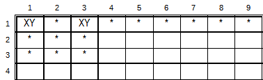
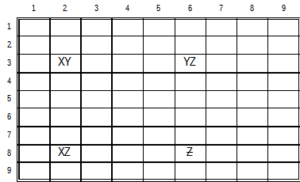
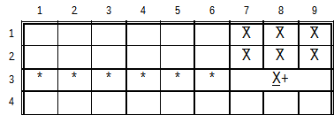
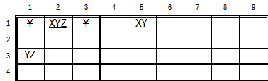
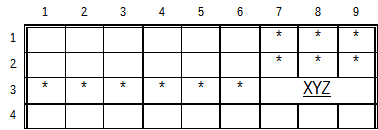
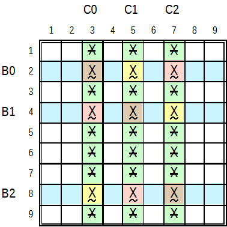
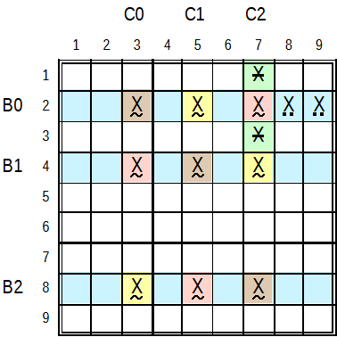

.. title:: Yet another Sudoku | Foundation | Notation

.. include:: ..\globals.inc

***************
Sudoku Notation
***************

Agreement on a notation to communicate Sudoku concepts avoids a 
`Confusion of Tongues <https://en.wikipedia.org/wiki/Tower_of_Babel#Confusion_of_tongues>`_.  This 
is my attempt to draw from what I consider best
practices in the literature and put forward a precise, descriptive, comprehensive, consistent and
unambiguous language for Sudoku.  The notation is loosely based on and adapted from `Sudopedia's
Diagrams and Notations <http://sudopedia.enjoysudoku.com/Diagrams_and_Notations.html>`_.

.. _found_lang_ccells:

Cells, Ccells, Houses and Chouses
=================================

A :term:`Cell` is a location on a Sudoku Grid.  A Cell is present in the three :term:`House`\s:, 
:term:`row`, :term:`Column`, and a :term:`Box`.

A :term:`Ccell` refers to any candidate in any cell as defined by its candidate value, row index
and column index.  That is, a Ccell is the unique reference to a specific candidate in a cell.

Ccells are three-dimensional tuples of value, row and column, each dimension ranging
between 1 and 9.  In Sudoku, 729 unique (9 value x 9 row x 9 column) possible Ccells exist.  Ccells
represent the remaining possible candidate values in a :term:`Cell`

A solved Sudoku puzzle comprises 81 unique Ccells of the 729 unique possibilities.  That is each 
cell in the 9 row by 9 column has only one value, all values in all cells obeying the
:ref:`Sudoku Rule <sudoku-rule>`.

The term Ccell is not to be confused with a:

*  :term:`Node`:  A further qualification of a ccell in a :term:`pattern` such as a net or chain.
   For example:  Ccells linked together in a chain form the Nodes between the links of the chain.
*  :term:`Candidate`:  A lesser reference to only the possible values in cells that obey Sudoku
   Rules.
*  :term:`Potential Elimination`:  A Synonym for Candidate, in the context of applying
   :term:`Conditional Logic`: to reduce the set of Candidates in a Cell.

:term:`House` is the collective noun for :term:`Row`, :term:`Column`, and :term:`Box`, on a Sudoku grid.

:term:`Chouse` is the collective noun for :term:`House` and :term:`Cell`.

Syntax
======

Cell (Location) Specifiers
--------------------------

.. table::
   :width: 97%
   :widths: 20 80
   :align: left
   :header-columns: 1
   :column-alignment: left left
   :column-dividers: single single none
   :column-wrapping: ny

   ============================================ =================================================================
   :raw-html:`<mono>r6c5</mono>`                The cell in location row 6, column 5 in the 9x9 cell grid
   :raw-html:`<mono>b4</mono>`                  The cells in box 4.
   :raw-html:`<mono>b4p6</mono>`                The cell in box 4, position 5. Boxes and positions in boxes are
                                                counted left to right then top to bottom, same location as
                                                ``r5c2``
   :raw-html:`<mono>r2</mono>`                  All cells in row 2
   :raw-html:`<mono>c4</mono>`                  All cells in column 4
   :raw-html:`<mono>r34c245</mono>`             The grid of 6 cells ``r3c2, r3c4, r3c5, r4c2, r4c4, r4c5``
   :raw-html:`<mono>r2r5,r3c456,r56c56</mono>`  A collection of cells in a comma separated list
   :raw-html:`<mono>r2c!378</mono>`             All cells in row 2 other than ``r2c378``
   :raw-html:`<mono>r!35c6</mono>`              All cells in column 6 other than ``r35c6``
   ============================================ =================================================================

Ccell Specifiers
----------------

.. table::
   :width: 97%
   :widths: 20 80
   :align: left
   :header-columns: 1
   :column-alignment: left left
   :column-dividers: single single none
   :column-wrapping: ny

   ================================================== =================================================================
   :raw-html:`<mono>3r6c5</mono>`                     The Ccell of value 3 in row 6, column 5
   :raw-html:`<mono>3r6</mono>`                       All Ccells with value 3 in row 6
   :raw-html:`<mono>347b6p2</mono>`                   A condensing of 3b6p2,4b6p2,7b6p2.  Also, same as: ``3437r4c8``
   :raw-html:`<mono><wuline>3r258c5</wuline></mono>`  Two or more ccells of value 3 found in any of ``r258c5``
   :raw-html:`<mono><duline>7r3c1368</duline></mono>` One or more ccells of value 7 found in any of ``r3c1368``
   ================================================== =================================================================

Ccell Postfixes
---------------

.. table::
   :width: 97%
   :widths: 20 80
   :align: left
   :header-columns: 1
   :column-alignment: left left
   :column-dividers: single single none
   :column-wrapping: ny

   ================================= ======================================================================
   :raw-html:`<mono>o</mono>`        The Ccell is a member of the odd parity :ref:`Super Node<super-node>`
                                     in a :ref:`SL Pattern <strong-linked-patterns>`
   :raw-html:`<mono>e</mono>`        The Ccell is a member of the even parity :ref:`Super Node<super-node>`
                                     in a :ref:`SL Pattern <strong-linked-patterns>`
   ================================= ======================================================================

Pattern Combiners
-----------------

.. table::
   :width: 97%
   :widths: 20 80
   :align: left
   :header-columns: 1
   :column-alignment: left left
   :column-dividers: single single none
   :column-wrapping: ny

   ================================= ======================================================================
   :raw-html:`<mono>,</mono>`        list ccell specifiers forming a pattern.
   :raw-html:`<mono>;</mono>`        list of related ccell patterns creating a larger pattern leading to
                                     an elimination or placement.
   ================================= ======================================================================

Operators
---------

.. table::
   :width: 97%
   :widths: 20 80
   :align: left
   :header-columns: 1
   :column-alignment: left left
   :column-dividers: single single none
   :column-wrapping: ny

   =============================== =================================================================
   :raw-html:`<mono>:=</mono>`     Placement of a value in a cell, eg. ``>r4c5:=5``
   :raw-html:`<mono>-=</mono>`     Elimination of a ccell or ccells - candidate(s) from a cell eg.
                                   ``r7c2-=24``
   =============================== =================================================================

Conditionals
------------

.. table::
   :width: 97%
   :widths: 20 80
   :align: left
   :header-columns: 1
   :column-alignment: left left
   :column-dividers: single single none
   :column-wrapping: ny

   ============================= ===================================================================
   :raw-html:`<mono>==</mono>`   Presence of only value or candidates in cells,  e.g. ``23==r2c57``
   :raw-html:`<mono>~=</mono>`   Presence of only 2 or more of specified candidates in each
                                 specified cell in a cell grouping, such that union of candidates
                                 in specified cells match specified candidates. e.g.
                                 ``347~=r2c259``, an exposed subset.
   :raw-html:`<mono>--</mono>`   Presence of at least the specified candidate(s) in cells e.g.
                                 ``34--r2c8``.  This condition is also specified by ``34r2c8``, a
                                 shorthand where the “--” is implied.
   :raw-html:`<mono>~-</mono>`   Presence of at least one instance of each specified candidate,
                                 amongst other candidates in a cell grouping. e.g. ``34~-r3Ib3``,
                                 candidates 3 and 4 with other candidates, are present in the
                                 intersection of row 3 with box 3
   :raw-html:`<mono>!-</mono>`   Absence of candidate(s) in cells, eg. ``34!-r2c235``, candidates 3
                                 and 4 are absent in cells ``r2c2, r2c3, r2c5``
   ============================= ===================================================================

Relational Specifiers
---------------------

.. table::
   :width: 97%
   :widths: 20 80
   :align: left
   :header-columns: 1
   :column-alignment: left left
   :column-dividers: single single none
   :column-wrapping: ny

   =================================== =================================================================
   :raw-html:`<mono>#</mono>`          Count, e.g. ``17#2r3``, candidates 1 and 7 occur twice in row 3.
   :raw-html:`<mono>=></mono>`         Inference, e.g. ``1r2c2 => 1!=r7c2 => 3r7c2``, asserting 1 in
                                       cell r2c2 infers an absence of 1 in cell r7c2, which in turn 
                                       infers the presence of 3 in r7c2, and so on.
   :raw-html:`<mono>U</mono>`          House union, e.g. ``r5Ub6``, the 15 cells in union of row 5 and
                                       box 6
   :raw-html:`<mono>I</mono>`          House intersections, e.g. ``r5Ib6``, the 3 cell in the
                                       intersection of row 5 and box 6
   :raw-html:`<mono>=</mono>`          Direct Strong Link between two Ccells. If X is True then Y is
                                       False and if X is False then Y is True
   :raw-html:`<mono>-</mono>`          Direct Weak Link between two Ccells. If X is True then Y is False
                                       and if X is False then Y is Unknown
   :raw-html:`<mono>~</mono>`          Strong Link masquerading as a Weak Link in a pattern
   :raw-html:`<mono>|=|</mono>`        Indirect Strong Link between two Ccells, resulting from
                                       a pattern
   :raw-html:`<mono>|-|</mono>`        Indirect Weak Link between two Ccells, resulting from
                                       a pattern
   :raw-html:`<mono>|~|</mono>`        (Indirect) Robust link between two Ccells. Opposite to a Weak
                                       Link, If X is True, then Y is unknown, and if X is False, Y is
                                       True
   :raw-html:`<mono>(...)</mono>`      Parenthesis - Distributive Property
                                       ``5r3c2=3r3c2`` &equiv; ``(5=3)r3c2``
   :raw-html:`<mono>{...,...}</mono>`  Braces – Groupings of sub-patterns in Nets, etc.
   :raw-html:`<mono>[...]</mono>`      Square Brackets - To group sub-patterns of larger patterns
   :raw-html:`<mono><...></mono>`      Pointy Brackets - contain relationships between grouped
                                       sub-patterns
   =================================== =================================================================

Candidate Dressing
------------------

.. table::
   :width: 97%
   :widths: 20 80
   :align: left
   :header-columns: 1
   :column-alignment: left left
   :column-dividers: single single none
   :column-wrapping: ny

   ============================= ===================================================================
   :raw-html:`<mono>/</mono>`    Restricted Candidate, ``3/456r3Ub2``, 4 is the
                                 restricted candidate in the union of row 3 and box 2
   :raw-html:`<mono>\</mono>`    Unrestricted Candidate, ``34\56c7Ub4``, 5 is the
                                 unrestricted candidate in the union of column 7 and box 4
   ============================= ===================================================================

Set Algebra
------------------

.. table::
   :width: 97%
   :widths: 20 80
   :align: left
   :header-columns: 1
   :column-alignment: left left
   :column-dividers: single single none
   :column-wrapping: ny

   ========================================================= =======================================
   :raw-html:`<mono>A = {P, Q, R}</mono>`                    X, Y and Z are Ccell members of Set A
   :raw-html:`<mono>|</mono>`                                (Bar) Set Union Operator
   :raw-html:`<mono>&</mono>`                                Set Intersection Operator
   :raw-html:`<mono>-</mono>`                                (Dash) Set difference Operator
   :raw-html:`<mono>U(A, B, C)</mono>`                       Union of sets A, B, and C.
   :raw-html:`<mono>I(A, B, C)</mono>`                       Intersection of sets A, B, and C.
   ========================================================= =======================================

Symantics
=========

Reading and interpreting this Sudoku language syntax is explained by examples.  An appreciation of
the meaning (semantics) of this syntax evolves through the balance of this section and the next.
Albeit a comprehensive list, it is not an exhaustive treatise of all patterns, but hopefully a 
reference and enough to get a good understanding of the syntax mechanics.

Note:

#. Values always precede operators and/or cell specifiers when describing or specifying a pattern.
#. Values always follow an operator when cell(s) are being modified (either assigning a value or
   eliminating a Ccell).
#. A Ccell that is part of a structure such as a Chain or Net is always called a Node to distinguish
   it from other Ccells that are not part of the structure.
#. A Ccell that is part of a Set is called either a Member or Element of the Set to distinguish it
   from other Ccells that are not part of the Set.

Singles
-------

**Exposed Singles**
   ``3==r7c1``
      3 is the only candidate in r7c1 (and can be placed).  

**Hidden Singles**
   ``3#1b7,b7p3``
      3 occurs only once in box 7, and that is in position 3

**Pointing Locked Singles**
   ``7r9c12,!-b7``
      7 occurs in r9, cells r9c1, and r9c2, and nowhere else in box 7, locking it to row 9

**Claiming Locked Singles**
   ``4r45c2,!-c2``
      4 occurs in column 2, cells r4c2 and r5c2, and nowhere else in column 2, locking it to box 4.

**Empty Rectangles**
   ``7#4b4,r4,c3;7r4c4=7r7c4``
      7 occurs 4 times in box 4 describing lines r4 and c3 and 7r4c4 is strongly linked to 7r7c4.

(Straight) Subsets
------------------

**Exposed Pairs**
   ``56==r4c59``
      Only Candidates 5 and 6 are only present in both r4c5 and r4c9 in row 4.

**Exposed Triples**
   ``14==r3c1,15==r3c5,145==r3c6``
      Only candidates 1 and 4 are present in r3c1, 1 and 5 in r3c5, and 145 in r3c6, all in row 3

**Exposed Quads**
    ``5789==r4c4,579==r4c5,78==r4c6,5789==r4c8``
      Only candidates 5, 7, 8 and 9 are present in r4c4, 5, 7, and 9 in r4c5, 7 and
      8 present in r4c6, and 5, 7, 8, and 9 present in r4c8, all in row 4

**Exposed Locked Pairs**
   ``68==r89c1``
      Only candidates 6 and 8 are present in r89c1 which lies in the intersection of column1 and
      box 7

**Exposed Locked Triples**
   ``345==r2c4,45==r2c5,35==r2c6``
      Only candidates 3, 4, 5 are present r2c4, 4 and 5 in r2c5, and 3 and 5 in r2c6, all in
      row 2 and box 5,

**Hidden Pairs**
   ``45#2r3c38``
      Candidates 4 and 5 only occur twice in r3, in cells r3c3 and r3c8.  These candidates can be
      hidden by other candidates in those cells

   OR

   ``45!-r3c!38``
      Candidates 4 and 5 are not present in row 3 outside of cells r3c3 and r3c8

**Hidden Triples**
   ``259!-r1c!135``
      Candidates 2, 5 and 9 are not present in row 1 outside r1c1, r1c3 and r1c5

**Hidden Quads**
   ``2689!-r1c!1378``
      Candidates 2, 6, 8 and 9 are not present in row 1 outside r1c1, r1c3, r1c7 and r1c8

Fish
----

.. note::
    In Fish ccell pattern specifications, the base set row or column always precede the cover set column or
    row. For example 3c47r26 finds the base sets in columns 4 and 7, and the cover sets in rows 2
    and 6.

**X-Wings**
   ``5r26c69``
      Candidate 5 is found twice in the base rows 2 and 6, which are covered by columns 6 and 9

**Swordfish**
   :raw-html:`<code class="docutils literal notranslate"><wuline>8c157r234</wuline></code>`
      Candidate 8 is found two to three times in each base column 1, 5 and 7, which are covered by
      rows 2, 3, and 4

**Jellyfish**
   :raw-html:`<code class="docutils literal notranslate"><wuline>2r1469c1589</wuline></code>`
      Candidate 2 is found two to four times in each base row 1, 4, 6, and 9 which are covered by
      columns 1, 5, 8 and 9

**Finned X-Wings**
    ``2c57r28,r79c5;2r8c6-2r7c5;2r8c6-2r9c5``
      Candidate 2 is found twice in base columns 5 and 7, which are covered by rows 2 and 8.
      Base column 5 also has two fins in ``r7c5`` and row ``r9c5``. Cover Ccell ``2r8c6`` sees both fins.

**Finned Swordfish**
   :raw-html:`<code class="docutils literal notranslate"><wuline>2r267c345</wuline>,r7c6;2r8c5-2r7c6;2r9c5-2r7c6</code>`
      Candidate 2 is found two to three times in base rows 2, 6 and 7, that are covered by columns 3, 4
      and 5.  Base row 7 also has a fin ``2r7c6``.  Cover Ccell ``2r8c5`` sees the fin.

**Finned Jellyfish**
   :raw-html:`<code class="docutils literal notranslate"><wuline>8r1358c4689</wuline>,r8c7;8r7c9-8r8c7</code>`
      Candidate 8 is found two to four times in base rows 1, 3, 5, and 8, that are covered by columns
      4, 6, 8 and 9.  Fin ``8r8c7`` exists in row 8. Cover Ccell ``8r7c9`` sees this fin.

**Sashimi X-Wings**
   ``2r69c2,r6c4,r9c5,r9c6;2r7c4-2r6c4;2r7c4-2r9c5;2r7c4-2r9c6``
      Candidate 2 is found twice in base rows 6 and 9, that is only covered by column 4. Three fins
      exist, ``r9c5`` and ``r9c6`` in base row 9 and ``r6c4`` in base row 6. Ccell ``2r7c4`` sees all
      fins.

**Sashimi Swordfish**
   :raw-html:`<code class="docutils literal notranslate" style="overflow-x: scroll;"><wuline>6r258c69</wuline>,r5c1,r8c2,r8c3;6r7c1-6r5c1;6r7c1-6r8c2;6r7c1-6r8c3;6r9c1-6r5c1;6r9c1-6r8c2; 6r9c1-6r8c3</code>`
      Candidate 6 is found two to three times in base rows 2, 5 and 8, that is only covered by columns
      6 and 9.  Three fins exist, r8c2 and r8c3 in base row 8 and r5c1 in base row 5. Ccells 6r7c1
      and 6r9c1 see all three fins.

**Sashimi Jellyfish**
   :raw-html:`<code class="docutils literal notranslate"><wuline>7r1569c468</wuline>,r9c7,r5c9;7r7c9-7r9c7;7r7c9~7r5c9</code>`
      Candidate 7 is found two to four times in base rows 1, 5, 6 and 9, that are covered by only
      three columns 4, 6, and 8.  Two fins exist r9c7 and r5c7.  Ccell 7r7c9 sees both Fins.

.. style="overflow: visible; overflow-x: scroll"

Bent Subsets
------------

**Y-Wings**
   ``23==r1c6,26==r1c7,36==r2c8;(3r1c8,3r2c6)-\3(r1c6,r2c8)``
      Y-Wing spanning row 1 and box 3, with :term:`Unrestricted Candidate` 3 in the pincers cells
      ``r1c6`` and ``r2c8``.  Both ``3r1c8`` and ``3r2c6`` from outside the pattern see
      Unrestricted Candidate 3 in the pincers ``3r1c6`` and ``3r2c8``.

**XYZ-Wings**
   ``359==r6c7,35==r6c8,39==r7c7;3r5c7-\3(r6c7,r6c8,r7c7)``
      XYZ Wing spanning column 7 and box 7 with Unrestricted Candidate 3 in all three cells. 3r5c7
      from outside the pattern see all Unrestricted Candidate instances - 3r6c7, 3r6c8 and
      3r7c7.

**Bent Exposed Quads**
   ``459==r7c1,14==r7c5,45==r7c7,19==r8c4;(9r8c1,9r8c3)-\9(r7c1,r8c4)``
      Bent exposed quad spanning row 7 and box 7, with Unrestricted Candidate 9.  9r8c1 and 9r8c3
      from outside the pattern see all Unrestricted Candidate instances - 9r7c1 and 9r8c4.

**Grouped Bent Pair, Exposed Line, Hidden Box**
   ``U89r8c456,89==r8c1,89--r7c4``
      Grouped Bent Pair with the union of candidates 8 and 9 in the intersection of row 8 and box 8
      with exposed pair in row 8 and hidden pair in box 8.

**Grouped Bent Pair, Hidden Line, Exposed Box**
   ``U49r789c3,49==r8c2,49--r6c3``
      Grouped Bent Pair with the union of candidates 4 and 9 in the intersection of column 3 and box
      3.  The exposed pair is box 3 and hidden pair in column 3.

**Bent Hidden Triples**
   ``18r7c3-189r7c7-89r4c7``
      Bent Hidden Triple in made up candidates 1, 8, 9 in row 7 and column 7.

Inference Chains, Loops and Nets
--------------------------------

**Skyscrapers**
   ``2r5c9=2r7c9~2r7c4=2r6c4,2r5c9~2r6c8-2r6c4``
      A four node SE-AIC, where both ends 2r5c9 and 2r6c4 form a :term:`Robust Link`. 2r6c8 sees
      both ends resulting in its elimination.

**Two String Kites**
   ``3r2c1=3r2c6-3r3c5=3r8c5,3r2c1-3r8c1-3r8c5``
      A four node SE-AIC, where both ends 3r2c1 and 3r8c5 form a :term:`Robust Link`. 3r8c1 sees
      both ends resulting in its elimination.

**Turbot Fish**
   ``7r2c8=7r2c6-7r9c6=7r7c5,7r2c8-7r7c8-7r7c5``
      A four node SE-AIC, where both ends 7r2c8 and 7r7c5 form a :term:`Robust Link`. 7r7c8 sees
      both ends resulting in its elimination.

**Longer X-Chains**
   ``7r1c2=7r1c9-7r2c8=7r7c8-7r7c3=7r4c3,7r1c2-7r4c2-7r4c3``
      A six node SE-AIC, where both ends 7r1c9 and 7r4c3 see 7r1c2, resulting in its elimination.

**Even X-Loops**
   ``3r2c4=3r2c8~3r3c7=3r5c7-3r4c9=3r4c4~,3r4c9-3r5c9-3r5c7``
      A six (even numbered) node Even X loop where 3r5c9 can see two of the nodes, resulting in its
      elimination. Note the trailing - or ~ specifier back to the start indicating the chain loops
      back on itself with a weak link or masquerading as weak link respectively.

**Strong X-Loops**
   ``6r1c6=6r4c6-6r4c2=6r2c2-6r2c4=,6r4c6=6r1c6=6r1c6``
      A five (odd numbered) node Strong X-Loop where 6r1c6 pivots on two strong links, resulting in
      its placement.  Note the trailing = specifier indicating a strong link looping back to the
      start.

**XY-Chains**
   ``(8=3)r1c6~(3=4)r1c7~(4=5)r5c7-(5=8)r5c4,8r5c4-8r4c6~8r5c4``
      An eight node XY Chain.  Each cell only contains two nodes, a bi-value cell.  Hence, the
      strong links of the AIC exist in the cells, and the weak links between the cells.  8r4c6 can
      see both ends of the chain, resulting in its elimination.

**XY-Loops**
   ``(4=7)r1c7~(7=9)r8c7~(9=8)r9c9~(8=4)r7c7~,9r9c9-9r8c9-9r8c7``
      An eight node XY Loop.  Each cell only contains two nodes, a bi-value cell.  The loop causes
      all the links between cells to become strong.  9r8c9 can see both an odd numbered link
      9r9c9 and an even numbered link 9r8c7, resulting in its elimination. Note the trailing - or ~
      specifier back to the start indicating the chain loops back on itself with a weak link or
      masquerading as weak link respectively.

**Remote Pairs**
   ``(2=3)(r4c5~r4c9~r9c9~r7c7~r6c7),3r4c5-3r7c5-3r7c7``
      A 5 Cell, 10 Node Net made up of same valued bi-value cells. 3r7c5 Can see both an odd
      and even parity Ccell in the net and can be eliminated.

**W-Wings**
   ``(8=9)r4c3~9r4c4=9r5c4~(9=8)r5c7,8r4c3-8r4c8-8r5c7``
      A :term:`Conjugate Pair` at the ends of a chain with the same :term:`End Node` candidate value
      and the inner conjugate pair nodes see each other through an interior :term:`Strong Link`.
      This pattern forms a :term:`Robust Link` between the End Nodes. 8r4c8 can see both ends
      resulting in its elimination.

**AI-Chains**
   ``2r4c8=2r4c9-7r4c9=7r8c9-7r9c7=7r9c5-2r9c5=2r8c5,2r4c8-2r8c8-2r8c5``
      An 8 node AI-Chain forming a :term:`Robust Link` between its ends, 2r4c8 and 2r8c5.  2r8c8 can
       see both ends, resulting in its elimination.

**Even AI-Loops**
   ``1r4c5=1r6c5-1r6c8=3r6c8-3r4c7=3r4c5-,1r4c5-5r4c5-3r4c5,1r4c5-8r4c5-3r4c5,3r4c7-3r5c7-3r6c8,3r4c7-3r5c8-3r6c8,1r6c8-1r6c3-1r6c5``
      A 6 node AI-Loop, strengthening the existing weak links.  All Nodes that can see both an odd
      and even parity link can be eliminated, such as 58r4c5, 3r5c78, and 1r6c3.

**Strong AI-Loops**
   ``r8c9=1r1c9-6r1c9=6r1c8-3r1c8=3r7c8-3r8c9=,1r1c9=1r8c9=1r8c9``
      A seven (odd numbered) node Strong AI-Loop where 3r8c9 pivots on two strong links, resulting in
      its placement.  Note the trailing = specifier indicating a strong link looping back to the
      start.

**Group Linked Chains and Loops**
   ``8r3c23=8r2c3-8r8c3=8r8c9,8r3c23-8r3c9-8r8c9``
      An group linked Turbot fish where the :term:`End Node`\s 8r3c23 and 8r8c9 form a :term:`Robust
      Link`.  8r3c9 can see both ends resulting in its elimination.

**Strong Linked Net**
   ``5r5c4e=5r6c4o=6r6c4e={6r6c8o,6r2c4o=6r1c6e=6r4c6o=9r4c6e=9r4c7o=9r5c9e=9r5c4o},9r1c9-9r5c9e,6r1c9-6r1c6e``
      Note the braces grouping multiple subnet links to a parent.  Also note the net level parity appended to each
      Ccell.  All the candidates in a cell outside the net see even nodes (9r1c9-9r5c9e, 6r1c9-6r1c6e).  If Even nodes
      are True, then none of the candidates in that outside cell can be True.  This is a contradiction, the Truth set
      for that cell must contain at least one candidate.  Therefore, all the Even Parity Nodes are False and can be
      eliminated.  And, by implication, all the Odd Parity Nodes are True and can be placed.

..   Unlocked Sets
..   -------------
..
..   **Unlocked Set Chains**
..
..   **Unlocked Set Loops**
..
..   **Sue de Coq**
..
..   Hybrid Chains
..   -------------
..
..   **Hidden Subset Loops**
..
..   **Mixed Pattern Chains**
..
..   Uniqueness
..   ----------
..
..   **BUG+1**
..
..   **Unique Rectangles**
..
..   **Hidden Rectangles**
..
..   **Avoidable Rectangles**
..
..   **Extended Rectangles**
..
..   Searching
..   ---------
..
..   **Digit Forcing Chains**
..
..   **Nisho Forcing Chains**
..
..   **Cell Forcing Chains**
..
..   **House Forcing Chains**
..
..   **Bowman's Bingo**
..
..   **Unaligned Subset Exclusions**
..
..   **Pattern Overlays**
..

Super Human Patterns
--------------------

**Kraken Finned Fish**
   ``2r69c12,r9c6;2r9c6-2r9c1=3r9c1-3r9c2=3r6c2-2r6c2=2r6c1-2r7c1``
      In this Kraken Finned X-Wing, Candidate 2 is found twice in base row 6 and 9, which are
      covered by columns 1 and 2. A fin is present in ``r9c6``, seen by Ccell ``2r7c1`` through the
      WE-AIC: ``2r9c6-2r9c1=3r9c1-3r9c2=3r6c2-2r6c2=2r6c1-2r7c1``.

**Kraken Sashimi Fish**
   ``2r13c5,r1c8,r3c9;2r1c8~2r1c5=7r1c5-7r1c7=6r1c7~6r9c7=6r9c9~2r9c9;2r3c9~2r9c9``
      In this Kraken Sashimi X-Wing, Candidate 2 is found twice in base rows 1 and 3, and is only
      covered by column 5.  Two fins exist ``r1c8`` and ``r3c9``.  Ccell ``2r9c9`` sees ``2r3c9`` directly and ``2r1c8``
      indirectly through the WE-AIC: ``2r1c8~2r1c5=7r1c5-7r1c7=6r1c7~6r9c7=6r9c9~2r9c9``.

..
..   **Multi-Fish**
..
..   **Exocets**
..
..   **Multi Sector Locked Sets**

Outcomes
========

**Placements**
   ``r3c5:=7``
      Place 7 in cell ``r3c5``.  Only a single value can be placed in a Cell

**Eliminations**
   ``r3c5-=7``
      Remove candidate 7 from ``r3c5``, if present.

   ``r3c5-=237``
      Remove candidates 2, 3, and 7 from cell ``r3c5``, if present.

   ``r3c789-=237``
      Remove candidates 2, 3, and 7 from cells ``r3c7``, ``r3c8`` and ``r3c9``, if present.

   ``r3c!(789)-=237``
      Remove candidates 2, 3, and 7 from all cells in row 3 other than ``r3c789``.

   ``r8c456-=!(237)``
      Remove all candidate other than 2, 3, and 7 from cell ``r3c5``.

   ``r8c!(456)-=!(237)``
      Remove all candidate other than 2, 3, and 7 from row 8 other than ``r8c456``.

   ``b8p!(456)-=!(237)``
      Remove all candidates other than 2, 3, 7 from box 8 other than ``b8p456``

Candidate Diagrams
==================

Candidate Representation
------------------------

Candidate Diagrams here vary from those described in
`Sudopedia <http://sudopedia.enjoysudoku.com/Diagrams_and_Notations.html>`_ and the
`Sudoku Forum <https://forum.enjoysudoku.com/>`_.

The contents of a Candidate Diagram Cell is made up of the following components

.. table:: Candidate Diagram Symbols
   :name: tbl-cand-diag-symbs
   :width: 97%
   :widths: 20 80
   :header-alignment: left left
   :header-columns: 1
   :column-alignment: left left
   :column-dividers: single single none
   :column-wrapping: ny

   ================================ ===========================================================
   Symbol                           Description
   ================================ ===========================================================
   X                                A unique but unspecified candidate value that may be
                                    present in that cell.
   :raw-html:`<uline>X</uline>`     (Underline). A unique but unspecified candidate value that
                                    that must be present in that cell.
   :raw-html:`<duline>X</duline>`   (Dashed underline).  A unique but unspecified candidate
                                    value that may be present in that cell, and at least
                                    one of X must be present in their house.
   :raw-html:`<wuline>X</wuline>`   (Wavy underline).  A unique but unspecified candidate value
                                    that may be present in that cell, but at least two of X
                                    must be present in their house.
   \+                               An appended "+" indicates the presence of other candidates.
                                    A "+" on its own indicates any candidates including those
                                    in the pattern may or may not be present in that cell.
   :raw-html:`<oline>X</oline>`     (Overline).  Not X.  X must be absent from that cell.
   :raw-html:`<mline>X</mline>`     (Strikethrough). If candidate is present in that cell it
                                    can be eliminated.
   X\*                              (Wildcard) Any candidate but X can be eliminated from that
                                    cell.
   ================================ ===========================================================

.. table:: Candidate Diagram Expressions
   :name: tbl-cand-diag-expr
   :width: 97%
   :widths: 20 80
   :header-alignment: left left
   :header-columns: 1
   :column-alignment: left left
   :column-dividers: single single none
   :column-wrapping: ny

   ================================ ================================================================
   Expression                       Description
   ================================ ================================================================
   \+                               Any candidate including those in the pattern being considered,
                                    may or may not be present.
   X+                               X may be present, optionally other candidates too
   :raw-html:`<uline>XY</uline>`    X and Y are the only two candidates in that cell
   :raw-html:`<uline>XY</uline>+`   X and Y must be in that cell, optionally other candidates too
   XY                               X and Y are the only two candidates in that cell (synonym of :raw-html:`<uline>XY</uline>`)
   XY+                              X and Y must be present, optionally others (synonym of :raw-html:`<uline>XY</uline>+`)
   XYZ                              At least two of X, Y and Z are the only candidates present in
                                    that cell
   XYZ+                             At least two of X, Y, and Z are present, optionally other
                                    candidates too
   :raw-html:`<uline>XY</uline>Z`   X and Y must be present, optionally Z only
   :raw-html:`<uline>XYZ</uline>`   X, Y and Z are the only candidates present in that cell
   :raw-html:`<uline>XYZ</uline>+`  X, Y and Z are present, optionally other candidates too
   WXYZ                             At least two of W, X, Y, and Z are the only candidates present
                                    in that cell
   WXYZ+                            At least two of W, X, Y and Z are present, optionally other
                                    candidates too.
   :raw-html:`<uline>WX</uline>YZ`  W and X must be present, optionally Y and Z only
   :raw-html:`<uline>WXY</uline>+`  W, X and Y must be present, optionally other candidates too
   :raw-html:`<uline>WXYZ</uline>`  W, X, Y and Z must be the only candidates present
   :raw-html:`<uline>WXYZ</uline>+` W, X, Y and Z must be present in that cell, optionally other
                                    candidates too
   X*                               Any candidate other than X can be eliminated
   XYZ*                             At least one of X, Y, and Z is present and any other candidate
                                    can be eliminated
   :raw-html:`<uline>XY</uline>Z*`  X and Y must be present, optionally Z, and any other candidate
                                    can be eliminated
   ================================ ================================================================

Many patterns rely on the presence of Candidate values anywhere in the intersection of a line and
a box.  For these patterns, Candidate Diagrams merge the three cells in the intersection into one
larger cell containing the union of the Candidates in the intersecting cells.

Some Examples
-------------

Locked Exposed Pair
+++++++++++++++++++

   Locked Exposed Pair Pattern

``XYr1c13``. The exposed pair XY is confined to the intersection of r1 and b1.  \* indicates all the cells that
can see the cells of the exposed pair.  If X or Y exists in the cells with a \*, they can be eliminated.

|

Y-Wing
++++++

   Y-Wing Pattern

``XYr3c2`` locks the :term:`Truth` ``Z(r8c2,r3c6)`` in both pincers, so any Ccell like ``Zr8c6`` that
ees both pincers cannot be true and is eliminated.

|
|
|
|
|
|
|
|

Locked Pointing Single
++++++++++++++++++++++

   Locked Pointing Single Pattern

X is present in the intersection of row 3 and box 3, and not present in the
rest of box 3.  Therefore, X must be True in the intersection resulting in the elimination of X
along row 3 outside the intersection.

|
|

XYZ-Wing
++++++++

   XYZ-Wing Pattern

``XYZr1c2`` in the intersection of ensures that the Unrestricted Candidate, Y, must be True
in at least one of the cells forming the pattern.  Therefore, any other candidate Y that
can see all occurrences of Y in the pattern can be eliminated.  The only locations that
can see all the pincers and pivot lies in the intersection of row 1 and box 1.

Locked Exposed Triple
+++++++++++++++++++++

   Locked Exposed Triple Pattern

X, Y, Z are the only candidates confined (locked) to the intersection of row 3 and box 3,
with no other candidates, they identify an Exposed Triple.  X, Y, Z are True in the cells of the
Exposed Triple, therefore any Ccells that can see all the same value Ccells in the Exposed
Triple cannot be True and can be eliminated.

Swordfish
+++++++++

   Swordfish

Base sets B0, B1, and B2 with at least 2 instances of X align such that each of the three cover sets
sees at least two ccells in their three intersectons. This locks the :term:`Truth` to the
intersecting cells.  Therefore any instance of X along the covers outside the intersections cannot
be True and is eliminated.

|
|
|
|
|
|
|
|
|

Finned Swordfish
++++++++++++++++

   Finned Swordfish

Base sets B0, B1, and B2 with at least 2 instances of X align such that each of the three cover sets
sees at least two ccells in their three intersections.  But B0 has two fins Xr2c89.  So either the
Swordfish is the :term:`Truth` or one of the fins are True.  Therefore, any instance of X in the
covers outside the intersection, that can see the fins cannot be true and is eliminated.

|
|
|
|
|

Other Notations
===============

Candidate Grids
---------------

Also known as Pencilmark Grids or PM Grids.

:raw-html:`<pre>skdlfjls adsfklfj sdf</pre>`

:raw-html:`

<pre>
.---------------------.---------------------.---------------------.
| 2      56789  578   | 34569  345789 456789| 1     *467    679   |
| 1      4      57    | 569    2      5679  | 679    8      3     |
| 679    6789   3     | 469    1      46789 | 5     *2467   2679  |
:--------------------- --------------------- ---------------------:
| 3457   12357  2457  | 34569  34589  45689 | 46789 -12467  126789|
| 34     123    6     | 7      3489   489   | 489    5      1289  |
| 8      57     9     | 2      45     1     | 3     -467    67    |
:--------------------- --------------------- ---------------------:
| 45679  56789  4578  | 459    4579   3     | 2      167    15678 |
| 45679  5679   1     | 8      4579   2     | 67     3      567   |
| 357    23578  2578  | 1      6      57    | 78     9      4     |
'---------------------'---------------------'---------------------'
</pre>

`

A '*' is prefixed to the candidate's string in the pattern that cause the elimination or placement. 
A '-' is prefixed to the candidate to be eliminated's string. 

There are many variations in pencil mark grids.  Sometimes the symbol may be appended instead of
prefixed,  sometimes symbols are placed in the middle of a 
of candidate strings to indicate the candidates are relevant or those to be eliminated or placed 
like below.

:raw-html:`

<pre>
.---------------.---------------.---------------.
| 6    9    3   | 7    4    8   | 25   25   1   |
| 1    4    5   | 69   2    3   | 69   7    8   |
| 7    2    8   | 1    5    69  | 3    69   4   |
:--------------- --------------- ---------------:
| 35   1357 6   | 389  178  2   | 589  4    579 |
| 4    13-7 9   | 368  1678 5   | 268  268  27  |
| 8    57   2   | 469  679  469 | 1    569  3   |
:--------------- --------------- ---------------:
| 2    58   1   | 459  89   49  | 7    3    6   |
|*59   568  4   | 568  3    7   | 2589 1   *59+2|
|3*59  3568 7   | 2    68   1   | 4    589 *59  |
'---------------'---------------'---------------'
</pre>

`

For more complex techniques where the '*' symbol is not sufficient to indicate the cause of the 
eliminations, or when illustrating multiple techniques causing multiple eliminations in a single 
diagram, other symbols such as '#' and '@' can be used. 

If the logic behind the eliminations involves only a single digit, say the digit 4 in this case 
Some people choose to communicate the same message by showing only the cells with 4 as a
candidate, like the one shown below. This kind of grid tend to be much easier to read than the grid
showing the entire pencilmarks.

:raw-html:`

<pre>
.---------.----------.----------.
| .  .  . |  4  4  4 |  . *4  . |
| .  .  . |  .  .  . |  .  .  . |
| .  .  . |  4  .  4 |  . *4  . |
:--------- ---------- ----------:
| 4  .  4 |  4  4  4 |  4 -4  . |
| 4  .  . |  .  4  4 |  4  .  . |
| .  .  . |  .  4  . |  . -4  . |
:--------- ---------- ----------:
| 4  .  4 |  4  4  . |  .  .  . |
| 4  .  . |  .  4  . |  .  .  . |
| .  .  . |  .  .  . |  .  .  . |
'---------'----------'----------'
</pre>

`

Sets
----

FIXUP

From Allan Barker's site.

Eliminations are written in standard notation except for sets, which are written in a form that 
makes them easy to recognize. The notation follows the definition of Sudoku sets in 3D, and adds an
extra number so that row 4 contains row sets r41 to r49. The extra number is the digit except for 
cell sets, which are noted by row and column. The four types of sets are then:

``row = R(row, digit),  column = C(column, digit), cell = N(row, column), box = B(box, digit)``

Subgroups like c51, c53, and c59 are written as c5(139). The short notation is meant for use with diagrams that provide exact candidate details. However, set theory says that all eliminations can be understood based on sets alone without candidate details, in principle.

An example elimination expression is:

``Rank 1: [r46 c5(139) c76 n23 n3(12)](ST) r26*c56 => r2c5 <> 6``

which is of the form:

``<rank>: [list of covering sets](triplet info)<overlap linksets> => <assignments>,<eliminations>``

In some cases <overlap linksets> is replaced with [list of covering linksets], particularly for rank 0 logic (like fish) where all linksets can cause eliminations. The triplet information denotes the presence of triplets, where T means a linkset Triplet and S means a Set triplet.

``S4=[r(28)6 c26 b56], L6=[r(56)6 c(459)6 b76] =>  r6c9<>6``

``S23=[r(27)2 r(148)4 r35 r19 c8(39) n(379)2 n83 n(27)5 n96 b15 b2(28) b3(16) b74 b97], L28=[r2(16) r38 r7(34) r9(67) c14 c28 c3(45) c58 c6(258) c74 n31 n34 n15 n17 n(1379)8 n89 b1(24) b71] =>  r3c1<>4``

Chains
------

FIXUP

Links with strong inference are represented by =X=, where X is the digit. Links with weak inference 
are represented by -X-. To make a distinction between continuous and discontinuous loops, a single
dash or equal sign is placed at the start and end of the loop to indicate how it continues.

``=[r1c1]-1-[r4c1]=1=[r4c5]-1-[r1c5]=1=[r1c1]-``

These continuation markers are not present in discontinuous loops.

``[r1c1]-1-[r4c1]=1=[r4c5]-1-[r5c6]=1=[r1c6]-1-[r1c1]``
