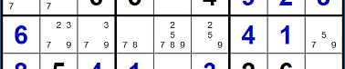
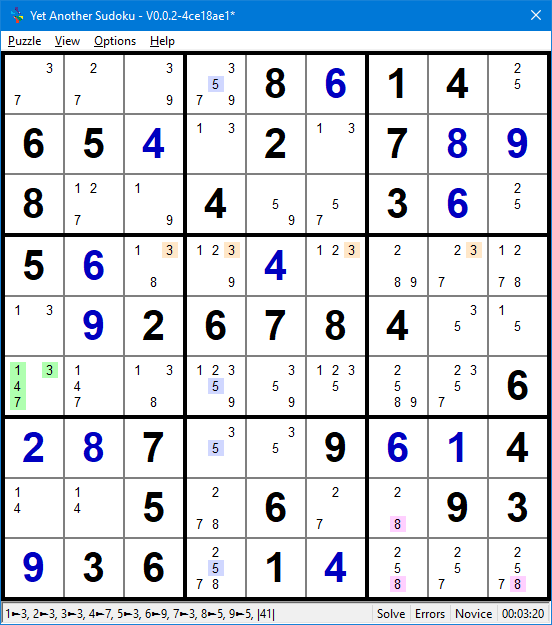

.. title:: Yet Another Sudoku | Foundation | Concepts

.. include:: ..\globals.inc

.. _found_core-concepts:

*************
Core Concepts
*************

.. _found_cc_premises_and_inferences:

Premises and Inferences
=======================

Source: http://sudopedia.enjoysudoku.com/Inference.html

Solving Sudoku puzzles involves asserting a premise, and deducing what conclusions can be
inferred.  Applying a premise is different to guessing.  A premise is used to infer logical
conclusions, whereas guessing is taking a chance on arbitrarily selecting what might be the correct
cell value and testing it.

The most basic assertion of a premise is on the state of a Ccell. For example, asserting
Ccell ``3r7c2`` True.

An inference implies a relationship (link) between two Ccells, characterised by the other Ccell's
response to the assertion of a premise on the first Ccell.  For example, If
``3r7c2`` is True, then according to the :ref:`Sudoku Rule <sudoku-rule>`,
``3r7c5`` is False.

The inference (link) between two Ccells is characterised by the outcome of asserting each Ccell
True and False.  The important link (inference) relationships in Sudoku are:

*  Weak Links
*  Strong Links
*  Robust Links

.. _found_cc_weak_links:

Weak Links
----------

A weak link is formed by two ccells A and B, where they are either:

* Two or more same valued candidates in that house, or
* Two of three or more candidates in a cell.

   Links Example

Observe that candidate 7 occurs more than twice in this example row 7 of a puzzle.
Notice that:

*  if ``7r7c2`` is True, then none of the same valued Ccells in row 7 can be
   True.
*  if ``7r7c2`` is False, it does not infer state of any other same valued
   Ccell in the row.

This is the characteristic defining a Weak Link.

Weak links are indicated by a “-”(dash) between the two Ccells, for example, A-B and conform to the following
inferences:

.. table:: Weak Link Inference Table
   :name: tbl-weak-link-it
   :width: 65%
   :widths: 30 70
   :header-alignment: center left
   :header-columns: 1
   :column-alignment: center left
   :column-dividers: single single none
   :column-wrapping: nn

   ================================================ ================================
   :raw-html:`<mono>A &nbsp;-&nbsp; B</mono>`
   ================================================ ================================
   :raw-html:`<mono>T &nbsp;&rarr;&nbsp; F</mono>`  If A is True then B is False
   :raw-html:`<mono>F &nbsp;&larr;&nbsp; T</mono>`  If B is True then A is False
   :raw-html:`<mono>F &nbsp;&rarr;&nbsp; ?</mono>`  If A is False then B is unknown
   :raw-html:`<mono>? &nbsp;&rarr;&nbsp; F</mono>`  If B is False then A is unknown
   ================================================ ================================

The conclusion drawn from weak link inferences is that if one end is True, the other
end is False, and if the one end is False, the other end can be either True or False.  That is,
both ends can never be simultaneously True, and at least one end is always False.

Ccells see each other through weak links (directly or indirectly — e.g. Weakly Ended Chain).  When
any two Ccells see each other, and the one Ccell is asserted True, the other Ccell must be asserted
False.

.. _found_cc_strong_links:

Strong Links
------------

A strong link between two Ccells A and B, exists either:
   *  In a conjugate pair (like ``3r7c23`` in :numref:`fig-links-eg1`), where
      two same valued Ccells are the only same valued Ccells in that house, or
   *  In a Bi-value cell where the two different valued ccells are the only ccells in that cell,
      like ``78r7c4``.

In :numref:`fig-links-eg1` above:

*  If ``3r7c2`` is False, then ``7r7c3`` must be True, as only one of the conjugate pair must be True.
*  if ``3r7c2`` is True, then ``7r7c3`` must be False, as only one of the conjugate pair must be False

Strong links are indicated by a “=” linking the two ccells and obey the following inferences:

.. table:: Strong Link Inference Table
   :name: tbl-strong-link-it
   :width: 65%
   :widths: 30 70
   :header-alignment: center left
   :header-columns: 1
   :column-alignment: center left
   :column-dividers: single single none
   :column-wrapping: nn

   ================================================ =============================
   :raw-html:`<mono>A &nbsp;=&nbsp; B</mono>`
   ================================================ =============================
   :raw-html:`<mono>T &nbsp;&rarr;&nbsp; F</mono>`  If A is True then B is False
   :raw-html:`<mono>F &nbsp;&larr;&nbsp; T</mono>`  If B is True then A is False
   :raw-html:`<mono>F &nbsp;&rarr;&nbsp; T</mono>`  If A is False then B is True
   :raw-html:`<mono>T &nbsp;&larr;&nbsp; F</mono>`  If B is False then A is True
   ================================================ =============================

The conclusion drawn from a Strong Links is that ends always have opposite state.

Any two Strongly Linked Ccells must be of alternate state, therefore:

* if the one end is True the other end is False
* Any third Ccell that can see both Strongly Linked Ccells cannot be True because the Strong link
  guarantees one of its ends to be True.

.. _found_cc_robust_links:

Robust Links
------------

Robust links are derived from other structures such as (but not limited to) Alternating Inference
Chains.  Robust link inferences are opposite to Weak Links.  Robust links are indicated with a
"\|\~|" where the outer bars indicate that this link is derived/indirect resulting from another
structure.

.. table:: Robust Link Inference Table
   :name: tbl-robust-link-it
   :width: 65%
   :widths: 30 70
   :header-alignment: center left
   :header-columns: 1
   :column-alignment: center left
   :column-dividers: single single none
   :column-wrapping: nn

   ================================================ ===============================
   :raw-html:`<mono>A |~| B</mono>`
   ================================================ ===============================
   :raw-html:`<mono>T &nbsp;&rarr;&nbsp; ?</mono>`  If A is True then B is unknown
   :raw-html:`<mono>? &nbsp;&larr;&nbsp; T</mono>`  If B is True then A is unknown
   :raw-html:`<mono>F &nbsp;&rarr;&nbsp; T</mono>`  If A is False then B is True
   :raw-html:`<mono>T &nbsp;&rarr;&nbsp; F</mono>`  If B is False then A is True
   ================================================ ===============================

The conclusion drawn from Robust Link Inferences is that if the one end is False, the other end is
True, and if the one end is True, the other end can be either True or False.  That is, both ends can
never be simultaneously False, at least one end is always True.  But if one end is asserted True, it
is impossible to determine the state of the other end with a Robust link.

Any third Ccell that can see both ends of a Robust Link cannot be True, because at least one end is
True.

.. _found_cc_sl_and_rl_masq_as_wl:

Strong and Robust Links Masquerading as Weak
--------------------------------------------

Strong and Robust links possesses all the link attributes of a Weak Link.  That is if one end is
True, the other is False.  Therefore, it is possible to substitute a Strong or Robust Link for a
Weak Link to identify patterns.

Weak links do not possess the link attributes of Strong or Robust Links.  That is if one end is
False, it is impossible to determine the state of the other end. Therefore, it is not possible to
substitute a Weak Link for a Strong or Robust Link.

When a Strong or Robust link is substituted for a weak link, it is masquerading as a Weak link.
The ``~`` symbol is used to indicate a masqueraded weak link.

.. _found_cc_truth:

Truths
======

A Truth is a collection of :term:`Ccell`\s in a :term:`House` or :term:`Cell` where one of those 
Ccells is the solved value for that cell.  Sudoku is played by applying :ref:`Preference / Inference 
Logic <found_cc_premises_and_inferences>` to whittle  away the Ccell in Truths until each Cell's
value has been deduced.

   'A Truth' and 'The Truth' Example

   :raw-html:`<mong>....8+614.65+4.2.7+8+98..4..3+6.5+6..+4.....+926784..........6+2+87..9+6+14..5.6..93+936.1+4...|r3c6-=1|Pointing Locked Single||3r1c13,!-b2|r1c4-=3|+7+2+3+98+614+565+4+32+17+8+98+1+94+5+73+6+25+6+1+2+4+3+9+7+8+3+926784+5+1+4+7+8+1+9+5+2+36+2+87+5+39+6+14+1+45+76+2+893+936+81+4+5+2+7</mong>`

Truth Examples:

*  In Row 4, ``3r4c3468`` is all cells containing candidate 3.
*  In Column 4, ``5r1679c4`` is all the cells containing 5.
*  In Box 9,  ``8b9p479`` is all the cells in box 9 containing 8.
*  In Cell ``r6c1``, ``1347r6c1`` is all the possible values in that cell.

|
|
|
|
|
|
|
|

.. _found_cc_spatial_reps:

Spatial Representation
======================

See Denis Berthier’s Hidden Logic of Sudoku. https://github.com/denis-berthier.

A Sudoku solution is a unique selection and ordering of 81 ccells (value,
row, column tuples) out of an exhaustive set of 729 ccells – where values, rows and columns can
assume any value between 1 and 9, and Sudoku rules apply.  Sudoku is a Finite Constraint Satisfaction
problem, and the recognition of patterns and their resolutions in solving the puzzle are the
constraint propagation techniques.

Sudoku puzzles are spatially represented as values on a 9 row by 9 column grid of
cells.  However, this is not the only possible spacial representation for Sudoku.  The same
puzzle can be represented as row numbers on a value x column number or any of the other 6 spatial
domains:

*  values on a row x column grid (default)
*  row numbers on a value x column grid
*  column numbers on a value x row grid
*  values on a cell x box grid
*  box numbers on a value x cell grid
*  cell numbers on a value x box grid

The underlying puzzle logic is the same, it is only the perspective, that differs in each spatial
representation.

However, each perspective, exposes patterns that are hidden in other perspectives.  For example, a
hidden single or hidden subset patten will be transformed into an exposed pattern in one of the
five perspectives.

Viewing puzzles from different perspectives, come into its own with more complex patterns
such as chains, loops, nets, bent hidden subsets, etc. Transforming to another domain may make it
easier to spot exposed patterns that are hidden in the former domain.
