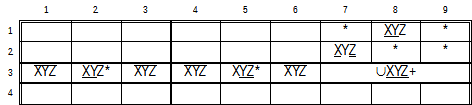
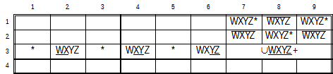
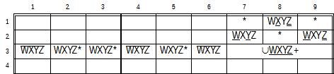
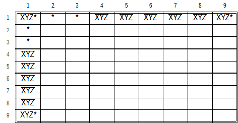

.. title:: Yet Another Sudoku | Foundation | Subsets

.. include:: ..\globals.inc

.. _found_subsets:

*******
Subsets
*******

Subsets refer to 'n' cell by 'n' candidate grouping, where each cell in the grouping contains between
2 and 'n' of the candidates. 'n' ranges between 2 and 4, (pairs, triples and quads).  For values
of “n” > 4, a reciprocal subset relationship of 9 – 'n' candidate values exists, so it is
unnecessary to look for subsets larger than 4.

.. _found_subs_exposed_hidden:

Exposed or Hidden
=================

Subsets can be Exposed or Hidden:

*  An exposed subset is where 'n' candidate values are the only values occurring between 2 and 'n' times in the 'n' cells.
*  A hidden subset is where 'n' candidate values can are confined to 'n' cells, but are not
   necessarily the only candidates in those cells.

.. _found_subs_str_or_bent:

Straight or Bent
================

Subsets can be Straight or Bent:

*  A Straight Subset, simply called a "Subset", refers to a collection of 'n' Candidates in 'n'
   Cells in a single :term:`House`.
*  A "Bent Subset" is a collection of 'n' Candidates in n Cells spanning the union of two
   :term:`House`\s with at least one cell in the intersection.

.. _found_str_subs:

Straight  Subsets
=================

In :ref:`Straight Exposed Subsets <hsp_subsets>`, the 'n' candidates can each only be True in one of
the 'n' cells in a :term:`House` they occupy.  That is the n Candidates are
:term:`A Truth` for those n cells. Therefore, they cannot be True outside those 'n' cells.  Any
occurrence of those 'n' candidates outside the 'n' cells can be eliminated.

In :ref:`Straight Hidden Subsets <hsp_subsets>`, the 'n' candidates are confined to only 'n' cells in
a Group, forming :term:`A Truth`.  Because of this 'Truth', any other candidates in those four cells
can be eliminated.

:ref:`Base Sets and Cover Sets <found_bsets_and_csets>` develops an algebra to verify the logic of
these Subset patterns.

See :ref:`Human Solvable Patterns / Subsets <hsp_subsets>` for worked examples of Exposed and
Hidden - Pairs, Triples and Quad (Unbent) Subsets.

.. _found_bent_exp_subs:

Bent Exposed Subsets
====================

Bent Exposed Subsets are often called Wings, but Wings is rather overloaded term in Sudoku-Speak.

These patterns comprise 'n' candidates in 'n' Cells with 2 to 'n' candidates in each cell spanning
two intersecting :term:`House`\s with at least one cell in the intersection.  Bent Exposed Subsets must only
have one :term:`Unrestricted Candidate` to be viable, the remaining candidates being
:term:`Restricted Candidate`\s.

The smallest Bent Exposed Subset is the Bent Exposed Triple because at least three cells are
needed to have bend spanning two houses.

These patterns are a special case of :ref:`Unlocked Sets <found_unlocked_sets>`, where two
:term:`ULS`\s are linked in a chain with a single :term:`Unrestricted Candidate`.  Bent Exposed
Subsets have a relatively high probability of occurrence in puzzles and are relatively easier to
master than the more complex Unlocked Sets, :term:`YMMV`.

.. _found_rest_unrest_cands:

Restricted and Unrestricted Candidates
--------------------------------------

A :term:`Restricted Candidate` is one where all instances of its value in a pattern can see each
other.  An :term:`Unrestricted Candidate` is one where all its instances of its value do not see
each other.

A Bent Exposed subset must have only one Unrestricted Candidate to be viable.  The other Candidates
are all Restricted.  The Unrestricted Candidate must have an instances in :term:`Pattern Cell`\s of
both :term:`House`\s outside the intersection and may have instances in Pattern Cells in the Intersection.
The Restricted Candidates are only present in pattern cells in that are fully in one :term:`House`
or the other.

The Unrestricted Candidate can be True in at least one or both Houses, but can never
be False in both.  Therefore, any Ccell outside the pattern that can see all Unrestricted Candidate
instances in the Cell Pattern cannot be True, resulting in their elimination.

.. _found_bet:

Bent Exposed Triples
--------------------

Bent Exposed triples are known by their other popular names, Y-Wings (or XY-Wing), and XYZ-Wings.
These two patterns are the only variants of Bent Exposed Triples.  Bent Exposed Triples comprise
3 Candidates in 3 Cells spanning two intersecting Houses with one Pattern Cell in the intersection.

.. _found_bet_y_wing:

Y-Wings
+++++++

.. figure:: images/y-wing-cd2.png
   :name: fig-y-wing-cd2
   :scale: 100%
   :alt: Y-Wings Candidate Diagram
   :align: right
   :figwidth: image

   Y-Wings Candidate Diagram

These are minimal Bent Exposed Triples where each Pattern Cell only contains two Candidate values
and instances of the Unrestricted Candidate only exist in the two Pattern Cells outside the
intersection.

:numref:`fig-y-wing-cd2` shows two examples of Y-Wings.  The first example:
``XYr2c6,YZr2c2,XZr5c2`` is a Y-Wing spanning Row 2 and Column 2.  X is the
Unrestricted Candidate because the Xr2c6 cannot see Xr5c2. The other two candidates are Restricted
because all instances see all other instances of themselves: ``Yr2c2-Yr2c6``, and ``Zr2c2-Zr5c2``.
As ``r2c2`` does not have an instance of X in it, the only possible Ccell that can see all
Unrestricted Candidates is ```Xr5c6``, which can be eliminated.

The second example: ``XYr7c8,YZr7c5,XZr9c4`` is a Y-Wing spanning Row 7 and
Box 8.  X is the Unrestricted Candidate because ``Xr7c8`` cannot see ``Xr9c4``.  The other two
candidates are Restricted, because all instances see other instances of themselves, ``Yr7c8-Yr7c5``
and ``Zr7c5-z-r9c4``.  In this Box/Line intersection, the possible Ccells that can see all instances
of the Unrestricted Candidates are ``Xr7c46`` and ``Xr9c789``, which can be eliminated

Y Wings are also six Node :ref:`XY Chains <hsp_xy-chains>`.
    Example 1: ``(X=Y)r2c6-(Y=Z)r2c2-(Z=X)r5c2``, and :raw-html:`<br>`
    Example 2: ``(X=Y)r7c8-(Y=Z)r7c5-(Z=X)r9c4``.

See :ref:`Human Solvable Patterns / Y-Wings <hsp_y_wings>` for worked examples.

.. _found_bet_xyz_wing:

XYZ-Wings
+++++++++

.. figure:: images/xyz-wing-cd2.png
   :name: fig-xyz-wing-cd2
   :scale: 100%
   :alt: XYZ-Wings Candidate Diagram
   :align: right
   :figwidth: image

   XYZ-Wings Candidate Diagram

An XYZ Wing pattern finds the Unrestricted Candidate value in all three cells of the Pattern, and
the remaining two Restricted Candidates confined to either one or the other :term:`House`.  The only Ccells
outside the Pattern that :term:`See` all Unrestricted Candidate instances must lie in the
intersection of the two Houses.  Therefore, this pattern only found with Line / Box intersections.
A line / Line intersection only has one Cell in the intersection, and it is part of the Pattern.

The XYZ-Wing pattern in :numref:`fig-xyz-wing-cd2`, ``XYr1c8,XYZr1c2,YZr3c3``
lies in the intersection of Row 1 and Box 1.  Y is the Unrestricted Candidate present in all three
cells, with Restricted Candidates X and Z which occur in only one :term:`House` each.  Yr1c1 and
Yr1c3 are the only Ccells that can see all three instances of the Unrestricted Candidate (which also
lie in the Intersection), cannot be True, resulting in their elimination.

See :ref:`Human Solvable Patterns / XYZ-Wings <hsp_xyz_wings>` for a worked example,

.. _found_subs_beq:

Bent Exposed Quads, Quints and Sexts
------------------------------------

Also known as WXYZ Wings, Bent Exposed Quad (BEQ) patterns comprise a set of 4 Candidates where 2 or
more are present in 4 Cells spanning two Intersecting :term:House`s, and at least one of the Cells lies in
this intersection.  Like all Bent Exposed Subsets only one Candidate is an Unrestricted Candidate
with the remaining Candidates, Restricted.  The Unrestricted Candidate is True in one or both
:term:`House`\s, but cannot be False in both.  Therefore, any Ccell outside the Pattern that can
see all Unrestricted Candidates cannot be True resulting in its elimination.  The Intersecting
Houses can be either a Line and a Box or two Lines.

See :ref:`Human Solvable Patterns / Bent Exposed Quads <hsp_bequads>` for a few worked
examples

Bent Exposed Quints and Sexts are Bent Exposed Subsets with five and six Candidates over five and
six cells in two Intersecting Houses with at least one Cell in the Intersections respectively.
These patterns are relatively common and easy to spot.  Bent Exposed Septs (7) and Octs also occur
but :ref:`Unlocked Sets <hsp_unlocked_sets>` are getting easier to spot for these large patterns,
:term:`YMMV`.

See :ref:`Human Solvable Patterns / Bent Exposed Quints <hsp_bequints>` and
:ref:`Human Solvable Patterns / Bent Exposed Sexts <hsp_besexts>` for worked examples.

.. _found_subs_bqs:

Grouped Bent Subsets
====================

Sources:
   |  http://forum.enjoysudoku.com/help-almost-locked-candidates-move-t37339.html
   |  http://forum.enjoysudoku.com/almost-locked-pair-and-almost-locked-triple-t39348.html
   |  http://forum.enjoysudoku.com/almost-locked-candidates-t4477.html


:ref:`Grouped Bent Subsets <hsp_grouped_bent_subsets>` are also known as Almost Locked Candidates.

If a set of 'n' candidates are found in a line box intersection such that they can form an Exposed
Subset in the one Group and a Hidden Subset in the other Group, same value candidates can be
eliminated from other cells in the Exposed Group and from those cells forming the Hidden Subset in
the Hidden Group.

.. _found_gbs_criteria:

Viable patterns have:
   *  A minimum of 2 to 'n' of the 'n' candidates as the only candidates present in
      :raw-html:`'n'&nbsp;-&nbsp;1` cells in the Exposed House outside the intersection.
   *  All 'n' candidates present at least once in the intersection.
   *  A minimum of 1 to 'n' of the 'n' candidates present in :raw-html:`'n'&nbsp;-&nbsp;1` cells with
      or without other candidates such that all 'n' Candidates are covered in those Cells outside
      the intersection.

Only one of the 'n' candidates can be True in the Intersection, forming a 'n' - 1 Exposed set in
the one house, and a 'n' - 1 Hidden Set in the other house.  This characteristic is used to find
the eliminations in this pattern without knowing this :term:`Unrestricted Candidate` value.

These patterns are another special case of :ref:`Unlocked Sets <found_unlocked_sets>`.  A Hidden
(incomplete) 'n' subset always has a reciprocal Exposed (incomplete) 9 - 'n' subset, and the ULS
Nodes include all the candidates in the intersection.  These patterns especially Grouped Bent Pairs
occur relatively often and are typically much easier to spot and solve this way than as an Unlocked
Set.

.. _found_subs_gbp:

Grouped Bent Pairs
------------------

Exposed Line, Hidden Box Grouped Bent Pairs
+++++++++++++++++++++++++++++++++++++++++++


   Grouped Bent Pair: Exposed Line, Hidden Box Candidate Diagram

   :raw-html:`<mong>U(XY+)r3c789,(XY)#1r3c!(789),!(XY)#5b3p!(789)</mong>`

Candidates X and Y are found in the intersection of Row 3 and Box 3 with possibly other candidates
too.  In the Exposed Row 3, the pattern requires only one Bi-Value Cell of X and Y outside the
Intersection.  In Hidden box 3, X and Y do not exist in 5 of the 6 Cells outside the Intersection.
That is, only one instance of X and Y are present in the same Cell outside the Intersection, with or
without other Candidates.

Asserting Xr3c2 True in the Exposed Row 3, infers X cannot be True in the Intersection.  This
further infers that X must be True in the only Cell in Hidden Box 3 outside the Intersection.
Therefore, Y is True in the Intersection.  Interchanging X and Y does not alter outcome.

Therefore, in the Exposed Row 3, any Candidate X or Y that is not part of the pattern, cannot
be True, resulting in its elimination.  That is: ``r3c12346-=XY``.  And in Hidden Box 3 any Candidates
other than X or Y in the Pattern Cells cannot be True, resulting in their Elimination.  That is
``b3p3-=!(XY)``.

See :ref:`Human Solvable Patterns / Grouped Bent Pairs - Exposed Line, Hidden Box <hsp_gbp_el_hb>`
for worked examples.

Hidden Line, Exposed Box Grouped Bent Pairs
+++++++++++++++++++++++++++++++++++++++++++

.. figure:: images/gbp-hl-eb-cd1.png
   :name: fig-gbp-hl-eb-cd1
   :scale: 100%
   :alt: Grouped Bent Pair: Hidden Line, Exposed Box Candidate Diagram
   :align: right
   :figwidth: 400px

   Grouped Bent Pair: Hidden Line, Exposed Box Candidate Diagram

   :raw-html:`<mong>U(XY+)r3c789,(XY)#1b3p!(789),!(XY)#5r3c!(789)</mong>`

Candidates X and Y are found in the intersection of Row 3 and Box 3 with possibly other candidates
too.  In the Exposed Box 3, the pattern requires only one Bi-Value Cell of X and Y outside the
Intersection.  In Hidden Row 3, X and Y do not exist in 5 of the 6 Cells outside the Intersection.
That is, only one instance of X and Y are present in the same Cell outside the Intersection, with or
without other Candidates.

Asserting ``Xr1c8`` True in the Exposed Box 3, infers X cannot be True in the Intersection.  This
further infers that X must be True in the only Cell in Hidden Row 3 outside the Intersection.
Therefore, Y is True in the Intersection.  Interchanging X and Y does not alter outcome.

Therefore, in the Exposed Box 3, any Candidate X or Y that is not part of the pattern, cannot
be True, resulting in its elimination.  That is: b3p13456-=XY.  And in Hidden Box 3 any Candidates
other than X or Y in the Pattern Cells cannot be True, resulting in their Elimination.  That is
``r3c5-=!(XY)``.

See :ref:`Human Solvable Patterns / Grouped Bent Pairs - Hidden Line, Exposed Box <hsp_gbp_hl_eb>`
for worked examples.

.. _found_subs_gbt:

Grouped Bent Triples
--------------------

Exposed Line, Hidden Box Grouped Bent Triples
+++++++++++++++++++++++++++++++++++++++++++++


   Grouped Bent Triple: Exposed Line, Hidden Box Candidate Diagram

   :raw-html:`<mong>U(XYZ+)r3c789,(XYZ)#3r3c!(789),!(XYZ)#3b3p!(789)</mong>`

Candidates X, Y, and Z are found in the intersection of Row 3 and Box 3 with possibly other
candidates too.  In Exposed Row 3, the pattern requires a combination of X, Y, and Z in only
two cells outside the Intersection.  In the Hidden Box 3, Candidates X, Y, and Z do not exist
in four cells outside the Pattern and Intersection.  This implies that Candidates X, Y, and Z
are present in some combination in the other two cells outside the Intersection, with possibly other
candidates too.

Asserting Xr3c2 and Yr3c5 True in the Exposed Row 3 (outside the intersection) infers they are not
True in the Intersection.  This further infers X and Y must be True in Hidden Box 3, outside the
Intersection.  As only two locations for X, Y, and Z exist in Box 3 outside the Intersection, Z can
only be True in the Intersection. Interchanging X, Y, and Z does not alter outcome.

Therefore, in the Exposed Row 3, any Candidate X, Y, or Z that is not part of the pattern, cannot
be True, resulting in its elimination.  That is: ``r3c1346-=XYZ``.  And in Hidden Box 3 any Candidates
other than X, Y, or Z in the Pattern Cells outside the Intersection cannot be True, resulting in
their Elimination.  That is ``b3p24-=!(XYZ)``, removing all candidates from ``b3p24``, except for X, Y, or
Z.

See :ref:`Human Solvable Patterns / Grouped Bent Triples - Exposed Line, Hidden Box <hsp_gbt_el_hb>`
for worked examples.

Hidden Line, Exposed Box Grouped Bent Triples
+++++++++++++++++++++++++++++++++++++++++++++



   Grouped Bent Triple: Hidden Line, Exposed Box Candidate Diagram

   :raw-html:`<mong>U(XYZ+)r3c789,!(XYZ)4#r3c!(789),(XYZ)#3b3p!(789)</mong>`

Candidates X, Y, and Z are found in the intersection of Row 3 and Box 3 with possibly other
candidates too.  In Exposed Box 3, the pattern requires a combination of X, Y, and Z in only two
Cells outside the Intersection.  In Hidden Row 3, Candidates X, Y, and Z do not exist in four Cells
outside the Pattern and Intersection.  This implies that Candidates X, Y, and Z are present in some
combination in the other two Cells outside the Intersection, with possibly other candidates too.

Asserting Xr1c8 and Yr2c7 True in the Exposed Box 3 (outside the intersection), infers they are not
True in the Intersection.  This further infers X and Y to be True in Hidden Row 3 outside the
Intersection.  As only two locations for X, Y, and Z exist in Hidden Row 3 outside the intersection,
Z can only be True in the Intersection.  Interchanging X, Y, and Z does not alter outcome.

Therefore, in the Exposed Box 3, outside the Intersection, any Candidate X, Y, or Z that is not
part of the pattern, cannot be True, resulting in its elimination.  That is: ``b3p1356-=WXYZ``.  And in
Hidden Row 3 any other candidates in the pattern cells cannot be True resulting in their
elimination: That is: ``R3c25-=!(XYZ)``.

See :ref:`Human Solvable Patterns / Grouped Bent Triples - Hidden Line, Exposed Box <hsp_gbt_hl_eb>`
for worked examples.

.. _found_subs_gbq:

Grouped Bent Quads
------------------

Exposed Line, Hidden Box Grouped Bent Quads
+++++++++++++++++++++++++++++++++++++++++++



   Grouped Bent Quad: Exposed Line, Hidden Box Candidate Diagram

   :raw-html:`<mong>U(WXYZ+)r3c789,(WXYZ)#3r3c!(789),!(WXYZ)#3b3p!(789)</mong>`

Candidates W, X, Y, Z are found in the intersection of Row 3 and Box 3 with possibly other
candidates too.  In the Exposed Row 3, the pattern requires a combination of W, X, Y, and Z in only
three cells outside the Intersection.  In the Hidden Box 3, Candidates W, X, Y, and Z do not exist
in the three cells outside the Pattern.  This implies that Candidates W, X, Y, and Z are present in
some combination in the other three cells outside the Intersection, with possibly other candidates
too.

Asserting Wr3c2, Xr3c4 and Yr3c6 True in the Exposed Row 3 (outside the Intersection)  infers that
they are not True in the Intersection.  This further infers W, X and Y True in Hidden Box 3 outside
the Intersection.  As only three locations exist for W, X, Y and Z in Hidden Box 3 Outside the
Intersection, they will be taken by W, X, and Y, leaving Z to be True in the Intersection.
Interchanging W, X, Y, and Z does not alter outcome.

Therefore, in the Exposed Row 3, any Candidate W, X, Y, or Z that is not part of the pattern, cannot
be True, resulting in its elimination.  That is: ``r3c135-=WXYZ``.  And in Hidden Box 3 any other
Candidates in the pattern cells cannot be True resulting in their elimination.  That is:
``b3p135``-=!(WXYZ), removing all candidates from b3p135 that are not W, X, Y, and Z.

See :ref:`Human Solvable Patterns / Grouped Bent Quads - Exposed Line, Hidden Box <hsp_gbq_el_hb>`
for worked examples.

Hidden Line, Exposed Box Grouped Bent Quads
+++++++++++++++++++++++++++++++++++++++++++



   Grouped Bent Quad: Hidden Line, Exposed Box Candidate Diagram

   :raw-html:`<mong>U(WXYZ+)r3c789,!(WXYZ)3#r3c!(789),(WXYZ)#3b3p!(789)</mong>`

Candidates W, X, Y, Z are found in the intersection of Row 3 and Box 3 with possibly other
candidates too.  In the Hidden Row 3, Candidates W, X, Y, and Z do not exist in three Cells
outside the Intersection.  This implies that Candidates W, X, Y, Z are present in some combination
in the other three Cells outside the Intersection, with possibly other candidates too. In the
Exposed Box 3, the pattern requires a combination of W, X, Y, Z in only three Cells outside the
Intersection.

Asserting Wr2c7, Xr1c8 and Yr2c9 True in the Exposed Box 3, (outside the Intersection) infers they
cannot be True in the Intersection.  This further infers that W, X, and Y must be True in Hidden Row
3 Outside the Intersection.  As only three locations exist for W, X, Y, and Z in Hidden Row 3
outside the Intersection, Z can only be True in the Intersection.  Interchanging W, X, Y, and Z does
not alter outcome.

Therefore, in the Exposed Box 3, outside the Intersection, any Candidate W, X, Y, or Z that is not
part of the pattern, cannot be True, resulting in its elimination.  That is: ``b3p135-=WXYZ``.  And in
Hidden Row 3 any other candidates in the pattern cells cannot be True resulting in their
elimination: That is: ``r3c235-=!(WXYZ)``, remove all candidates from r3c235 that are not W, X, Y, or Z.

See :ref:`Human Solvable Patterns / Grouped Bent Quads - Hidden Line, Exposed Box <hsp_gbq_hl_eb>`
for worked examples.

.. found_subs_bhs:

Bent Hidden Subsets
===================

Also known as Fireworks, this description is derived from the following sources:
   |  http://forum.enjoysudoku.com/fireworks-t39513.html
   |  https://www.sudokuwiki.org/Fireworks

The only viable pattern from this family is the Bent Hidden Triple.  Bent Hidden Singles and Pairs
do not produce any eliminations, but may be useful as building blocks for the more comprehensive
:ref:`Unlocked Sets <found_unlocked_sets>`.  See the above sources for that discussion, our interest
is the productive Bent Hidden Triple pattern.



   Bent Hidden Triple Candidate Diagram

   :raw-html:`<mong>(<uline>XYZ</uline>)+r1c1,U(XYZ)(r1c9,r9c1)</mong>`

Bent Hidden Triples are a three Candidate, three Cell patterns in an Intersecting Row and Column
that involve the Box of the intersection.  For example, as shown in :numref:`fig-bht-cd1`.  The
intersecting Cell is a :term:`pivot`, and the other two cells along each :term:`Line` outside the
box are :term:`pincer`\s.

X, Y, or Z can either be True in one cell outside the box bounding the Intersecting Row and Column
or once inside the Box.

*  If \*r1c1 is True, then it is impossible to place all of X, Y, Z in both Row 1 and Column 1.
   This means that one of X, Y, Z must be True in r1c1.
*  If Xr1c1 is True and ``\*r9c1`` is True, then the Exposed Pair ``YZr23c1`` is True, blocking Y and Z
   from being True in the box.  The only other place for Y and Z along Row 1 is ``r1c9`` which has
   place for only one value, making it not possible to for ``\*r9c1`` to be True.
*  If Xr1c1 is asserted then r9c1 can only assume the value Y or Z.  Which ever value it assumes,
   the other value will be True within the intersecting box along the Column, which means it
   cannot be True within the intersecting box along the Row, making it the True value outside
   the Box along the Row.

Therefore, any other candidates in those Three cells can be eliminated, as well as any occurrence of
X, Y, and Z along the Row or Column in the intersecting Box.

Viable Bent Hidden Triples contain all three Candidates in the intersecting cell, and one or more
Candidate(s) in each Pincer such that all three Candidates are covered by both Pincers. That
is: :raw-html:`<mong>(<uline>XYZ</uline>)+r1c1,U(XYZ)(r1c9,r9c1)</mong>`.  X, Y, and Z are found in
the intersecting Row / Column cell with possibly other candidates.  Any combination of X, Y, Z is
found only in the Pincers, the other cells in the Row and Column outside the box housing the
intersection cannot contain X, Y, and Z.  Candidates other than X, Y, and Z can be eliminated from
the Pivot and Pincers.

A tip to find these patterns is to identify 3 candidates in a Cell, use that Cell as the Row /
Column intersection, and none of the three candidates should be present along both the row and
the column outside the box containing the intersection in 5 of the six cells.

See :ref:`Human Solvable Patterns / Bent Hidden Triple <hsp_bht>` for worked examples.
