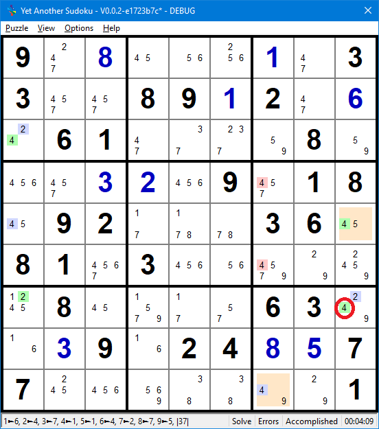

.. title:: Yet Another Sudoku | Foundation | Links and Chains

.. include:: ..\globals.inc

.. _found_link_chains:

****************
Links and Chains
****************

Two CCells that See each other are Linked, and they can be characterised according to how they see 
each other:

*  Weak Links
*  Strong Links

.. _found_lc_weak_links:

Weak Links
==========

A weak link is formed by two ccells A and B, where they are either:

* Two of three or more same valued candidates in a House, or
* Two of three or more candidates in a cell.

.. figure:: images/links-eg1.png
   :name: fig-links-eg1
   :scale: 100%
   :alt: Links Example
   :align: right
   :figwidth: image

   Links Example

Observe that candidate 7 occurs more than twice in this example row 7 of a puzzle.
Notice that:

*  if ``7r7c2`` is True, then none of the same valued Ccells in row 7 can be
   True, however, 
*  if ``7r7c2`` is False, it does not infer state of any other same valued
   Ccell in the row.

This is the defining characteristic of a a Weak Link.

Weak links are indicated by a “-”(dash) between the two Ccells, for example, A-B and conform to the following
inferences:

.. table:: Weak Link Inference Table
   :name: tbl-weak-link-it
   :width: 65%
   :widths: 30 70
   :header-alignment: center left
   :header-columns: 1
   :column-alignment: center left
   :column-dividers: single single none
   :column-wrapping: nn

   ================================================ ================================
   :raw-html:`<mono>A &nbsp;-&nbsp; B</mono>`
   ================================================ ================================
   :raw-html:`<mono>T &nbsp;&rarr;&nbsp; F</mono>`  If A is True then B is False
   :raw-html:`<mono>F &nbsp;&larr;&nbsp; T</mono>`  If B is True then A is False
   :raw-html:`<mono>F &nbsp;&rarr;&nbsp; ?</mono>`  If A is False then B is unknown
   :raw-html:`<mono>? &nbsp;&rarr;&nbsp; F</mono>`  If B is False then A is unknown
   ================================================ ================================

The conclusion drawn from weak link inferences is that if one end is True, the other
end is False, and if the one end is False, the other end can be either True or False.  That is,
both ends can never be simultaneously True, and at least one end is always False.

Ccells see each other through weak links (directly or indirectly — e.g. Weakly Ended Chain).  When
any two Ccells see each other, and the one Ccell is asserted True, the other Ccell must be asserted
False.

.. _found_lc_strong_links:

Strong Links
============

A strong link between two Ccells A and B, exists either:
   *  In a conjugate pair (like ``3r7c23`` in :numref:`fig-links-eg1`), where
      two same valued Ccells are the only same valued Ccells in that house, or
   *  In a Bi-value cell where the two different valued ccells are the only ccells in that cell,
      like ``78r7c4``.

In :numref:`fig-links-eg1` above:

*  If ``3r7c2`` is False, then ``7r7c3`` must be True, as only one of the conjugate pair must be True.
*  if ``3r7c2`` is True, then ``7r7c3`` must be False, as only one of the conjugate pair must be False

Strong links are indicated by a “=” linking the two ccells and obey the following inferences:

.. table:: Strong Link Inference Table
   :name: tbl-strong-link-it
   :width: 65%
   :widths: 30 70
   :header-alignment: center left
   :header-columns: 1
   :column-alignment: center left
   :column-dividers: single single none
   :column-wrapping: nn

   ================================================ =============================
   :raw-html:`<mono>A &nbsp;=&nbsp; B</mono>`
   ================================================ =============================
   :raw-html:`<mono>T &nbsp;&rarr;&nbsp; F</mono>`  If A is True then B is False
   :raw-html:`<mono>F &nbsp;&larr;&nbsp; T</mono>`  If B is True then A is False
   :raw-html:`<mono>F &nbsp;&rarr;&nbsp; T</mono>`  If A is False then B is True
   :raw-html:`<mono>T &nbsp;&larr;&nbsp; F</mono>`  If B is False then A is True
   ================================================ =============================

The conclusion drawn from a Strong Links is that ends always have opposite state.

Any two Strongly Linked Ccells must be of alternate state, therefore:

* if the one end is True the other end is False
* Any third Ccell that can see both Strongly Linked Ccells cannot be True because the Strong link
  guarantees one of its ends to be True.

.. found_lc_chains:

Chains, Loops, and Nets
=======================

Chains
------

A chain is simply a stream of inferences (links).  Starting with an assertion of a premise (state of
a Ccell is True or False) and propagating the inferences from Ccell to Ccell.  It is useful to refer
to Ccells in Chains as Nodes.  Nodes are linked by the logical relationship (inferences) between 
them.  

Links between nodes can either be weak or strong, and inferences between nodes propagate according 
to the link's characteristics.

The only link patterns that propagate in chains are:
   *  concatenated Strong Links forming Strong Link Chains (SLC), and
   *  alternating Strong and Weak Links forming Alternating Inference Chains (AIC).

Concatenating Weak Links cannot propagate because it is impossible to infer the state of a next
node from a False node.

For Alternating Inference Chains to be productive, they must either begin and  end with strong links
or weak links.  This can only be achieved with an even number of Nodes and one 
less Link.  A Strongly linked chain can only have strong ends. The collective propagation of links
The ends of these chains are effectively linked which can lead to eliminations.

Loops
-----

A Node can only be used once in the construction of a chain.  If a node in a chain is encountered a
second time in a chain, then a loop is identified.  The power in loops is their ability to create
a larger collective Truth that leads to eliminations.

Nets
----

A Net is a chain where at least one node is linked to two or more other nodes.  Any node has the 
possibility of seeing other nodes in rows, columns, boxes and the same cell.  Nets propagate out
multiple ends at an exponential rate to a maximum of the forth power.  As each leaf to root is a
chain in its own right, nets are very efficient in seeking chains that yield eliminations.

The fixed alternating True / False nature in both directions makes Strong Linked nets
productive in their own right too.

Indirect Links
==============

A direct link describes the relationship between two nodes that see themselves directly.  An
indirect link describes the relationship between two end nodes of a chain that see each other 
through the inferences of the chain.

Weak Link Patterns
------------------

Consider two end Nodes A and B connected with AI Linked six node Chain, where the end links are Weak.

:raw-html:`

<pre>A - W = X - Y = Z - B</pre>

`

The chain's inferences are described in the following table.

.. table::  :raw-html:`&nbsp;<b><mong>A |-| B</mong></b>:&nbsp;` Weak Link Ended AIC Inference Table
   :name: tbl-we-aic-it
   :width: 80%
   :widths: 60 40
   :header-alignment: center left
   :header-columns: 1
   :column-alignment: center left
   :column-dividers: single single none
   :column-wrapping: nn

   ==================================================================================================================================== ================================
   :raw-html:`<mono>A &nbsp;-&nbsp; W &nbsp;=&nbsp; X &nbsp;-&nbsp; Y &nbsp;=&nbsp; Z &nbsp;-&nbsp; B</mono>`
   ==================================================================================================================================== ================================
   :raw-html:`<mono>T &nbsp;&rarr;&nbsp; F &nbsp;&rarr;&nbsp; T &nbsp;&rarr;&nbsp; F &nbsp;&rarr;&nbsp; T &nbsp;&rarr;&nbsp; F</mono>`  If A is True then B is False
   :raw-html:`<mono>F &nbsp;&larr;&nbsp; T &nbsp;&larr;&nbsp; F &nbsp;&larr;&nbsp; T &nbsp;&larr;&nbsp; F &nbsp;&larr;&nbsp; T</mono>`  If B is True then A is False
   :raw-html:`<mono>F &nbsp;&rarr;&nbsp; ? &nbsp;&rarr;&nbsp; ? &nbsp;&rarr;&nbsp; ? &nbsp;&rarr;&nbsp; ? &nbsp;&rarr;&nbsp; ?</mono>`  If A is False then B is unknown
   :raw-html:`<mono>? &nbsp;&larr;&nbsp; ? &nbsp;&larr;&nbsp; ? &nbsp;&larr;&nbsp; ? &nbsp;&larr;&nbsp; ? &nbsp;&larr;&nbsp; F</mono>`  If B is False then A is unknown
   ==================================================================================================================================== ================================

A WE-AIC has an Even Node count to preserve the weak end link requirement of the chain. If an End
Node is True, the other is False, and if the other end is True, then the first is False.  The chain
identifies a reversible opposing inference relationship (True to False) between the End Nodes.
The ends of WE-AIC behave exactly the same as :ref:`Weak Links <found_lc_weak_links>`.

With an Odd Node count chain, if the one end is True, so is the other.  But the chain is not
reversible. The other starting link is Strong, and a True assertion from that end does not
propagate passed the second link.  This passing forward of the True state in one direction may be
useful.  But it is this reversible opposing inference relationship found in Even Node
Count chains that gives them the same behaviour as Weak Links.  And like weak links, can be used in
the characterisation of Truths.

The symbol :raw-html:`<mono>"|-|"</mono>` describes the indirect linkage of the end Nodes of a 
WE-AIC.  The bars indicating indirectly related end nodes.

.. _found_lc_robust_link_patterns:

Robust Link_patterns
--------------------

Consider two end Nodes A and B connected with AI Linked six node Chain, where the end links are
Strong Links.

:raw-html:`

<pre>A = W - X = Y - Z = B</pre>

`

The chain's inferences are described in the following table.

.. table::  :raw-html:`&nbsp;<b><mong>A |~| B</mong></b>:&nbsp;` Strong Link Ended AIC Inference Table
   :name: tbl-se-aic-it
   :width: 80%
   :widths: 60 40
   :header-alignment: center left
   :header-columns: 1
   :column-alignment: center left
   :column-dividers: single single none
   :column-wrapping: nn

   ==================================================================================================================================== ===============================
   :raw-html:`<mono>A &nbsp;=&nbsp; W &nbsp;-&nbsp; X &nbsp;=&nbsp; Y &nbsp;-&nbsp; Z &nbsp;=&nbsp; B</mono>`
   ==================================================================================================================================== ===============================
   :raw-html:`<mono>T &nbsp;&rarr;&nbsp; F &nbsp;&rarr;&nbsp; ? &nbsp;&rarr;&nbsp; ? &nbsp;&rarr;&nbsp; ? &nbsp;&rarr;&nbsp; ?</mono>`  If A is True then B is unknown
   :raw-html:`<mono>? &nbsp;&larr;&nbsp; ? &nbsp;&larr;&nbsp; ? &nbsp;&larr;&nbsp; ? &nbsp;&larr;&nbsp; F &nbsp;&larr;&nbsp; T</mono>`  If B is True then A is unknown
   :raw-html:`<mono>F &nbsp;&rarr;&nbsp; T &nbsp;&rarr;&nbsp; F &nbsp;&rarr;&nbsp; T &nbsp;&rarr;&nbsp; F &nbsp;&rarr;&nbsp; T</mono>`  If A is False then B is True
   :raw-html:`<mono>T &nbsp;&larr;&nbsp; F &nbsp;&larr;&nbsp; T &nbsp;&larr;&nbsp; F &nbsp;&larr;&nbsp; T &nbsp;&larr;&nbsp; F</mono>`  If B is False then A is True
   ==================================================================================================================================== ===============================

A SE-AIC has an Even node count to preserve the strong end link requirement of the chain.  If an End
Node is False, the other is True, and if the other is False then the first is True.  The chain
identifies a reversible opposing inference relationship (False to True) between the end Nodes.
However, unlike Strong Links, if the one end is True, it is not possible to determine the state of
the other end.  Although the Sudoku literature terms this link Strong, it clearly is not. Here this 
behavior is termed a Robust link.

With an Odd Node count chain, if the one end is False so is the other.  But the chain is not
reversible. The other starting link is Weak and a False assertion from that end does not propagate.
This False to False one way passing forward may be useful.  But it is this reversible opposing
inference relationship found in Even Node count chains that give it the behavior of Robust Links.

The Robust Link symbol :raw-html:`<mono>"|~|"</mono>` describes the indirect linkage of the end 
Nodes of a SE-AIC.  The bars indicating that the end nodes are indirectly related.

Because at least one end of a Robust link is always True, any Ccell, cannot be True and can be 
eliminated.

.. _found_lc_strong_link_patterns:

Strong Links
------------

Chain Patterns are one of Chains, Nets or Loops.

Consider two end Nodes A and B, connected by Strongly Linked six node chain:

:raw-html:`

<pre>A = W = X = Y = Z = B</pre>

`

The end Nodes behave exactly as a Direct Strong Link.  This relationship is indicated with a
:raw-html:`<mono>"|=|"</mono>` symbol to differentiate this Link type from a Direct Strong Link

.. table::  :raw-html:`&nbsp;<b><mong>A |=| B</mong></b>:&nbsp;` Strongly Linked Chain Inference Table
   :name: tbl-slc-it
   :width: 80%
   :widths: 60 40
   :header-alignment: center left
   :header-columns: 1
   :column-alignment: center left
   :column-dividers: single single none
   :column-wrapping: nn

   ==================================================================================================================================== =============================
   :raw-html:`<mono>A &nbsp;=&nbsp; W &nbsp;=&nbsp; X &nbsp;=&nbsp; Y &nbsp;=&nbsp; Z &nbsp;=&nbsp; B</mono>`
   ==================================================================================================================================== =============================
   :raw-html:`<mono>T &nbsp;&rarr;&nbsp; F &nbsp;&rarr;&nbsp; T &nbsp;&rarr;&nbsp; F &nbsp;&rarr;&nbsp; T &nbsp;&rarr;&nbsp; F</mono>`  If A is True then B is False
   :raw-html:`<mono>F &nbsp;&larr;&nbsp; T &nbsp;&larr;&nbsp; F &nbsp;&larr;&nbsp; T &nbsp;&larr;&nbsp; F &nbsp;&larr;&nbsp; T</mono>`  If B is True then A is False
   :raw-html:`<mono>F &nbsp;&rarr;&nbsp; T &nbsp;&rarr;&nbsp; F &nbsp;&rarr;&nbsp; T &nbsp;&rarr;&nbsp; F &nbsp;&rarr;&nbsp; T</mono>`  If A is False then B is True
   :raw-html:`<mono>T &nbsp;&larr;&nbsp; F &nbsp;&larr;&nbsp; T &nbsp;&larr;&nbsp; F &nbsp;&larr;&nbsp; T &nbsp;&larr;&nbsp; F</mono>`  If B is False then A is True
   ==================================================================================================================================== =============================

Because one end of a Strongly Linked Chain is always True, any other Ccell, cannot be True and can 
be eliminated.

However, an SL Pattern requires a straight traversal of at least 4 links for a Ccell to potentially
see two links of opposing polarity in the Net.

.. _found_cc_sl_masq_as_wl:

Strong Links Masquerading as Weak
=================================

Strong links possesses all the attributes of a Weak Link.  That is if one end is
True, the other is False.  Therefore, it is possible to substitute a Strong Link for a
Weak Link to identify patterns.

Weak links do not possess the link attributes of Strong Links.  That is if one end is
False, it is impossible to determine the state of the other end. Therefore, it is not possible to
substitute a Weak Link for a Strong or Robust Link.

When a Strong link is substituted for a weak link, it is masquerading as a Weak link.
The ``~`` symbol is used to indicate a masqueraded weak link.

.. found_lc_cannibalism:

Cannibalistic Eliminations
==========================

A cannibalistic elimination is where the identified condition (say both ends of a Strong AI chain)
results in the eliminations that break the identifying pattern (say interior links of the chaing)

Does a cannibalistic elimination also break the condition?  To answer this we need to distinguish 
between the condition and the pattern used to identify the condition.  

The condition is the state(s) of Ccell(s) in relation to the state(s) of other Ccell(s).  This
is consistent irrespective of how the condition was found.

The pattern, in contrast, is a tool used to find the condition.  The pattern is evident because of
the current organisation of Ccells, and may not have been apparent in prior solving steps, or be
apparent in following solving steps.

It is the condition that drives the pattern, not the pattern driving the condition.  The condition
exists irrespective of the pattern.

If a discovered condition results in the elimination of Ccells that break that pattern, the 
condition still exists, even though the pattern does not.

Therefore, patterns such as AI Chains can be cannibalistic and consume their interior links.

   Cannibalistic AI Chain Example

   :raw-html:`<mong>9.+8...+1.33..89+12.+6.61....8...+3+2.9.18.92...36.81.3......8....63..+39.24+8+577.......1|r1c2-=5;r1c4-=67;r1c5-=47;r1c6-=7;r3c1-=5;r3c4-=5;r3c5-=45;r3c6-=5;r3c7-=47;r3c9-=4;r4c5-=7;r5c4-=45;r5c5-=45;r5c6-=5;r6c5-=7;r6c6-=7;r6c8-=47;r7c5-=5;r9c5-=56;r9c6-=56;r9c8-=4|AI-Chain T1||4r5c9=4r5c1-4r3c1=2r3c1~2r7c1=2r7c9-4r7c9=4r9c7,4r5c9~4r7c9=4r9c7|r4c7-=4;r6c7-=4;r7c9-=4|9+2+8+4+6+5+1+733+7+589+12+4+6+461+7+3+2+98+5+6+4+3+2+59+718+592+1+7+836+481+73+4+6+5+9+2+28+4+5+1+763+9+1+39+624+8+577+5+6+9+8+3+4+21</mong>`

The AI Chain ``4r5c9=4r5c1-4r3c1=2r3c1~2r7c1=2r7c9- 4r7c9=4r9c7,4r5c9~4r7c9=4r9c7``
identifies the Robust link ``4r5c9|~|4r9c7``.  The Ccells that see both ends of this Robust
link, can be eliminated are ``r4c7-=4``, ``6c7-=4``, and ``r7c9-=4``.
<Mong4r7c9</mong>,the second last link of the AI-Chain gets consumed.`

Source: https://www.youtube.com/c/SudokuSwami

|
|
|
|
|
|
|
