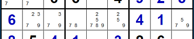

.. title:: Yet Another Sudoku | Foundation | Links and Chains

.. include:: ..\globals.inc

.. _found_link_chains:

****************
Links and Chains
****************

Two CCells that See each other are Linked, and they can be characterised according to how they see 
each other:

*  Weak Links
*  Strong Links
*  Robust Links

.. _found_weak_links:

Weak Links
----------

A weak link is formed by two ccells A and B, where they are either:

* Two of three or more same valued candidates in a House, or
* Two of three or more candidates in a cell.

   Links Example

Observe that candidate 7 occurs more than twice in this example row 7 of a puzzle.
Notice that:

*  if ``7r7c2`` is True, then none of the same valued Ccells in row 7 can be
   True, however, 
*  if ``7r7c2`` is False, it does not infer state of any other same valued
   Ccell in the row.

This is the defining characteristic of a a Weak Link.

Weak links are indicated by a “-”(dash) between the two Ccells, for example, A-B and conform to the following
inferences:

.. table:: Weak Link Inference Table
   :name: tbl-weak-link-it
   :width: 65%
   :widths: 30 70
   :header-alignment: center left
   :header-columns: 1
   :column-alignment: center left
   :column-dividers: single single none
   :column-wrapping: nn

   ================================================ ================================
   :raw-html:`<mono>A &nbsp;-&nbsp; B</mono>`
   ================================================ ================================
   :raw-html:`<mono>T &nbsp;&rarr;&nbsp; F</mono>`  If A is True then B is False
   :raw-html:`<mono>F &nbsp;&larr;&nbsp; T</mono>`  If B is True then A is False
   :raw-html:`<mono>F &nbsp;&rarr;&nbsp; ?</mono>`  If A is False then B is unknown
   :raw-html:`<mono>? &nbsp;&rarr;&nbsp; F</mono>`  If B is False then A is unknown
   ================================================ ================================

The conclusion drawn from weak link inferences is that if one end is True, the other
end is False, and if the one end is False, the other end can be either True or False.  That is,
both ends can never be simultaneously True, and at least one end is always False.

Ccells see each other through weak links (directly or indirectly — e.g. Weakly Ended Chain).  When
any two Ccells see each other, and the one Ccell is asserted True, the other Ccell must be asserted
False.

.. _found_cc_strong_links:

Strong Links
------------

A strong link between two Ccells A and B, exists either:
   *  In a conjugate pair (like ``3r7c23`` in :numref:`fig-links-eg1`), where
      two same valued Ccells are the only same valued Ccells in that house, or
   *  In a Bi-value cell where the two different valued ccells are the only ccells in that cell,
      like ``78r7c4``.

In :numref:`fig-links-eg1` above:

*  If ``3r7c2`` is False, then ``7r7c3`` must be True, as only one of the conjugate pair must be True.
*  if ``3r7c2`` is True, then ``7r7c3`` must be False, as only one of the conjugate pair must be False

Strong links are indicated by a “=” linking the two ccells and obey the following inferences:

.. table:: Strong Link Inference Table
   :name: tbl-strong-link-it
   :width: 65%
   :widths: 30 70
   :header-alignment: center left
   :header-columns: 1
   :column-alignment: center left
   :column-dividers: single single none
   :column-wrapping: nn

   ================================================ =============================
   :raw-html:`<mono>A &nbsp;=&nbsp; B</mono>`
   ================================================ =============================
   :raw-html:`<mono>T &nbsp;&rarr;&nbsp; F</mono>`  If A is True then B is False
   :raw-html:`<mono>F &nbsp;&larr;&nbsp; T</mono>`  If B is True then A is False
   :raw-html:`<mono>F &nbsp;&rarr;&nbsp; T</mono>`  If A is False then B is True
   :raw-html:`<mono>T &nbsp;&larr;&nbsp; F</mono>`  If B is False then A is True
   ================================================ =============================

The conclusion drawn from a Strong Links is that ends always have opposite state.

Any two Strongly Linked Ccells must be of alternate state, therefore:

* if the one end is True the other end is False
* Any third Ccell that can see both Strongly Linked Ccells cannot be True because the Strong link
  guarantees one of its ends to be True.

.. _found_cc_robust_links:

Robust Links
------------

Robust links are links derived from other structures such as (but not limited to) Alternating Inference
Chains.  Robust link inferences are opposite to Weak Links.  Robust links are indicated with a
"\|\~|" where the outer bars indicate that this link is derived/indirect resulting from another
structure.

.. table:: Robust Link Inference Table
   :name: tbl-robust-link-it
   :width: 65%
   :widths: 30 70
   :header-alignment: center left
   :header-columns: 1
   :column-alignment: center left
   :column-dividers: single single none
   :column-wrapping: nn

   ================================================ ===============================
   :raw-html:`<mono>A |~| B</mono>`
   ================================================ ===============================
   :raw-html:`<mono>T &nbsp;&rarr;&nbsp; ?</mono>`  If A is True then B is unknown
   :raw-html:`<mono>? &nbsp;&larr;&nbsp; T</mono>`  If B is True then A is unknown
   :raw-html:`<mono>F &nbsp;&rarr;&nbsp; T</mono>`  If A is False then B is True
   :raw-html:`<mono>T &nbsp;&rarr;&nbsp; F</mono>`  If B is False then A is True
   ================================================ ===============================

The conclusion drawn from Robust Link Inferences is that if the one end is False, the other end is
True, and if the one end is True, the other end can be either True or False.  That is, both ends can
never be simultaneously False, at least one end is always True.  But if one end is asserted True, it
is impossible to determine the state of the other end with a Robust link.

Any third Ccell that can see both ends of a Robust Link cannot be True, because at least one end is
True.

.. _found_cc_sl_and_rl_masq_as_wl:

Strong and Robust Links Masquerading as Weak
--------------------------------------------

Strong and Robust links possesses all the link attributes of a Weak Link.  That is if one end is
True, the other is False.  Therefore, it is possible to substitute a Strong or Robust Link for a
Weak Link to identify patterns.

Weak links do not possess the link attributes of Strong or Robust Links.  That is if one end is
False, it is impossible to determine the state of the other end. Therefore, it is not possible to
substitute a Weak Link for a Strong or Robust Link.

When a Strong or Robust link is substituted for a weak link, it is masquerading as a Weak link.
The ``~`` symbol is used to indicate a masqueraded weak link.

.. _found_cc_truth:
