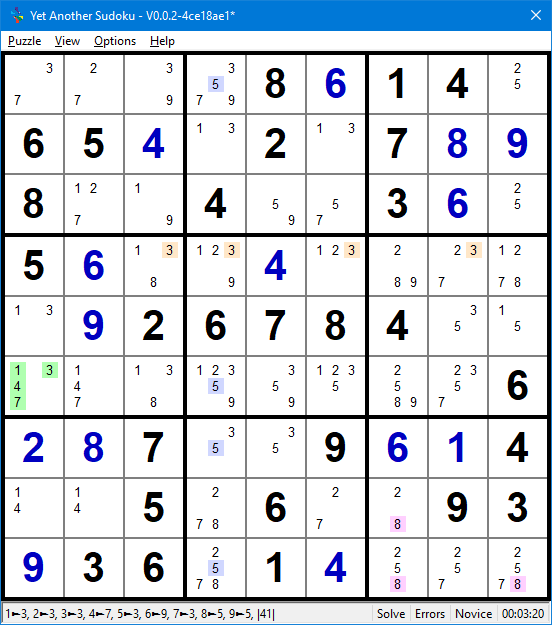

.. title:: Yet Another Sudoku | Foundation | Truth, Sets and Fish

.. include:: ..\globals.inc

.. _found_truth_sets_fish:

********************
Truth, Sets and Fish
********************

.. _found_tsf_truth:

Truths
======

A Truth is a Set of :term:`Ccell`\s in a :term:`Chouse` that see each other.  One of the Ccells in
any truth Set is True, that is the solved value for that :term:`Cell`.

   Truths

   :raw-html:`<mong>....8+614.65+4.2.7+8+98..4..3+6.5+6..+4.....+926784..........6+2+87..9+6+14..5.6..93+936.1+4...|r3c6-=1|Pointing Locked Single||3r1c13,!-b2|r1c4-=3|+7+2+3+98+614+565+4+32+17+8+98+1+94+5+73+6+25+6+1+2+4+3+9+7+8+3+926784+5+1+4+7+8+1+9+5+2+36+2+87+5+39+6+14+1+45+76+2+893+936+81+4+5+2+7</mong>`

Truth Examples:

*  In Row 4, ``3r4c3468`` is all cells containing candidate 3.
*  In Column 4, ``5r1679c4`` is all the cells containing 5.
*  In Box 9,  ``8b9p479`` is all the cells in box 9 containing 8.
*  In Cell ``r6c1``, ``1347r6c1`` is all the possible values in that cell.

|
|
|
|
|
|
|
|

Sets
====

**See**
   :term:`Ccell`\s that have an :term:`Link` between them are said to see each other.

**Set**
   A collection of :term:`Ccell`\s that :term:`See` each other in a :term:`Chouse`.
   
**Truth**
   A collection of :term:`Ccell`\s that :term:`See` each other in a :term:`Chouse` where one of 
   the Ccells is True, that is the :term:`Solved Value`.

**Base Set**
   A Base Set is a :term:`Set` of one or more :term:`Ccell`\s in a :term:`Chouse` forming a 
   :term:`Truth`.

**Link Set**
   A :term:`Set` of one or more :term:`Ccell`\s in a non-:term:`Base Set` :term:`Chouse` that are 
   in any Base Set.

**Cover Set**
   A Cover Set is a :term:`Set` of all the :term:`Ccell`\s that :term:`See` each other in the 
   :term:`Chouse` of a :term:`Link Set`.

A Set pattern comprises 'n' non-intersecting Base Sets where Ccells in the union of Base Sets, are
intersected by Link Sets. If the number of Base Sets = the number of Link Sets then every Base Set
Truth can be seen in a Link Set, thus locking the patterns making the whole pattern a Collective 
Truth.  Ccell that are not part of the intersection in any Cover Set cannot be True and are eliminated.

Subsets
=======

Subsets refer to 'n' cell by 'n' candidate grouping, where each cell in the grouping contains between
2 and 'n' of the candidates. 'n' ranges between 2 and 4, (pairs, triples and quads).  For values
of “n” > 4, a reciprocal subset relationship of 9 – 'n' candidate values exists, so it is
unnecessary to look for subsets larger than 4.

.. _found_subs_exposed_hidden:

Exposed or Hidden
-----------------

Subsets can be Exposed or Hidden:

*  An exposed subset is where 'n' candidate values are the only values occurring between 2 and 'n' times in the 'n' cells.
*  A hidden subset is where 'n' candidate values can are confined to 'n' cells, but are not
   necessarily the only candidates in those cells.

.. _found_subs_str_or_bent:

Straight or Bent
----------------

Subsets can be Straight or Bent:

*  A Straight Subset, simply called a "Subset", refers to a collection of 'n' Candidates in 'n'
   Cells in a single :term:`House`.
*  A "Bent Subset" is a collection of 'n' Candidates in 'n' Cells spanning the union of two
   :term:`House`\s with at least one candidate in the intersection.

.. _found_str_subs:

Straight Subsets
----------------

In :ref:`Straight Exposed Subsets <hsp_subsets>`, the 'n' candidates can each only be True in one of
the 'n' cells in a :term:`House` they occupy.  That is the n Candidates are a :term:`Truth` for 
those n cells. Therefore, they cannot be True outside those 'n' cells.  Any occurrence of those 'n'
candidates outside the 'n' cells can be eliminated.

In :ref:`Straight Hidden Subsets <hsp_subsets>`, the 'n' candidates are confined to only 'n' cells 
in a Group, forming a :term:`Truth`.  Because of this 'Truth', any other candidates in those four 
cells can be eliminated.

:ref:`Base Sets and Cover Sets <found_blc_sets>` develops an algebra to verify the logic of
these Subset patterns.

See :ref:`Human Solvable Patterns / Subsets <hsp_subsets>` for worked examples of Exposed and
Hidden - Pairs, Triples and Quad (Unbent) Subsets.

.. _found_bent_subs:

Bent Subsets
------------

These patterns comprise 'n' candidates in 'n' Cells with 2 to 'n' candidates in each cell spanning
two intersecting :term:`House`\s with at least one cell in the intersection.  Bent Exposed Subsets 
can only have one :term:`Unrestricted Candidate` to be viable, the remaining candidates being
:term:`Restricted Candidate`\s.

Candidates can be exposed or hidden in either house.

Bent Subsets where candidates are exposed in both houses are often called Wings.  The smallest
of these being Y-Wings and XYZ Wings (collectively termed Bent Exposed Triples) with one part of the
pattern in either house and the third in the intersection of both houses locking the pattern.

These patterns are a special case of :ref:`Nearly Locked Sets <found_tsf_nls>`, where two
:term:`ULS`\s are linked in a chain with a single :term:`Unrestricted Candidate`.  Bent Exposed
Subsets have a relatively high probability of occurrence in puzzles and are relatively easier to
master than the more complex Unlocked Sets, :term:`YMMV`.

.. _found_rest_unrest_cands:

Restricted and Unrestricted Candidates
++++++++++++++++++++++++++++++++++++++

A :term:`Restricted Candidate` is one where all instances of its value in a pattern can see each
other.  An :term:`Unrestricted Candidate` is one where all its instances of its value do not see
each other.

A Bent Exposed subset must have only one Unrestricted Candidate to be viable.  The other Candidates
are all Restricted.  The Unrestricted Candidate must have an instances in :term:`Pattern Cell`\s of
both :term:`House`\s outside the intersection and may have instances in Pattern Cells in the Intersection.
The Restricted Candidates are only present in pattern cells in that are fully in one :term:`House`
or the other.

The Unrestricted Candidate can be True in at least one or both Houses, but can never
be False in both.  Therefore, any Ccell outside the pattern that can see all Unrestricted Candidate
instances in the Cell Pattern cannot be True, resulting in their elimination.

.. _found_tsf_nls:

Nearly Locked Sets
==================

FIXUP Take from all the notes from ALS, ULS in sudoku.odt. Conceptual stuff here, details and examples
in  :ref:` Patterns <hsp_nls>`

Fish
====

Fish are single Candidate :ref:`Base Set / Cover Set <found_blc_sets>` patterns where both
Base Sets and Cover Sets are :term:`House`\s.

Fish are named according to their Base Set count:
   *  2: X-Wing
   *  3: Swordfish
   *  4: Jellyfish.

Every Fish with a Base Set count 'n' has a reciprocal Fish pattern exists of count 9 - 'n', thus,
making it unnecessary to look for Base Set counts greater than 4.

Consider a single candidate value X, where X is a number between 1 and 9. Fish pattern is made up of:
    * 'n' non-intersecting Houses containing between 2 and 'n' instances of X as the Bases,
    * where all instances of X in each Base Set :term:`Link`\s to another instance of X in another Base Set.
    * The houses containing these links form the Cover Sets.
    * From :ref:`Base Sets and Cover Sets <found_blc_sets>` above, we have shown that any
      instance of X in the Cover Sets that is not part of the intersection is not part of the
      :term:`Truth`, and can be eliminated.

Basic Fish patterns have either row Base Sets and column Cover Sets or vise-versa.

Fish may be degenerate. Often it is possible to eliminate of candidates from these
degenerate fish.  Finned Fish have an extra Ccell or two in one of the Base Sets.  Sashimi fish are
missing a Ccell in one of the Base Sets.  Finned Sashimi fish have an extra Ccell in
one Base Set and are missing Ccell in another Base Set.

Fraken and Mutant Fish are more complex Fish patterns. Fraken Fish have one or more Box Base Sets.
Mutant fish have a combination of non-intersecting row, column and box Base
Sets. In both Franken and Mutant Fish, Cover Sets can be in any House type.  Fraken and Mutant fish
can be degenerate too (Finned and or Sashimi).

Kraken Fish, are degenerate fish where eliminatable candidates in the Cover Sets see all
the fins with :term:`AIC` chains if it cannot see them directly.

Franken, Mutant, and Kraken Fish border on what is considered human solvable.
