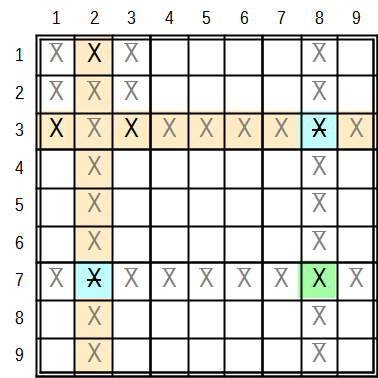

.. title:: Yet another Sudoku | Human Solvable Patterns | Singles

.. include:: ..\globals.inc

=======
Singles
=======

Basic Solving Without Pencil Marks
----------------------------------

Many good sites that describe these techniques better than me rehashing the information here:
   |  `Paul's Pages <https://paulspages.co.uk/sudokuxp/howtosolve/#Starting>`_
   |  `Kristanix <https://www.kristanix.com/sudokuepic/sudoku-solving-techniques.php>`_
   |  `Sudocue <https://www.sudocue.net/guide.php#squeezing>`_
   |  `Google Search: Solving without Pencil Marks <https://www.google.com/search?q=sudoku+solving+without+pencil+marks>`_
   |  `Google Search: Sudoku Cross Hatch <https://www.google.com/search?q=sudoku+cross+hatch>`_

.. _hsp_sing_exp:

Exposed Singles
---------------

`Hodoku <http://hodoku.sourceforge.net/en/tech_singles.php#n1>`__ provides a good explanation of
Exposed Singles.

.. _hsp_sing_hid:

Hidden Singles
--------------

`Hodoku <http://hodoku.sourceforge.net/en/tech_singles.php#h1>`__, provides a good explanation of
Hidden Singles

.. _hsp_sing_locked:

Locked Singles
--------------

Pointing Locked Candidates
++++++++++++++++++++++++++

`Hodoku <http://hodoku.sourceforge.net/en/tech_intersections.php#lc1>`__ provides a good explanation
of Pointing Locked Candidates.

Claiming Locked Candidates
++++++++++++++++++++++++++

`Hodoku <http://hodoku.sourceforge.net/en/tech_intersections.php#lc2>`__, provides a good explanation
of Claiming Locked Candidates.

Empty Rectangles
----------------

Empty Rectangles are a special case of :ref:`Mutant X-Wings <hsp_fish_mut_fish>`  They can also be
found by noticing 3 to 5 same value candidates in a box that describe both a row
and a column.

.. _fig-empty-rect-cd1:

   Empty Rectangle Pattern

In :numref:`fig-empty-rect-cd1`, the three X candidates in box 1 describe row 3 and column 2.

X can only be True once in Box 1, **therefore**:

*  If Xr1c2 is True then:

   *  X cannot be True anywhere else along column 2, and
   *  Xr3c13 cannot be True in the box either, X is True somewhere along row 3 outside box 1.
   *  If an X is found along column 2, such as Xr7c2, and if it forms a strong link with another
      candidate X along row 7 outside of tower 1, such as Xr7c8; then because Xr7c2 cannot be True,
      Xr7c8 must be True, and if Xr7c8 is True, Xr3c8 cannot be True.

*  If Xr1c2 is False then:

   *  Either Xr3c1 or Xr3c3 is True, ensuring that The Truth does not lie along row 3 outside box 1

*  Therefore, irrespective whether Xr1c2 is True or not, if Xr7c28 are strongly linked then Xr3c8 cannot
   be True and can be eliminated.

**Similarly**:

*  If Xr3c13 is a truth then:

   *  X cannot be True anywhere else along row 3, and
   *  Xr1c2 cannot be True in the box either, X is True somewhere along column 2 outside box 1.
   *  Where an X is found along row 3, such as Xr3c8, and it forms a strong link with another
      candidate X along column 8 outside of floor 1, such as Xr7c8, then
      because Xr3c8 cannot be True, Xr7c8 must be True, and if Xr7c8 is True, Xr7c2 cannot be 'The Truth'
      along column 2.

*  If both Xr3c13 are False then:

   *  Xr1c2 is True, ensuring that The Truth does not lie along column 2 outside box 1

*  Therefore, irrespective whether Xr3c13 is 'A Truth' or not, if Xr37c8 are strongly linked then Xr8c2 cannot
   be True and can be eliminated.

A box with two same value candidates can be resolved as an Empty Rectangle, however these patterns overlap
with Turbot Fish and Grouped X Chains.  Of these three patterns, a Turbot Fish is the easiest to resolve.
