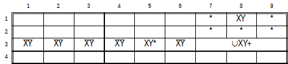

.. title:: Yet another Sudoku | Human Solvable Patterns | Bent Subsets

.. include:: ..\globals.inc

.. _hsp_bent_subsets:

************
Bent Subsets
************

 FIXME    change all <mong> to `` in text, not figure blocks.

Bent Subsets are a family of subsets where the grouping 'n' candidates in 'n' cells spans the union
of two :term:`House`\s with at least one candidate in the intersection.  The two Houses can either be a
:term:`Line` and a :term:`Box`, or two lines.

.. _hsp_bent_exposed_subsets:

Bent Exposed Subsets
====================

These patterns are formed by 'n' Candidate values in 'n' Cells across the :term:`Union` of two
Groups where each Cell contains between 2 and 'n' Candidates values and at least one cell lies in
the :term:`Intersection` of the two :term:`House`\s.

Bent Exposed Subsets belong to the larger family of :ref:`Nearly Locked Sets <found_tsf_nls>`
patterns.  However, it is simpler to treat these patterns as Bent Exposed Sets rather than Unlocked
Sets.

Bent Exposed_Triples
--------------------

Bent Exposed triples are known by their other popular names, Y-Wings (or XY-Wing), and XYZ-Wings.
These two patterns are the only variants of Bent Exposed Triples.  Bent Exposed Triples comprise
3 Candidates in 3 Cells spanning two intersecting Houses with one Pattern Cell in the intersection.

.. _hsp_y_wings:

Y-Wings
+++++++

.. figure:: images/y-wing-eg1.png
   :name: fig-y-wing-eg1
   :scale: 100%
   :alt: Y-Wing (Column / Box) Example
   :align: right
   :figwidth: 359px

   Y-Wing (Column / Box) Example

   :raw-html:`<mong>9..+24.....+5.6+9.+231.2..+5..9..+9.7..+32...29356.+7.7...2+9...6+9.+2..7351..+79.+6+2+2.+7.8+6..9|r1c7-=8;r3c1-=4;r3c3-=4;r3c4-=3;r3c7-=8;r4c6-=1;r6c4-=1;r9c8-=1|Y-Wing||38==r1c2,34==r9c2,48==r7c1|r2c1-=8;r3c1-=8|9+3+1+24+7+5+8+6+7+5+46+9+8+231+62+8+1+5+3+79+4+1+9+57+6+4+32+8+4+829356+1+7+37+6+8+12+9+4+5+86+9+5+2+1+47351+3+4+79+8+6+2+2+4+7+38+6+1+59</mong>`

Courtesy of `SudokuWiki <https://www.sudokuwiki.org/Y_Wing_Strategy>`__, this interesting puzzle
solves with five consecutive Y-Wings, starting with
:raw-html:`<mong>38==r1c2,34==r9c2,48==r7c1</mong>` where Column 2 intersects Box 7, the Unrestricted
Candidate is 8 and the two restricted candidates are 3 and 4.  The Ccells that can see all instances
of the Unrestricted Candidate 8 in the pattern are r2c1-=8 and r3c1-=8, resulting in their
elimination.

|
|
|
|
|
|
|
|
|
|
|

.. figure:: images/y-wing-eg2.png
   :name: fig-y-wing-eg2
   :scale: 100%
   :alt: Y-Wing (Row / Column) Example
   :align: right
   :figwidth: 359px

   Y-Wing (Row / Column) Example

   :raw-html:`<mong>9..+24.....+5.6+9.+231.2..+5..9..+9.7..+32...29356.+7.7...2+9...6+9.+2..7351..+79.+6+2+2.+7.8+6..9|r1c7-=8;r2c1-=8;r3c1-=48;r3c3-=4;r3c4-=3;r3c7-=8;r4c6-=1;r6c4-=1;r9c8-=1|Y-Wing||47==r2c1,78==r2c6,48==r4c6|r4c1-=4|9+3+1+24+7+5+8+6+7+5+46+9+8+231+62+8+1+5+3+79+4+1+9+57+6+4+32+8+4+829356+1+7+37+6+8+12+9+4+5+86+9+5+2+1+47351+3+4+79+8+6+2+2+4+7+38+6+1+59</mong>`

The next Y-Wing, :raw-html:`<mong>47==r2c1,78==r2c6,48==r4c6|r4c1-=4|</mong>`, Row 2 intersects
Column 6, 4 is the Unrestricted Candidate with 7 and 8 restricted. Only one Ccell, 4r4c1 sees both
instances of the Unrestricted Candidate, 4r2c1 and 4r4c6, resulting in its elimination.

It is left as a challenge to the reader to solve the remaining 3 Y-Wings.

|
|
|
|
|
|
|
|
|
|

.. _hsp_xyz_wings:

XYZ-Wings
+++++++++

   XYZ-Wing Example

   :raw-html:`<mong>+673.+8.+2.9514.92..+3+9+82.....+5+167+359..28.+9.1.53+6..+5+8..+7+9+1..+614.9+2+8..+1..835+4..+8...1+67||XYZ-Wing||467==r3c4,46==r3c7,67==r2c4|r3c5-=6;r3c6-=6|+673+5+8+1+2+49514+692+8+7+3+9+82+4+7+3+6+1+5+167+359+4+828+2+9+71+453+6+4+3+5+8+2+6+7+9+1+3+5+614+79+2+8+7+9+1+2+6835+4+2+4+8+9+3+51+67</mong>`

XYZ-Wing :raw-html:`<mong>467==r3c4,46==r3c7,67==r2c4</mong>` is found in the puzzle example
:numref:`fig-xyz-wing-eg1`. 6 is the Unrestricted Candidate present in all three cells. Both Ccells
6r3c5 and 6r3c6 see all three instances of the Unrestricted Candidate resulting in their
elimination.

|
|
|
|
|
|
|
|
|
|
|
|
|
|

.. _hsp_bequads:

Bent Exposed Quads
------------------

.. figure:: images/beq-eg1.png
   :name: fig-beq-eg1
   :scale: 100%
   :alt: Bent Exposed Quad Example 1
   :align: right
   :figwidth: 359px

   Bent Exposed Quad Example 1

   :raw-html:`<mong>+841.....+5+5+2+3.....9+7+965.8.+1+33+6+7+4+51+928+4158+9273+698+26..+5+41+6+5.3.41..2+3...+5...+1+7....35.|r7c5-=8;r7c8-=7;r8c5-=6;r8c7-=4;r8c8-=7|Bent Exposed Quad||2367==r1c5,37==r6c5,27==r7c5,67==r2c6;7r2c5-\7(r1c5,r6c5,r7c5,r2c6)|r2c5-=7|+841+2+3+9+6+7+5+5+2+3+1+6+7+4+89+7+965+48+2+1+33+6+7+4+51+928+4158+9273+698+26+7+3+5+41+6+5+83+241+9+72+3+9+7+1+5+8+6+4+1+7+4+9+8+635+2</mong>`

:numref:`fig-beq-eg1` solves two consecutive BEQs. The first BEQ is.
:raw-html:`<mong>2367==r1c5,37==r6c5,27==r7c5,67==r2c6;7r2c5-\7(r1c5,r6c5,r7c5,r2c6)</mong>`. 7 is
the only Unrestricted Candidate in this Column 5 / Box 2 Intersecting pattern, 7r2c5 is the only
Ccell that sees all instances of the Unrestricted Candidate resulting in its elimination.

|
|
|
|
|
|
|
|
|
|
|
|

.. figure:: images/beq-eg2.png
   :name: fig-beq-eg2
   :scale: 100%
   :alt: Bent Exposed Quad Example 2
   :align: right
   :figwidth: 359px

   Bent Exposed Quad Example 2

   :raw-html:`<mong>+841.....+5+5+2+3.....9+7+965.8.+1+33+6+7+4+51+928+4158+9273+698+26..+5+41+6+5.3.41..2+3...+5...+1+7....35.|r2c5-=7;r7c5-=8;r7c8-=7;r8c5-=6;r8c7-=4;r8c8-=7|Bent Exposed Quad||67==r2c6,69==r9c6,27==r7c5,29==r9c4;7r1c5-\7(r2c6,r7c5)|r1c5-=7|+841+2+3+9+6+7+5+5+2+3+1+6+7+4+89+7+965+48+2+1+33+6+7+4+51+928+4158+9273+698+26+7+3+5+41+6+5+83+241+9+72+3+9+7+1+5+8+6+4+1+7+4+9+8+635+2</mong>`

The second BEQ is shown in :numref:`fig-beq-eg2` is:
:raw-html:`<mong>67==r2c6,69==r9c6,27==r7c5,29==r9c4;7r1c5-\7(r2c6,r7c5)</mong>`.  7, again, is the
only Unrestricted Candidate in this Column 6 / Box 8 Intersecting pattern. 7r1c5 is the only Ccell
that sees all instances of the Unrestricted Candidate resulting in its elimination.

Notice that All the cells in this pattern are Bi-Value cells, making this a Minimal BEQ.  This
puzzle can also be resolved as an XY-Chain:
:raw-html:`<mong>(7=6)r2c6-(6=9)r9c6-(9=2)r9c4-(2=7)r7c5,7r7c5-7r1c5-7r7c5</mong>`

|
|
|
|
|
|
|

.. figure:: images/beq-eg3.png
   :name: fig-beq-eg3
   :scale: 100%
   :alt: Bent Exposed Quad Example 3
   :align: right
   :figwidth: 359px

   Bent Exposed Quad Example 3

   :raw-html:`<mong>6.......+85..9.+8..782...1.3.34.2.9.8.+2...8.+3..+18.3.7.25+75.4...929....5..4+4...+9...3|r1c2-=13;r1c7-=49;r3c3-=9;r4c5-=6;r4c7-=1;r5c2-=6;r5c4-=6;r5c8-=1;r5c9-=6;r7c3-=6;r8c3-=6;r9c3-=6|Bent Exposed Quad||79==r5c2,15==r5c4,19==r5c9,57==r1c4;7r1c2-\7(r5c2,r1c4)|r1c2-=7|6+9+3+7+2+4+1+5+85+1+49+3+8+2+6782+7+6+51+43+934+52+19+78+6+2+7+9+58+6+3+4+1+18+63+47+925+75+14+6+3+8929+3+2+8+75+6+14+4+6+8+1+9+2+5+73</mong>`

The BEQ: :raw-html:`<mong>79==r5c2,15==r5c4,19==r5c9, 57==r1c4;7r1c2-\7(r5c2,r1c4)</mong>`
in :numref:`fig-beq-eg3` has Row 5 and column 4 intersect with only one Cell with r5c4 in the
intersection.  Coincidently, 7 is the Unrestricted Candidate, in this Minimal BEQ. 7r1c2 is the
only Ccell outside the pattern that can see all Unrestricted Candidates in the intersection
resulting in its elimination.

Because this BEQ is Minimal it is also resolved as an XY-Chain:
:raw-html:`<mong>(7=5)r1c4-(5=1)r5c4~(1=9)r5c9-(9=7)r5c2,7r1c4-7r1c2-7r5c2</mong>`

Another XY-Chain exists
:raw-html:`<mong>(9=7)r1c2-(7=5)r1c4-(5=1)r5c4-(1=9)r5c9,9r5c9-9r5c2~9r5c9</mong>`

|
|
|
|
|

.. _hsp_bequints:

Bent Exposed Quints
-------------------

   Bent Exposed Quint Example

   :raw-html:`<mong>+34..+6.27.+286......1.+7..+2...+6...5....5+7.21+693..+21.9..567+6..3549.9...........6.+9..3|r1c4-=1;r2c4-=1;r2c9-=4;r3c4-=8;r3c7-=8;r3c9-=4;r4c3-=48;r4c4-=3;r4c6-=3;r4c8-=4;r8c3-=28;r8c6-=1;r8c8-=2;r8c9-=8;r9c5-=8;r9c8-=8|Bent Exposed Quint||1589==r1c9,159==r2c9,589==r3c9,128==r7c9,12==r9c8;1r8c9-\1(r1c9,r2c9,r7c9,r9c8)|r8c9-=1|+34+5+9+6+827+1+286+5+7+1+3+4+91+9+7+3+4+2+6+8+5+6+3+9+85+4+1+2+75+7+821+693+4+4+21+79+3+8567+6+2+13549+89+1+3+4+8+7+5+6+2+8+5+46+2+9+7+13</mong>`

The Bent Exposed Quint
:raw-html:`<mong>1589==r1c9, 159==r2c9, 589==r3c9, 128==r7c9, 12==r9c8;1r8c9-\1(r1c9,r2c9,r7c9,r9c8)</mong>` in
:numref:`fig-bequint-eg1` spans Column 9 and Box 9. 1 is the Unrestricted Candidate and only Ccell 1r8c9 sees all
instances of this Unrestricted Candidate.

|
|
|
|
|
|
|
|
|
|
|
|
|
|

.. _hsp_besexts:

Bent Exposed Sexts
------------------

.. figure:: images/besext-eg1.png
   :name: fig-besext-eg1
   :scale: 100%
   :alt: Bent Exposed Sext Example
   :align: right
   :figwidth: 359px

   Bent Exposed Sext Example

   :raw-html:`<mong>+54.........72+4.5..9.....+463...964.....5...+6........1.281...7........5+7867+5.3.....|r1c3-=26;r1c4-=7;r1c5-=7;r2c6-=6;r3c4-=18;r3c5-=18;r5c1-=12;r5c2-=2;r6c3-=6;r6c8-=5;r7c3-=3;r9c5-=1;r9c6-=1|Bent Exposed Sext||289==r9c5,2689==r9c6,29==r9c7,1249==r9c8,149==r9c9,46==r7c4;(4r7c8,4r7c9)-\4(r9c8,r9c9,r7c4)|r7c8-=4;r7c9-=4|+54+1+8+3+6+9+2+7+6+372+4+95+1+89+2+8+7+5+1+463+1+7+2964+8+3+5+3+85+1+7+2+6+9+4+4+6+9+5+8+31+7281+4+6+27+3+5+9+2+9+3+4+15+7867+5+63+9+8+2+4+1</mong>`

The Bent Exposed Sext
:raw-html:`<mong>289==r9c5, 2689==r9c6, 29==r9c7, 1249==r9c8, 149==r9c9,46==r7c4;(4r7c8,4r7c9)-\4(r9c8,r9c9,r7c4)</mong>`
in :numref:`fig-besext-eg1` spans Row 9 and Box 8. 4 is the Unrestricted Candidate and Ccells 4r7c8
and 4r7c9 see all instances of this Unrestricted Candidate.

|
|
|
|
|
|
|
|
|
|
|
|

.. _hsp_grouped_bent_subsets:

Grouped Bent Subsets
====================

Sources:
   |  http://forum.enjoysudoku.com/help-almost-locked-candidates-move-t37339.html
   |  http://forum.enjoysudoku.com/almost-locked-pair-and-almost-locked-triple-t39348.html
   |  http://forum.enjoysudoku.com/almost-locked-candidates-t4477.html

:ref:`Grouped Bent Subsets <hsp_grouped_bent_subsets>` are also known as Almost Locked Candidates.

If a set of 'n' candidates are found in a line box intersection such that they can form an Exposed
Subset in the one Group and a Hidden Subset in the other Group, same value candidates can be
eliminated from other cells in the Exposed Group and from those cells forming the Hidden Subset in
the Hidden Group.

.. _found_gbs_criteria:

Viable patterns have:
   *  A minimum of 2 to 'n' of the 'n' candidates as the only candidates present in
      :raw-html:`'n'&nbsp;-&nbsp;1` cells in the Exposed House outside the intersection.
   *  All 'n' candidates present at least once in the intersection.
   *  A minimum of 1 to 'n' of the 'n' candidates present in :raw-html:`'n'&nbsp;-&nbsp;1` cells with
      or without other candidates such that all 'n' Candidates are covered in those Cells outside
      the intersection.

Only one of the 'n' candidates can be True in the Intersection, forming a 'n' - 1 Exposed set in
the one house, and a 'n' - 1 Hidden Set in the other house.  This characteristic is used to find
the eliminations in this pattern without knowing this :term:`Unrestricted Candidate` value.

These patterns are another special case of :ref:`Nearly Locked Sets <found_tsf_nls>`.  A Hidden
(incomplete) 'n' subset always has a reciprocal Exposed (incomplete) 9 - 'n' subset, and the ULS
Nodes include all the candidates in the intersection.  These patterns especially Grouped Bent Pairs
occur relatively often and are typically much easier to spot and solve this way than as an Unlocked
Set.

Grouped Bent Pairs
------------------

.. _hsp_gbp_el_hb:

Exposed Line, Hidden Box Grouped Bent Pairs
+++++++++++++++++++++++++++++++++++++++++++

.. figure:: images/gbp-el-hb-cd1.png
   :name: fig-gbp-el-hb-cd1
   :scale: 100%
   :alt: Grouped Bent Pair: Exposed Line, Hidden Box Candidate Diagram
   :align: right
   :figwidth: 400px

   Grouped Bent Pair: Exposed Line, Hidden Box Candidate Diagram

   :raw-html:`<mong>U(XY+)r3c789,(XY)#1r3c!(789),!(XY)#5b3p!(789)</mong>`

Candidates X and Y are found in the intersection of Row 3 and Box 3 with possibly other candidates
too.  In the Exposed Row 3, the pattern requires only one Bi-Value Cell of X and Y outside the
Intersection.  In Hidden box 3, X and Y do not exist in 5 of the 6 Cells outside the Intersection.
That is, only one instance of X and Y are present in the same Cell outside the Intersection, with or
without other Candidates.

Asserting Xr3c2 True in the Exposed Row 3, infers X cannot be True in the Intersection.  This
further infers that X must be True in the only Cell in Hidden Box 3 outside the Intersection.
Therefore, Y is True in the Intersection.  Interchanging X and Y does not alter outcome.

Therefore, in the Exposed Row 3, any Candidate X or Y that is not part of the pattern, cannot
be True, resulting in its elimination.  That is: ``r3c12346-=XY``.  And in Hidden Box 3 any Candidates
other than X or Y in the Pattern Cells cannot be True, resulting in their Elimination.  That is
``b3p3-=!(XY)``.

An exposed row example:

.. figure:: images/gbp-er-hb-eg1.png
   :name: fig-gbp-er-hb-eg1
   :scale: 100%
   :alt: Group Bent Pair Exposed Row, Hidden Box Example
   :align: right
   :figwidth: 359px

   Group Bent Pair Exposed Row, Hidden Box Example

   :raw-html:`<mong>+5...+2.+4..+2...5483.3+4...826+5+1+35789+6+42.7+42+6+15.+36.+2+4+3+5...+456.1.....2.....547..+54...+6||Grouped Bent Pair ER HB||U89r8c456,89==r8c1,89--r7c4|r8c3-=89;r8c7-=9;r7c4-=3|+5+6+8+3+2+7+4+1+9+2+1+9+65483+73+4+7+1+9826+5+1+35789+6+42+87+42+6+15+9+36+9+2+4+3+5+7+8+1+456+91+2+3+7+8+92+3+8+7+6+1547+8+1+54+3+9+2+6</mong>`

:numref:`fig-gbp-er-hb-eg1` has a Group Bent Pair
:raw-html:`<mong>U89r8c456,89==r8c1,89--r7c4</mong>` finds Row 8 and Box 8 as Intersecting houses
with Candidates 8 and 9.

Candidates 8 and 9 are:
   *  Exposed as the only candidates in one Cell in Exposed Row 8 outside the Intersection.
   *  Present in the Intersection
   *  Hidden in only one Cell in Hidden Box 8 outside the Intersection.

Thus, the Intersection Locks both the Exposed Pair in Row 8 and Hidden Pair in Box 8.

Therefore, in Exposed Row 8, outside the intersection, any Candidate 8 or 9 that is not part of the
Pattern cannot be True, resulting in its elimination.  Namely: r8c3-=89 and r8c7-=9. In Hidden Box 8
outside the intersection, any candidate other than 8 or 9 in Pattern Cells outside the Intersection
cannot be True resulting in its elimination.  Namely: r7c4-=3.

An exposed column Example:

.. figure:: images/gbp-ec-hb-eg1.png
   :name: fig-gbp-ec-hb-eg1
   :scale: 100%
   :alt: Group Bent Pair Exposed Column, Hidden Box Example
   :align: right
   :figwidth: 359px

   Group Bent Pair Exposed Column, Hidden Box Example

   :raw-html:`<mong>+6+41..8+32+98+7+3+29+164+55+92..+4+1+87.8..2.+4.+1.....9+2.3...41.+8.+6......+7+3..6.9..51...714.+96+8||Grouped Bent Pair EC HB||U23r456c1,23==r9c1,23--r6c2|r7c1-=2;r8c1-=23;r6c2-=5|+6+41+7+58+32+98+7+3+29+164+55+92+6+3+4+1+87+98+6+32+5+4+7+1+7+1+4+8+69+2+53+2+3+541+7+8+9+6+1+2+9+5+8+6+7+3+4+46+89+7+351+2+3+5714+2+96+8</mong>`

:numref:`fig-gbp-ec-hb-eg1` has a Group Bent Pair
:raw-html:`<mong>U23r456c1,23==r9c1,23--r6c2</mong>` find Column 1 and Box 4 as Intersecting houses
with candidates 2 and 3.

Candidates 2 and 3 are:
   *  Exposed as the only candidates in one Cell in Exposed Column 1 outside the Intersection.
   *  Present in the Intersection
   *  Hidden in only one Cell in Hidden Box 4 outside the Intersection.

Thus, the Intersection Locks both the Exposed Pair in Column 1 and Hidden Pair in Box 4.

Therefore, in Exposed Column 1, outside the intersection, any Candidate 2 or 3 that is not part of
the Pattern cannot be True, resulting in its elimination.  Namely: r7c1-=2 and r8c1-=23. In Hidden
Box 4 outside the intersection, any candidate other than 2 or 3 in Pattern Cells outside the
Intersection cannot be True resulting in its elimination.  Namely: r6c2-=5.

.. _hsp_gbp_hl_eb:

Hidden Line, Exposed Box Grouped Bent Pairs
+++++++++++++++++++++++++++++++++++++++++++

   Grouped Bent Pair: Hidden Line, Exposed Box Candidate Diagram

   :raw-html:`<mong>U(XY+)r3c789,(XY)#1b3p!(789),!(XY)#5r3c!(789)</mong>`

Candidates X and Y are found in the intersection of Row 3 and Box 3 with possibly other candidates
too.  In the Exposed Box 3, the pattern requires only one Bi-Value Cell of X and Y outside the
Intersection.  In Hidden Row 3, X and Y do not exist in 5 of the 6 Cells outside the Intersection.
That is, only one instance of X and Y are present in the same Cell outside the Intersection, with or
without other Candidates.

Asserting ``Xr1c8`` True in the Exposed Box 3, infers X cannot be True in the Intersection.  This
further infers that X must be True in the only Cell in Hidden Row 3 outside the Intersection.
Therefore, Y is True in the Intersection.  Interchanging X and Y does not alter outcome.

Therefore, in the Exposed Box 3, any Candidate X or Y that is not part of the pattern, cannot
be True, resulting in its elimination.  That is: b3p13456-=XY.  And in Hidden Box 3 any Candidates
other than X or Y in the Pattern Cells cannot be True, resulting in their Elimination.  That is
``r3c5-=!(XY)``.

A Hidden Row example:

   Group Bent Pair hidden Row, Exposed Box Example

   :raw-html:`<mong>+29+3..+7856685+2+3+94+17.1.+8+6+5+3+92...7........6..7.9...+928..4....+8....3+4+8592+6+7+15+21+37+6+94+8||Grouped Bent Pair HR EB||U35r6c789,35==r4c9,35--r6c2|r4c7-=5;r4c8-=3;r5c8-=3;r6c2-=67|+29+3+1+4+7856685+2+3+94+17+71+4+8+6+5+3+92+8+6+97+5+4+1+2+3+4+5+26+1+37+89+1+3+7+928+5+64+9+7+6+4+8+1+2+3+53+4+8592+6+7+15+21+37+6+94+8</mong>`

:numref:`fig-gbp-hr-eb-eg1` has a Group Bent Pair
:raw-html:`<mong>U35r6c789,35==r4c9,35--r6c2</mong>` finds row 6 and Box 6 and Intersecting houses
with Candidates 3 and 5.

Candidates 3 and 5 are:
   *  Exposed as the only candidates in one Cell in Exposed Box 6 outside the Intersection.
   *  Present in the Intersection
   *  Hidden in only one Cell in Hidden Row 6 outside the Intersection.

Thus, the Intersection Locks both the Exposed Pair in Box 6 and Hidden Pair in Row 6.

Therefore, in Exposed Box 6, outside the intersection, any Candidate 3 or 5 that is not part of
the Pattern cannot be True, resulting in its elimination.  Namely: r4c7-=5, and r45c8-=3. In Hidden
Row 6 outside the intersection, any candidate other than 3 or 5 in Pattern Cells outside the
Intersection cannot be True resulting in its elimination.  Namely: r6c2-=76.

A Hidden Column example:

   Group Bent Pair Hidden Column, Exposed Box Example

   :raw-html:`<mong>3....9742...5..6+8........1+5.......611.986.........3.....1.2.+53+6.4...5+1+975.....+428||Grouped Bent Pair HC EB||U16r123c6,16==r1c4,16--r9c6|r3c4-=6;r1c5-=1;r2c5-=1;r9c6-=7|3+6+5+1+89742+9+1+75+4+26+8+3+4+8+2+3+7+6+91+5+8+7+3+9+5+4+2611+2986+7+3+5+4+6+5+4+2+13+8+7+9+7+91+42+8+53+6+24+8+6+35+1+975+3+6+7+9+1+428</mong>`

:numref:`fig-gbp-hc-eb-eg1` has a Group Bent Pair
:raw-html:`<mong>U16r123c6,16==r1c4,16--r9c6</mong>` finds column 6 and Box 6 as intersecting houses
with Candidates 1 and 6

Candidates 1 and 6 are:
   *  Exposed as the only candidates in one Cell in Exposed Box 2 outside the Intersection.
   *  Present in the Intersection
   *  Hidden in only one Cell in Hidden Column 6 outside the Intersection.

Thus, the Intersection locks both the Exposed Pair in Box 2 and Hidden Pair in Column 6.

Therefore, in Exposed Box 2, outside the intersection, any Candidate 1 or 6 that is not part of
the Pattern cannot be True, resulting in its elimination.  Namely: r12c5-=1, and r1c4-=6. In Hidden
Column 6 outside the intersection, any candidate other than 1 or 6 in Pattern Cells outside the
Intersection cannot be True resulting in its elimination.  Namely: r9c6-=7.

Grouped Bent Triples
--------------------

.. _hsp_gbt_el_hb:

Exposed Line, Hidden Box Grouped Bent Triples
+++++++++++++++++++++++++++++++++++++++++++++

.. figure:: images/gbt-el-hb-cd1.png
   :name: fig-gbt-el-hb-cd1
   :scale: 100%
   :alt: Grouped Bent Triple: Exposed Line, Hidden Box Candidate Diagram
   :align: right
   :figwidth: 400px

   Grouped Bent Triple: Exposed Line, Hidden Box Candidate Diagram

   :raw-html:`<mong>U(XYZ+)r3c789,(XYZ)#3r3c!(789),!(XYZ)#3b3p!(789)</mong>`

Candidates X, Y, and Z are found in the intersection of Row 3 and Box 3 with possibly other
candidates too.  In Exposed Row 3, the pattern requires a combination of X, Y, and Z in only
two cells outside the Intersection.  In the Hidden Box 3, Candidates X, Y, and Z do not exist
in four cells outside the Pattern and Intersection.  This implies that Candidates X, Y, and Z
are present in some combination in the other two cells outside the Intersection, with possibly other
candidates too.

Asserting Xr3c2 and Yr3c5 True in the Exposed Row 3 (outside the intersection) infers they are not
True in the Intersection.  This further infers X and Y must be True in Hidden Box 3, outside the
Intersection.  As only two locations for X, Y, and Z exist in Box 3 outside the Intersection, Z can
only be True in the Intersection. Interchanging X, Y, and Z does not alter outcome.

Therefore, in the Exposed Row 3, any Candidate X, Y, or Z that is not part of the pattern, cannot
be True, resulting in its elimination.  That is: ``r3c1346-=XYZ``.  And in Hidden Box 3 any Candidates
other than X, Y, or Z in the Pattern Cells outside the Intersection cannot be True, resulting in
their Elimination.  That is ``b3p24-=!(XYZ)``, removing all candidates from ``b3p24``, except for X, Y, or
Z.

An exposed row example:

   Group Bent Triple Exposed Row, Hidden Box Example

   :raw-html:`<mong>+1+483+27..926+7+5+9+43+8+1.+3.+8+6+1+74+23+9+6+4521+787+14+6+38+9+25+85+2..+9....8.+2.6..7.+7..+852...+21..+3+8..||Grouped Bent Triple ER HB||U139r8c789,39==r8c3,19==r8c4,139--r7c8,9--r9c8|r8c1-=9;r7c8-=5;r9c8-=56|+1+483+27+6+5926+7+5+9+43+8+1+9+3+5+8+6+1+74+23+9+6+4521+787+14+6+38+9+25+85+2+1+7+9+4+6+3+48+9+2+16+5+37+6+7+3+9+852+1+4+5+21+7+4+3+8+9+6</mong>`

:numref:`fig-gbt-er-hb-eg1`,
:raw-html:`<mong>U139r8c789,39==r8c3, 19==r8c4,139--r7c8,9--r9c8</mong>` finds Row 8 and Box 9 as
intersecting Houses and 1, 3, and 9 as Candidates.

Candidates 1, 3, and 9 are:
   *  Exposed as the only Candidates in two Cells in Exposed Row 8 outside the intersection.
   *  Present in the intersection
   *  Hidden in two Cells in Hidden Box 9 outside the intersection.

Thus, the intersection locks both the Exposed Triple in Row 8 and the Hidden Triple in Box 9.

Therefore, in Exposed Row 8, outside the Intersection, any candidate, 1, 3, or 9 that is not part of
the pattern cannot be True, resulting in its elimination.  Namely: r8c1-=9.  In Hidden Box 9, any
Candidates in Pattern Cells outside the intersection other than 1, 3, and 9 connot be True resulting
in their elimination.

An exposed column example:

   Group Bent Triple Exposed Column, Hidden Box Example

   :raw-html:`<mong>+3+418596+725+7+8+6+32..4+9+6+27+1+4.3..+569.+82.3.89..+3.+6..+3+4..+6..+9+6+1.+2+9+5...+8+2.+467..149.3+81.+2+6||Grouped Bent Triple EC HB||U578r456c7,58==r3c7,57==r9c7,58--r6c8,57--r5c9|r7c7-=78;r8c7-=5;r6c8-=1|+3+418596+725+7+8+6+32+1+94+9+6+27+1+4+83+5+7+569+4+82+13+189+5+2+3+4+6+7+2+3+4+1+7+6+5+8+9+6+1+7+2+9+5+3+4+8+8+2+3+467+9+5149+53+81+7+2+6</mong>`

:numref:`fig-gbt-ec-hb-eg1`,
:raw-html:`<mong>U578r456c7, 58==r3c7, 57==r9c7, 58--r6c8, 57--r5c9</mong>` finds Column 7 and Box 6
as intersecting Houses with 5, 7, and 8 as candidates.

Candidates 5, 7, 8 are:
   * Exposed as the only Candidates in two cells in Exposed Column 7, outside the intersection.
   * Present in the intersection
   * Hidden in two cells in Hidden Box 6, outside the intersection.

Thus, the intersection locks both the Exposed Triple in Column 7 and the Hidden Triple in Box 6.

Therefore, in Exposed Column 7, outside the intersection, any candidate, 5, 7 or 8 that is not part
of the pattern cannot be True, resulting in its elimination.  Namely: r7c7-=78, and r8c7-=5.  In
Hidden Box 6, any other candidate in pattern cells outside the intersection cannot be True and can
be eliminated.  Namely: r6c8-=1

.. _hsp_gbt_hl_eb:

Hidden Line, Exposed Box Grouped Bent Triples
+++++++++++++++++++++++++++++++++++++++++++++

.. figure:: images/gbt-hl-eb-cd1.png
   :name: fig-gbt-hl-eb-cd1
   :scale: 100%
   :alt: Grouped Bent Triple: Hidden Line, Exposed Box Candidate Diagram
   :align: right
   :figwidth: 400px

   Grouped Bent Triple: Hidden Line, Exposed Box Candidate Diagram

   :raw-html:`<mong>U(XYZ+)r3c789,!(XYZ)4#r3c!(789),(XYZ)#3b3p!(789)</mong>`

Candidates X, Y, and Z are found in the intersection of Row 3 and Box 3 with possibly other
candidates too.  In Exposed Box 3, the pattern requires a combination of X, Y, and Z in only two
Cells outside the Intersection.  In Hidden Row 3, Candidates X, Y, and Z do not exist in four Cells
outside the Pattern and Intersection.  This implies that Candidates X, Y, and Z are present in some
combination in the other two Cells outside the Intersection, with possibly other candidates too.

Asserting Xr1c8 and Yr2c7 True in the Exposed Box 3 (outside the intersection), infers they are not
True in the Intersection.  This further infers X and Y to be True in Hidden Row 3 outside the
Intersection.  As only two locations for X, Y, and Z exist in Hidden Row 3 outside the intersection,
Z can only be True in the Intersection.  Interchanging X, Y, and Z does not alter outcome.

Therefore, in the Exposed Box 3, outside the Intersection, any Candidate X, Y, or Z that is not
part of the pattern, cannot be True, resulting in its elimination.  That is: ``b3p1356-=WXYZ``.  And in
Hidden Row 3 any other candidates in the pattern cells cannot be True resulting in their
elimination: That is: ``R3c25-=!(XYZ)``.

A hidden row example:

.. figure:: images/gbt-hr-eb-eg1.png
   :name: fig-gbt-hr-eb-eg1
   :scale: 100%
   :alt: Group Bent Pair Hidden Row, Exposed Box Example
   :align: right
   :figwidth: 359px

   Group Bent Triple Hidden Row, Exposed Box Example

   :raw-html:`<mong>5..9..3...3......4....6..8.1..4.2.....2.3.......5.67..6....98....8.....1.4.....3.||Grouped Bent Triple HR EB||U569r5c789,569==r4c7,569==r4c8,9--r5c1,569--r5c2|r4c9-=569;r6c8-=9;r6c9-=9;r5c1-=478;r5c2-=78|5+1+69+4+83+2+7+83+9+2+7+5+1+64+7+2+4+16+3+58+91+5+74+82+6+9+3+9+62+73+1+4+5+8+4+8+35+967+1+26+7+1+3+298+4+5+3+98+6+5+4+2+71+24+5+8+1+7+93+6</mong>`

:numref:`fig-gbt-hr-eb-eg1`,
:raw-html:`<mong>U569r5c789, 569==r4c7, 569==r4c8, 9--r5c1, 569--r5c2</mong>` finds Row, 5 and Box 6
as Intersecting Houses with 5, 6, and 9 as Candidates.

Candidates 5, 6, and 9 are:
   *  Exposed as the only candidates in two cells in exposed Box 6, outside the intersection.
   *  Present in the intersection
   *  Hidden in only two cells in Hidden Row 5, outside the intersection.

Thus, the intersection locks both the Exposed Triple in Box 6 and the Hidden Triple in Row 5.

Therefore, in Exposed Box 6, outside the intersection, any candidate 5, 6, 9 that is not part of the
Pattern cannot be True, resulting in its elimination.  Namely: r4c9-=569 and r6c89-=9.  In Hidden
Row 5, any other Candidates in pattern cells outside the intersection cannot be True, resulting in
their elimination.  Namely: r5c1-=478 and r5c2-=78.

A hidden column example:

.. figure:: images/gbt-hc-eb-eg1.png
   :name: fig-gbt-hc-eb-eg1
   :scale: 100%
   :alt: Group Bent Triple Hidden Column, Exposed Box Example
   :align: right
   :figwidth: 359px

   Group Bent Triple Hidden Column, Exposed Box Example

   :raw-html:`<mong>.7..+25.91.+58.4+3+27+6..+2...5..+81+5+3726+4+9+2+34..+6+7.8+697.8+4......+239...52..+6.......4+51...|r1c7-=3;r3c1-=34;r3c4-=19;r6c9-=3;r7c1-=1;r7c7-=4;r7c9-=4;r8c7-=8;r8c8-=8;r8c9-=7;r9c1-=9;r9c9-=3|Grouped Bent Triple HC EB||U134r789c7,13==r8c8,34==r8c9,4--r1c7,13--r6c7|r7c8-=1;r9c8-=3;r1c7-=8|+37+6+8+25+491+1+58+94+3+27+6+9+4+2+6+1+75+8+3+81+5+3726+4+9+2+34+5+9+6+7+18+697+18+4+3+2+5+4+6+1+239+8+5+752+9+7+6+8+1+3+4+7+8+34+51+9+6+2</mong>`

:numref:`fig-gbt-hc-eb-eg1`,
:raw-html:`<mong>U134r789c7, 13==r8c8, 34==r8c9, 4--r1c7, 13--r6c7</mong>` finds Column 7 and Box 9 as
Intersecting Houses with 1, 3, and 4 as Candidates.

Candidates 1, 3, and 4 are:
   *  Exposed as the only candidates in two cells in Exposed Box 9.
   *  Present in the intersection.
   *  Hidden in only two cells in Hidden Column 7, outside the intersection.

Thus, the intersection locks both the Exposed Triple in Box 9 and the Hidden Triple in Column 7.

Therefore, in Exposed Box 9, outside the intersection, any candidate 1, 3, 4 cannot be True
resulting in its elimination.  Namely: r7c8-=1 and r9c8-=3.  In Hidden Column 7, any other
candidates in pattern cells outside the intersection cannot be True, resulting in their elimination.
Namely: r1c7-=8.

Grouped Bent Quads
------------------

.. _hsp_gbq_el_hb:

Exposed Line, Hidden Box Grouped Bent Quads
+++++++++++++++++++++++++++++++++++++++++++

.. figure:: images/gbq-el-hb-cd1.png
   :name: fig-gbq-el-hb-cd1
   :scale: 100%
   :alt: Grouped Bent Quad: Exposed Line, Hidden Box Candidate Diagram
   :align: right
   :figwidth: 400px

   Grouped Bent Quad: Exposed Line, Hidden Box Candidate Diagram

   :raw-html:`<mong>U(WXYZ+)r3c789,(WXYZ)#3r3c!(789),!(WXYZ)#3b3p!(789)</mong>`

Candidates W, X, Y, Z are found in the intersection of Row 3 and Box 3 with possibly other
candidates too.  In the Exposed Row 3, the pattern requires a combination of W, X, Y, and Z in only
three cells outside the Intersection.  In the Hidden Box 3, Candidates W, X, Y, and Z do not exist
in the three cells outside the Pattern.  This implies that Candidates W, X, Y, and Z are present in
some combination in the other three cells outside the Intersection, with possibly other candidates
too.

Asserting Wr3c2, Xr3c4 and Yr3c6 True in the Exposed Row 3 (outside the Intersection)  infers that
they are not True in the Intersection.  This further infers W, X and Y True in Hidden Box 3 outside
the Intersection.  As only three locations exist for W, X, Y and Z in Hidden Box 3 Outside the
Intersection, they will be taken by W, X, and Y, leaving Z to be True in the Intersection.
Interchanging W, X, Y, and Z does not alter outcome.

Therefore, in the Exposed Row 3, any Candidate W, X, Y, or Z that is not part of the pattern, cannot
be True, resulting in its elimination.  That is: ``r3c135-=WXYZ``.  And in Hidden Box 3 any other
Candidates in the pattern cells cannot be True resulting in their elimination.  That is:
``b3p135``-=!(WXYZ), removing all candidates from b3p135 that are not W, X, Y, and Z.

An exposed row example:

   Group Bent Quad Exposed Row, Hidden Box Example

   :raw-html:`<mong>.1...2..32......4...356......2....71..8...6..7.....8......753...7.4...859..8...1.||Grouped Bent Quad ER HB||U5679r1c123,79==r1c4,579==r1c7,569==r1c8,569--r2c2,5679--r2c3,9--r3c2|r1c5-=9;r2c2-=8;r3c2-=48|+51+4+7+82+9+632+6+7+1+9+3+54+8+8+9356+4+1+2+7+6+32+9+5+8+471+1+48+3+2+76+5+97+5+9+6+4+18+3+2+4+8+1+2753+9+6+37+64+1+9+2859+2+58+3+6+71+4</mong>`

:numref:`fig-gbq-er-hb-eg1`,
:raw-html:`<mong>U5679r1c123, 79==r1c4, 579==r1c7, 569==r1c8, 569--r2c2, 5679--r2c3, 9--r3c2</mong>`
finds Row 1 and Box 1 as Intersecting Houses with Candidates 5, 6, 7, and 9.

These four Candidates 5, 6, 7, and 9 are:
   *  Exposed as the only candidates in three cells in Exposed Row 1, outside the Intersection.
   *  Present in the Intersection
   *  Hidden in only 3 Cells in Box 1, outside the intersection

Thus, the intersection Locks both the Exposed Quad in Row 1 and the Hidden Quad in Box 1.

Therefore, any of these candidates that are not part of the Pattern in Row 1, outside the
intersection can be eliminated, that is: r1c5-=8.  Any Candidates inside the Pattern
Cells in the Hidden Box 1, outside the Intersection can be eliminated, that is r2c2-=8, r3c2-=48.

An exposed column example:

.. figure:: images/gbq-ec-hb-eg1.png
   :name: fig-gbq-ec-hb-eg1
   :scale: 100%
   :alt: Group Bent Quad Exposed Column, Hidden Box Example
   :align: right
   :figwidth: 359px

   Group Bent Quad Exposed Column, Hidden Box Example

   :raw-html:`<mong>...+6..4.2.1...2.3...6.8.......3...6...8.7.5...4...6.......6.8...3.7...2.7.4......|r1c1-=38;r1c6-=3;r6c1-=3;r6c9-=38;r7c4-=2;r8c1-=159;r9c2-=259;r9c6-=38;r9c9-=3|Grouped Bent Quad EC HB||U1259r789c1,59==r1c1,1259==r4c1,1259==r6c1,259--r7c2,1259--r7c3,159--r8c3|r2c1-=59;r3c1-=259;r5c1-=129|+5+8+9+6+3+14+72+41+7+9+52+63+8+3+26+48+7+1+9+5+1+7+53+9+8+26+4+6+98+27+45+1+3+24+3+5+16+7+8+9+9+5+2+16+38+4+7+83+17+4+5+92+67+64+8+2+9+3+5+1</mong>`

:numref:`fig-gbq-ec-hb-eg1`,
:raw-html:`<mong>U5679r1c123, 79==r1c4, 579==r1c7, 569==r1c8, 569--r2c2, 5679--r2c3, 9--r3c2</mong>`
finds Column 1 and Box 7 as Intersecting Houses with Candidates 1, 2, 5, and 9.

These four Candidates 1, 2, 5, and 9 are:
   *  Exposed as the only candidates in three cells in Exposed Column 1, outside the Intersection.
   *  Present in the Intersection
   *  Hidden in only three Cells in Box 7, outside the intersection. Interestingly no candidates
      present to do the hiding exposing the Hidden Quad.

Thus, the intersection Locks both the Exposed Quad in Column 1 and the Hidden Quad in Box 7.

Therefore, any of these candidates that are not part of the Pattern in Column 1, outside the
intersection can be eliminated, that is: r2c1-=59, r3c1-=259, r5c1-=129.  Any Candidates inside the
Pattern Cells in the Hidden Box 7, outside the Intersection can be eliminated.  In this pattern,
none exist.

.. _hsp_gbq_hl_eb:

Hidden Line, Exposed Box Grouped Bent Quads
+++++++++++++++++++++++++++++++++++++++++++

.. figure:: images/gbq-hl-eb-cd1.png
   :name: fig-gbq-hl-eb-cd1
   :scale: 100%
   :alt: Grouped Bent Quad: Hidden Line, Exposed Box Candidate Diagram
   :align: right
   :figwidth: 400px

   Grouped Bent Quad: Hidden Line, Exposed Box Candidate Diagram

   :raw-html:`<mong>U(WXYZ+)r3c789,!(WXYZ)3#r3c!(789),(WXYZ)#3b3p!(789)</mong>`

Candidates W, X, Y, Z are found in the intersection of Row 3 and Box 3 with possibly other
candidates too.  In the Hidden Row 3, Candidates W, X, Y, and Z do not exist in three Cells
outside the Intersection.  This implies that Candidates W, X, Y, Z are present in some combination
in the other three Cells outside the Intersection, with possibly other candidates too. In the
Exposed Box 3, the pattern requires a combination of W, X, Y, Z in only three Cells outside the
Intersection.

Asserting Wr2c7, Xr1c8 and Yr2c9 True in the Exposed Box 3, (outside the Intersection) infers they
cannot be True in the Intersection.  This further infers that W, X, and Y must be True in Hidden Row
3 Outside the Intersection.  As only three locations exist for W, X, Y, and Z in Hidden Row 3
outside the Intersection, Z can only be True in the Intersection.  Interchanging W, X, Y, and Z does
not alter outcome.

Therefore, in the Exposed Box 3, outside the Intersection, any Candidate W, X, Y, or Z that is not
part of the pattern, cannot be True, resulting in its elimination.  That is: ``b3p135-=WXYZ``.  And in
Hidden Row 3 any other candidates in the pattern cells cannot be True resulting in their
elimination: That is: ``r3c235-=!(WXYZ)``, remove all candidates from r3c235 that are not W, X, Y, or Z.

A hidden row example:

.. figure:: images/gbq-hr-eb-eg1.png
   :name: fig-gbq-hr-eb-eg1
   :scale: 100%
   :alt: Group Bent Quad Hidden Row, Exposed Box Example
   :align: right
   :figwidth: 359px

   Group Bent Quad Hidden Row, Exposed Box Example

   :raw-html:`<mong>..8..2..1.6..1..7.5..4..9....2..9..4.8.....6.6..8..7....6..5..3.5..3..4.3..2..1..||Grouped Bent Quad HR EB||U1479r7c123,179==r8c3,479==r9c2,479==r9c3,179--r7c4,479--r7c5,9--r7c8|r8c1-=179;r7c5-=8;r7c8-=28|+4+78+5+92+6+31+26+9+31+8+47+55+3+14+6+79+2+8+7+12+6+59+3+84+98+3+1+7+4+56+26+4+58+2+37+1+9+1+26+7+45+8+93+85+7+93+1+24+63+9+42+8+61+5+7</mong>`

:numref:`fig-gbq-hr-eb-eg1`,
:raw-html:`<mong>U1479r7c123, 179==r8c3, 479==r9c2, 479==r9c3, 179--r7c4, 479--r7c5, 9--r7c8</mong>`
finds Row 7 and Box 7 as Intersecting Houses with Candidates 1, 4, 7, and 9.

These four Candidates 1, 4, 7, and 9 are:
   *  Exposed as the only candidates in three cells in Exposed Box 7, outside the Intersection.
   *  Present in the Intersection
   *  Hidden in only three Cells in Row 7, outside the intersection.

Thus, the intersection Locks both the Exposed Quad in Box 7 and the Hidden Quad in Row 7.

Therefore, any of these candidates that are not part of the Pattern in Box 7, outside the
intersection can be eliminated, that is: r8c1-=179.  Any Candidates inside the
Pattern Cells in the Hidden Row 7, outside the Intersection can be eliminated.  Namely: r7c5-=8
r7c8-=28.

A hidden column example:

.. figure:: images/gbq-hc-eb-eg1.png
   :name: fig-gbq-hc-eb-eg1
   :scale: 100%
   :alt: Group Bent Quad Hidden Column, Exposed Box Example
   :align: right
   :figwidth: 359px

   Group Bent Quad Hidden Column, Exposed Box Example

   :raw-html:`<mong>4+1.7...895+3+9.681...7..........8.23...63....5..................4.91..7.2..2+49..81.|r3c4-=3;r3c5-=3;r3c6-=3;r6c7-=6;r6c8-=6;r6c9-=6;r7c4-=5;r7c5-=5;r7c6-=5;r7c7-=5|Grouped Bent Quad HC EB||U1356r789c4,136==r7c6,35==r9c5,356==r9c6,15--r3c4,1--r5c4,1356--r6c4|r7c5-=13;r8c5-=35;r3c4-=24;r5c4-=4;r6c4-=4|4+1+67+2+3+5895+3+9+4681+7+2+27+8+5+1+9+4+6+3+1+4+58+723+9+6+763+1+9+4+25+8+9+8+2+6+3+5+7+4+1+6+5+7+2+8+1+9+34+891+3+47+62+5+32+49+5+681+7</mong>`

:numref:`fig-gbq-hc-eb-eg1`,
:raw-html:`<mong>U1356r789c4, 136==r7c6, 35==r9c5, 356==r9c6, 15--r3c4,1--r5c4, 1356--r6c4</mong>`
finds Column 4 and Box 8 as Intersecting Houses with Candidates 1, 3, 5, and 6.

These four Candidates 1, 3, 5, and 6 are:
   *  Exposed as the only candidates in three cells in Exposed Box 8 outside the Intersection.
   *  Present in the Intersection
   *  Hidden in only 3 Cells in Column 4 outside the intersection

Thus, the intersection Locks both the Exposed Quad in Box 8 and the Hidden Quad in Column 4.

Therefore, any of these candidates that are not part of the Pattern in Box 8, outside the
intersection can be eliminated, that is: r7c5-=13 and r8c5-=53.  Any Candidates inside the Pattern
Cells in the Hidden Column outside the Intersection can be eliminated, that is r3c4-=24, r56c4-=4.

.. _hsp_bht:

Bent Hidden Triples
===================

Also known as Fireworks, this description is derived from the following sources:
   |  http://forum.enjoysudoku.com/fireworks-t39513.html
   |  https://www.sudokuwiki.org/Fireworks

The only viable pattern from this family is the Bent Hidden Triple.  Bent Hidden Singles and Pairs
do not produce any eliminations, but may be useful as building blocks for the more comprehensive
:ref:`Nearly Locked Sets <found_tsf_nls>`.  See the above sources for that discussion, our interest
is the productive Bent Hidden Triple pattern.

.. figure:: images/bht-cd1.png
   :name: fig-bht-cd1
   :scale: 100%
   :alt: Bent Hidden Triple Candidate Diagram
   :align: right
   :figwidth: 400px

   Bent Hidden Triple Candidate Diagram

   :raw-html:`<mong>(<uline>XYZ</uline>)+r1c1,U(XYZ)(r1c9,r9c1)</mong>`

Bent Hidden Triples are a three Candidate, three Cell patterns in an Intersecting Row and Column
that involve the Box of the intersection.  For example, as shown in :numref:`fig-bht-cd1`.  The
intersecting Cell is a :term:`pivot`, and the other two cells along each :term:`Line` outside the
box are :term:`pincer`\s.

X, Y, or Z can either be True in one cell outside the box bounding the Intersecting Row and Column
or once inside the Box.

*  If \*r1c1 is True, then it is impossible to place all of X, Y, Z in both Row 1 and Column 1.
   This means that one of X, Y, Z must be True in r1c1.
*  If Xr1c1 is True and ``\*r9c1`` is True, then the Exposed Pair ``YZr23c1`` is True, blocking Y and Z
   from being True in the box.  The only other place for Y and Z along Row 1 is ``r1c9`` which has
   place for only one value, making it not possible to for ``\*r9c1`` to be True.
*  If Xr1c1 is asserted then r9c1 can only assume the value Y or Z.  Which ever value it assumes,
   the other value will be True within the intersecting box along the Column, which means it
   cannot be True within the intersecting box along the Row, making it the True value outside
   the Box along the Row.

Therefore, any other candidates in those Three cells can be eliminated, as well as any occurrence of
X, Y, and Z along the Row or Column in the intersecting Box.

Viable Bent Hidden Triples contain all three Candidates in the intersecting cell, and one or more
Candidate(s) in each Pincer such that all three Candidates are covered by both Pincers. That
is: :raw-html:`<mong>(<uline>XYZ</uline>)+r1c1,U(XYZ)(r1c9,r9c1)</mong>`.  X, Y, and Z are found in
the intersecting Row / Column cell with possibly other candidates.  Any combination of X, Y, Z is
found only in the Pincers, the other cells in the Row and Column outside the box housing the
intersection cannot contain X, Y, and Z.  Candidates other than X, Y, and Z can be eliminated from
the Pivot and Pincers.

A tip to find these patterns is to identify 3 candidates in a Cell, use that Cell as the Row /
Column intersection, and none of the three candidates should be present along both the row and
the column outside the box containing the intersection in 5 of the six cells.

   Group Bent Hidden Triple Example

   :raw-html:`<mong>.....1..2....3..45...26.73...51.7....18.5...49..3.......3....2..27...4..16..2...8||Bent Hidden Triple||126r2c3,16r2c7,26r6c3|r2c3-=9;r2c7-=89;r6c3-=4|+3+5+6+4+71+8+92+2+7+1+83+9+645+4+8+926+573+1+6+351+47+2+8+9+718+95+2+3+649+4+23+8+6+1+5+7+8+93+7+1+4+52+6+527+6+9+84+1+316+4+52+3+9+78</mong>`

:numref:`fig-bht-eg1`, :raw-html:`<mong>126r2c3,16r2c7,26r6c3</mong>` finds Candidates 1, 2, and 6
in intersecting Row 2 and Column 3.  Pincers are r2c7 and r6c3. No other Cell along Row 2 and Column
3 outside the box of the Intersection contains Candidates 1, 2, and 6.

Asserting 1r2c7 infers a Hidden pair 26r26c3.  Asserting 6r2c7, infers 1r2c3 and 2r6c3.  This
accounts for all combinations of 1, 2, and 6 in the pattern.  Therefore, any other candidates
in the pattern cells other than the pattern candidates cannot be True, resulting in their
elimination.
