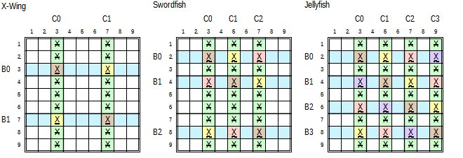

.. title:: Yet Another Sudoku | Human Solvable Patterns | Fish

.. include:: ..\globals.inc

.. _found_fish:

****
Fish
****

Basic Fish
==========

   Basic Fish Candidate Diagrams

X-Wing
------

The left image in :numref:`fig-basic-fish-cd1` of an X-Wing is made up of two Base Sets, each with
two candidates, ``B0 = Xr3c37``, and ``B1 = Xr7c37``.  These two Base Sets are intersected by links
in the two Cover Sets, ``C0=c3`` and ``C1=c7``, where X is found in each intersection.

If ``Xr3c3`` is True, then ``Xr3c7``, and ``Xr7c3`` must be False.  If ``Xr7c3`` is False, then the
only other X in ``r7`` must be True.  Therefore, either the two brown X's are True or the two yellow
X's are True.  As each Cover Set contains both a brown X, and a yellow X, no other X can be True in
the Cover Sets resulting in their elimination.

Swordfish
---------

FIXME - this is as far as I got in this file.

.. :raw-html:`<code class="docutils literal notranslate"><wuline>7r1569c468</wuline>,r9c7,r5c9;7r7c

The centre image in :numref:`fig-basic-fish-cd1` of a Swordfish is made up of three Base Sets, each
containing two or three candidates, :raw-html:`<pre>B0 = <wuline>Xr2c357</wuline></pre>, <pre>B1 = Xr4c357``, and ``B2 = Xr8c357``.  These
three Base Sets are intersected by links in the three Cover Sets, ``C0 = c3``, ``C1 = c5``, and
``C2 = c7``, and X is found at least twice where each Cover Set crosses over the three Base Sets to
form a valid Swordfish pattern.

This pattern is valid with any or all the lighter X's in the orange shaded cells absent.  If
they are all absent the pattern is a "minimal" Swordfish where each Base Set only has two
candidates.  The validating criteria of this pattern is that three Cover Set houses.
containing all the links between Base Sets.

The intersecting Ccells lock the truth of this pattern, Therefore any other same value ccelss
occurring in the Coversets (shaded light green) can be eliminated.
contains some int

Consider the Swordfish pattern with candidate X in the centre puzzle in the above figure.  The base
sets (lines) have been identified as Rows 1, 3 and 7.  Each row can have between two and three
occurrences of candidate X,  The Swordfish pattern is recognised by the corresponding 3 column
cover-sets each intersecting 2 to 3 base-sets on candidate X. (the blue and yellow X’s).  This
image shows a “minimal” Swordfish where each base-set has only two instances of candidate, and each
cover set only intersects 2 base-sets.  The light X white cells can also contain candidates
optionally without influencing the outcome of this pattern.  What is important is that the union of
intersections over the three bases must equal 3.

Swordfish
---------

In the Swordfish pattern only one of the (yellow, blue or orange)X’s can be True in any base-set,
and in any cover-set.  The yellow, blue and white X cells are the only cells where X can/may be
True. As X can only occur once in each of the cover sets, and only has the possibility of occurring
in a blue, yellow or white cell, all other occurrences of X along the green lines that is not part
of a base-set can be eliminated.

The Swordfish Truth is that either the yellow, blue or Orange X’s are True.  Therefore, any other X
candidate ccell that can see (same house as) one of each colour X cannot be True and can be
eliminated.  By definition of this Pattern, there is no possibility of this happening along
the base sets.  The only other so the only possible eliminations can only occur along the
cover-sets.

Jellyfish
---------

Consider the Jellyfish pattern with Candidate X in the right puzzle in the above figure.  Rows 1,
3, 5 and 7 are base sets with between two and 4 occurrences of Candidate X.  The Jellyfish pattern
is recognised by the corresponding four column cover sets, each intersecting between 2 and 4
base-sets on the X candidate.  The image shows a minimal Jellyfish with dark X’s in blue and yellow
cells; where there are two candidates in each base set and two cover-set intersections (the yellow
and blue cells).  The presence of The light X candidates in the orange and magenta cells does not
influence the outcome of this pattern.  What is important to the Jellyfish pattern is that the
union of intersecting Candidates in all base-sets must equal 4.

In this Jellyfish pattern, X can only occur once in each base (one of the blue, yellow, Orange or
Magenta cells).  As X can also only occur once in each cover set, and it is constrained to one of
the blue, yellow, white of pink cells, any other occurrence of X along the cover-sets (green cells)
can be eliminated.

The Jellyfish Truth is that either all the yellow, or all the blue, or all the orange or all the
magenta X’s are True.  Therfore any other X candidate ccell that can see (in the same house as) one
of each colour X cannot be True and can be eliminated.  By definition there is no possibility of
this happening along the base-sets, so the only possible eliminations can occur along the
cover-sets.

Algorithmic rules for Basic Fish:
    1. Fish order (n): 2 – X-Wing, 3 – Swordfish, 4 – Jellyfish.
    2. (n) base-sets and (n) cover - set
    3. 2 to (n) candidates per base-set
    4. 2 to (n) candidates per cover-set
    5. (n) items in Union of all bases.
    6. All same value candidates in cover-sets that are not part of base-sets can be eliminated.

.. _found_finned_fish:

Finned Fish
===========

Many times, fish patterns are almost formed, save for one of the base-sets having extra candidates.
Those extra candidates along the base-set are known as Fins.  Here, if certain conditions are met,
eliminations are still possible.

Finned X-Wing
-------------

Considering the Finned X-Wing on the right,  A fin is added to the previous X-Wing in Base B0,
Xr2c8.  The fin can either be True or False.  If the fin is False, then the original X-Wing as
previously explained is True. That is, either the blue X’s or the yellow X’s are True.  If the Fin
is True, then any other Candidate that sees (that is, in its row, column or box/block house/group)
the Fin cannot be True.  In this pattern, the Fin’s row house is also the X-Wing’s B0.  If the Fin
is True, neither the blue X and yellow X in B0 can be True negating the X-Chain’s Truth.  Any Cover
that can see all of a blue X, a yellow X and the Fin, can be eliminated, because we have shown that
one of them must be True.

Another way of saying this is:  Any Candidate that lies in the intersection of the Fish’s Truth set
and the Fin’s Truth Set can be eliminated.  The Fish’s Truth Set are the cover-set cells that are
not part of the base-sets.  And the Fin’s Truth Set are the other cells in the row, column and box
in which that Fin resides.  In the above X-Wing pattern, these are the light green cells r12c7. This
assertion can be further narrowed to. Any candidate in the intersection of the Fish’s cover-set and
Box of the Fin that is not part of the Finned Fish pattern can be eliminated.

A Finned Fish pattern can have multiple Fins.  The Fins need be grouped such that they are present
in the same X-Wing Base-Set in the same Box/Group as the Fin.  Thus, if one of the Fins are True,
the X-Wing Truth is negated, and if both Fins are False, the X-Wing Truth prevails.  Both Fins
cannot be simultaneously True because they are in the same house.  It is clear to see there can only
be 1 or 2 fins in Finned Fish.

The finned X-Wing on the right shows the possibility of two bases each having a fin if the finned
bases are in the same chute.  Because the bases are in the same chute f1 and the fins are in the
same house b3, any cover not part of a base-set that can see both fins such as Xr2c7 can be
eliminated.

Finned Swordfish
----------------

Considering the Finned Swordfish in the right. The intersection of the Red Fin’s Truth set with the
Swordfish’s Truth set is r13c7.  Any X candidate in these two cells r13c7 can be eliminated.

The following Finned Swordfish only exists because of the Xr8c6 fin.  This is a valid swordfish
because each base set has two or more members, and each cover set has two or more members, even
though the base-set with the fin only has two members including the fin.  Here, in B2 either Xr8c3
is True or Xr8c6 is True.  If Xr8c3 is True, then the reduced X-Wing in Xr24c57 ensures that any X
in c5 or c7 that is not part of the reduced X-Wing can be eliminated.  If Xr8c6 is True, then any X
in box 8 can be eliminated.  The intersection of both conditions makes the elimination of X in r7c5
and r9c5.

The Finned Swordfish on the right shows the possibility of two bases, B1 and B2 each having a fin
(Xr4c4 and Xr6c6 respectively) in a house b5.  Because cover Xr5c5 can see both fins it can see both
fins, it can be eliminated.

Finned Jellyfish
----------------

Considering the Finned Jellyfish on the left of the figure.  The intersection of the Red Fin’s Truth
set with the Jellyfish’s Truth set yields the four cells r13c79

This Finned Jellyfish only exists because of the presence of the Fin Xr2c8.  Either Xr2c3 or Xr2c8
can be True.  If Xr2C3 is True, then a reduced Swordfish Xr469c579 is formed making the elimination
of any X not part of the pattern in c5, c7 and c9 possible.  If Xr2c8 is True, then any other X in
box 3 can be eliminated.  The intersection of these two conditions makes the elimination of X from
r13c79 possible.

This Finned Jellyfish shows the possibility of two bases B1 and B2 each having a fin (Xr4c1 and
Xr6c2 respectively) in house b4.  Because cover Xr5c3 can see both fins, it can be eliminated.

Algorithmic rules for Finned Fish
---------------------------------

   #  Fish order (n): 2 – X-Wing, 3 – Swordfish, 4 – Jellyfish.
   #  (n) base-sets and (n) cover- set
   #  2 to (n) candidates in (n) – 1 base-sets,
   #  2 to (n)+2 candidates in 1 base-set containing fins
   #  2 to (n) candidates per cover-set (Fins confined to one base set).
   #  Fins do not have cover-sets (this is part of the definition of a fin).
   #  (n)+1 to (n)+2 items in Union of all bases, n for cover sets, 1 to 2 for fins.
   #  Fins are confined to the same box/block
   #  Any cover-set candidate that is not part of the base-set that can see all the fins can be eliminated.
   #  Max number of eliminations is 4.

.. _found_sashimi_fish:

Sashimi Fish
============

As with Finned Fish, many times Fish patterns are almost formed, save for one missing candidate.
These patterns are also known as Degenerate Fish.  If certain requirements are met, eliminations are
possible.  The general form of a Sashimi fish is (n) base-sets, (n)-1 cover-sets and 2 or 3 fins.
A Sashimi pattern ensures that only one of the Fins can be True.  Therefore, any ccell that can see
all fins, can be eliminated.

Sashimi X-Wing
--------------

Consider the Sashimi X-Wing image on the right.  There are two base-sets of two candidates each, B0,
and B1, but only 1 cover-set of two candidates C0.  As an aside this pattern is also recognised as a
Skyscraper.  As the Red X’s are their only cover, like Fins, they are treated as fins, even though
they are not confined to a single base-set).

If Fin Xr3c8 is True, Xr3c3 is False, Xr7c3 is True making Xr7c7. False.  Similarly, if Xr7c7 is
True, Xr3c8 is False.  Only one Fin can be True, never both or none.  If either fin is True, the
candidate ccells that see both Fins can be eliminated. If X is present can be eliminated from the
green cells.  The two fins need to be at least confined to a single chute for eliminations to be
made, the third Tower in this case.  If the bases were in the same floor chute, then eliminations
can be made from all other cells in the box/block containing the fins (floor – tower chute
intersection) that are not in the base-sets with up to 3 fins across the 2 base-sets.  If the Fins
were in different chutes then only the ccell that sees both fins lies on a base-set row with no X
candidate in that location.

Consider the Sashimi X-Wing on the right.  It is the same as the above Sashimi X-Wing, except for an
additional Fin in B1, Xr7c9.  In this case, the only ccells that can see all 3 fins are confined to
the two green cells.  If X is present in either of those two cells (that is the ccells exist), they
can be eliminated.

Consider the Sashimi X-Wing on the right.  Not only are the 2 (or 3)  fins confined to a cover
chute, they are also confined to a base street.  That is the fins are confined to a block/box.
Applying the rule that ccells that are not part of the base-set that see all the fins can be
eliminated, results in up to three ccells in the row in the base chute that is not a base set.

Sashimi Swordfish
-----------------

Considering the Sashimi Swordfish on the right.  3 Base-sets of between 2 and 3 candidates exist,
B0, B1, B2, and only two cover-sets exist with two or more candidates, C0 and C1.  There are fins
in at least 2 base-sets (B0 and B2).  Fins are bound to a cover chute (Third tower in this case).
The two fins are Xr2c8 and Xr8c7.

Following the logic of this Sashimi Swordfish, if the fin Xr2c8 is True, then the other Candidates
in B0 are False.  Either the blue or yellow cell in B1 can be True.  If B1 Blue is True, then B2
Blue is True making the other Fin Xr8c7 False.  If B1 yellow is True, then if B2 orange existed it
would be True, again making the Fin Xr8c7 False.  Because it does not exist. This specific pattern
also resolves B1 Blue and B2 Blue as True, which again keeps  Xr8c7 False.  If Xr8c7 is True, B2
Blue is False, Making B1 yellow True, B1 blue False, which forces B0 yellow True, making the
Fin Xr8c7 False.

Thus we have determined that any ccell that is not part of the base-set that can see all the fins
can be eliminated.  The two identified fins are confined to a Cover chute (third tower).  The only
ccells that fit these criteria are shaded green.

The Sashimi Swordfish image on the right is the same as above  except for the additional fin in B0,
Xr2c9.  Here The Fins are confined to only two boxes in the cover chute.  The only ccells that can
see all Fins are highlighted green.  If X is present in any of the green cells, the X can be
eliminated.

If the two or three fins are confined to a base chute (floors in this case), as shown on the right,
all the ccells that are not part of a base-set that see all the fins can be eliminated.  As the Fins
are confined to a box in two of the bases, any ccell in the other non base line can be eliminated,
as shown by the green cells.

Sashimi Jellyfish
-----------------

Considering the Sashimi Jellyfish in the above right figure.  The 4 base sets of between 2 and
candidates are B0, B1, B2 and B3 and the 3 covers are C1, C2, C3, and fins Xr2c3 and Xr6c1.  If Fin
Xr2c3 is True, then the other candidates in the Base-set B0 are False.  The resulting (n)-1
(Swordfish) pattern in B1, B2 B3/C1, C2,C3 will ensure that Fin Xr6c1 is False.  Similarly, if Fin
Xr6c1 is True, the remaining candidates in B2 are False.  The resulting (n)-1 (Swordfish) pattern in
B0, B1, B3, C1,C2,C3, ensures that Fin Xr2c3 is False.

Thus, we have determined that either the Swordfish in Xr579c468 is valid or one of the Red Fins are
True.  Therefore, any ccell that is not in a base-set that can see all the fins can be eliminated,
as identified by the green shaded cells.

The Sashimi Jellyfish on the right is exactly the same as above, except it has an additional Fin in
B1, Xr4c2.  Here the Fins are confined to only two boxes in the cover chute.  The only ccells that
can see all Fins are highlighted green.  If X is present in any of the green cells, the X can be
eliminated.

If the two or three fins are confined to a base chute (floors in this case), as shown on the right,
all the ccells that are not part of a base-set that see all the fins can be eliminated.  As the Fins
are confined to a box in two of the bases, any ccell in the other non base line can be eliminated,
as shown by the green cells.

Algorithmic rules for Sashimi Fish
----------------------------------

   #  Fish order (n): 2 – X-Wing, 3 – Swordfish, 4 – Jellyfish.
   #  (n) base-sets and (n)-1 cover- set
   #  2 to (n)+2 candidates in base-sets
   #  2 to (n) candidates per cover-set
   #  Fins do not have cover-sets
   #  Between 2 and 3 fins.
   #  Fins are confined to a cover chute, and only one or two base chutes, never three base chutes
   #  (n)+1 to (n)+2 items in Union of all bases, (n)-1 for cover sets, 2 to 3 for fins.
   #  Any Candidate that is not part of base-set that can see all fins can be eliminated.
   #  Maximum number of eliminations is 4.

.. _hsp_fish_kraken:

Kraken Fish
===========

Recall from Weakly Ended AIC's above, a Weakly Ended AIC (WE-AIC) mimics all the characteristics of
a Weak Link (two ccells seeing each other).  That is:

   *  The chain has an odd number of links and number of links + 1 nodes.
   *  The chain is reversible, it can be traversed from either end with the same predictable
      results, and
   *  If the one end is True, then the other end is False.  But if the one end is False, it is not
      possible to determine the state of the other end, it can be either True or False.

Also, for Finned/Sashimi Fish, recall that either one of the Fin Ccells is True or one of the Fish
pattern Ccells is True:  Therefore for:

   #  Kraken Finned Fish:
      #  Any Cover-set Candidate that is not part of the Base sets that is weakly linked to all the
         fins can be eliminated, and
      #  Any candidate that is weakly linked to all the fish pattern candidates and all the fins can
         be eliminated  (TODO To be implemented in YAS).  Hodoku refers to this as a Kraken type II
         pattern
   #  Kraken Sashimi Fish:
      #  Any Candidate that is not part of the Base Sets that is weakly linked to all the fins can
         be eliminated, and
      #  Any candidate that is weakly linked to all the fish pattern candidates and all the fins can
         be eliminated  (TODO To be implemented in YAS).  Hodoku refers to this as a Kraken type II
         pattern

Kraken Fish ease the following Finned/Sashimi constraints.
   #  Fins can occur in any base-set
   #  Fins are not confined to a cover chute.
   #  Kraken Finned Fish can have up to 9 – (n) fins
   #  Kraken Sashimi Fish can have up to 10 – (n) fins

Algorithmic rules for Kraken Finned Fish
----------------------------------------

   #  Fish order (n): 2 – X-Wing, 3 – Swordfish, 4 – Jellyfish.
   #  (n) base-sets and (n) cover- set
   #  Up to 9 candidates per base set, 2 to (n) for base candidates, 9 – (n) for fins
   #  2 to (n) candidates per cover-set
   #  Up to (9 – (n)) Fins
   #  Fins do not have cover-sets
   #  Up to 9 items in Union of all bases, (n) for cover-sets, up to  (9-(n)) for or fins.
   #  No restrictions to the location of Fins in base-sets.
   #  Any cover-set candidate that is not part of the base-set that can see all the fins can be eliminated.

Algorithmic rules for Kraken Sashimi Fish
-----------------------------------------

   #  Fish order (n): 2 – X-Wing, 3 – Swordfish, 4 – Jellyfish.
   #  (n) base-sets and (n)-1 cover- set
   #  Up to 9 candidates per base set, 1 to ((n) – 1) for base candidates 10 – (n) for fins.
   #  2 to (n) candidates per cover-set
   #  Up to (10 – (n))  Fins
   #  Fins do not have cover-sets
   #  Up to 9 items in Union of all bases, (n) – 1 for cover-sets, 10 – (n) for fins.
   #  No restrictions to location of Fins in base-sets.
   #  Any Candidate that is not part of base-set that can see all fins can be eliminated.

Kraken Fish Practical issues
----------------------------

   #  Relaxing the number of fins in base-sets and in the number of base-sets greatly increasing the number of possible
   #  base patterns that can be found for scanning for cover to fin connections.
   #  The number of chains to scan for each possible base pattern is the product of fins x covers for each pattern. greatly increases the probability of patterns
   #  Chain Length Processing Time below estimates an average of 10^(n/2) iteration steps to build a
   chain of length n.  A practical chain length to search before bottoming out is 10 – 14 nodes.
   Shorter than that it appears many opportunities to find and resolve patterns are missed, and
   there is a diminishing return for longer chain lengths. YMMV.  An iteration step is in the
   order of a few micro seconds on my PC, say 4uSecs in Python.

Searching for kraken fish patterns is hugely expensive, and is done twice, first time in the search
for regular scalar chains, and again for chains with group links.  As Kraken Fish are considered
rather exotic and because of the time taken to resolve, Kraken Fish are at the end of the list for
patterns to search.

Therefore, with Kraken fish, we search for the first found cover that can see all fins, rather than
exhaustively searching for all covers that can see all fins.

Kraken Fish Examples
--------------------

The following example from Systematic Sudoku (taken from KrazyDad SuperTough 555) is interesting in
that the X-Wing fin “sees” a candidate in the column cover-set by way of the Weakly linked AIC on 6:
6(r5c5~r2c5=r3c4~r3c3). [remember, “~” is the symbol for a strong link masquerading as a weak
link].   In this example, it is the only way the fin 6r5c5 sees the cover ccell 6r3c3.  The other
cover ccell 6r6c3 is not visible from the fin.  Other probably simpler solutions:

   *  Notice that the ERs in box 4 on both 6 and 1 candidates, coupled with the 61 conjugate pair
      (61r36c4) results in the elimination of both the 1 and 6 from r3c3 (r3c3-=61) solving r3c3:=2,
      and the rest of the puzzle is solved with simple singles.
   *  Noticing the exposed pair in 2(r18c2) causing r2c2-=1 and r6c2-=1. followed by r456c1
      describing a pointing locked single in b2, causing the elimination of r3c3-=1.  Followed by
      the Turbot Fish in 1(r2c1=r2c5-r8c5=r7c6) causing the elimination of r6c1-=1.
   *  A Skyscraper 1(r2c5=r2c1-r7c1=r7c6) or (Sashimi) Finned X-Wing (r27c1, r2c5, r7c6) both
      resulting in the elimination r8c5-= 1.

In this example, the would-be 6-wing is spoiled by the extra fin 6r5c5. If the fin could be wished away, the perfected
6-wing would eliminate 6r3c3 and 6r6c3. But 6r3c3 sees that fin, via 6-chain. If 6r3c3 is true, it will erase the fin,
allowing the fish to prove it false.  Potential victim 6r6c3 escapes the fish because it cannot see the fin.
https://sySudoku.com/guide/sySudoku-advanced/x-panel-methods/finned-and-kraken-fish/

Another Kraken X-Wing follows from  Systematic Sudoku.

Here, YAS finds a different Kraken X-Wing solution.  This one formed with base set rows, because YAS searches row bases
before column bases.

The pattern found is:  7r46c68,r4c3; together with the weakly linked chain from cover 7r5c6 to fin 7r4c3:
7r5c6-1r5c6=1r5c2~1r6c2=9r6c2~9r6c9=9r4c9~6r4c9=6r4c3-7r4c3.  This results in the elimination of the cover r5c6-=7

Fraken Fish
===========

[TODO]  See sodukowiki, hodoku, http://www.taupierbw.be/SudokuCoach/SC_index.shtml, etc.

.. _hsp_fish_mut_fish:

Mutant Fish Patterns
====================

An Empty Rectangle is a Mutant X Wing with one Base Set in a Row and the other Base Set in a Column.
A the Base Sets cross over in a Box, but do not share any common candidates in that Box.

[TODO]
