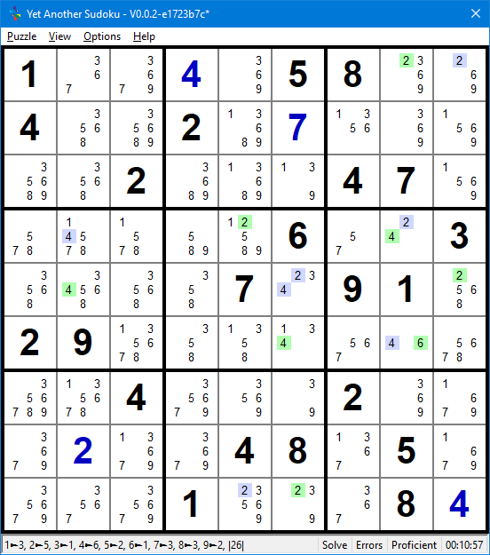
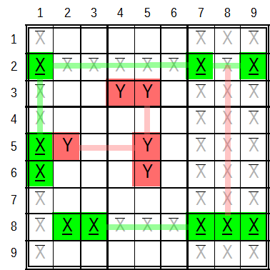

.. title:: Yet another Sudoku | Human Solvable Patterns | Chains, Loops and Nets

.. include:: ..\globals.inc

.. _human-solvable-chain-patterns:

.. _hsp_cln:

**********************
Chains, Loops and Nets
**********************

abcd
====

lskdfjs;df
----------

Broken Wings
++++++++++++

http://sudopedia.enjoysudoku.com/Broken_Wing.html

https://sudoku.allanbarker.com/sweb/gen2/blacklog.htm

TOTO: Also add to solver.

Any strong linked chain, where Ccells that see both ends see it with a strong link.

.. _hsp_cln_super-node:

Super Nodes
+++++++++++

Strong Linked Chains have a valuable additional property which greatly increases its productivity.
All consecutive nodes of a Strongly linked chain will always be of opposite state.  Therefore, any
Ccell that is not part of the pattern that sees both an odd count Node and even count Node in the
chain cannot be True and can be eliminated.  This property envelops the Strong Link property because
Chain End Nodes of an Even node count Strongly Linked Chain will always have opposing state.

In working with Strong Linked Chains it is useful to consecutively number the nodes from one end to
the other and identify odd and even parity nodes.  Similarly, odd and even parity nodes are
determined by the parity of the net level count.  Odd and even parity nodes will have opposing (yet
to be determined) state.  Therefore, any Ccell that is not part of the SL pattern that sees two
nodes in the pattern of opposing parity cannot be True and can be eliminated.

All the odd parity nodes are grouped into the Odd Parity Super Node Set of the SL pattern.
Similarly, the even parity are grouped int the Even Parity Super Node Set of the SL pattern. These
two Super-Nodes are Strongly linked, implying all the Nodes in each set are strongly linked to all
the nodes in the other set.

When solving as humans, it is useful to use different colours to distinguish parity.

.. _chained-strong-linked-pattern:

Chained Strong Linked Patterns
------------------------------

Developed from:
   |   http://www.sudocue.net/guide.php#MedusaBridge, and
   |   http://forum.enjoysudoku.com/3d-medusa-help-on-a-specific-puzzle-t31070.html.

Often puzzles with multiple SL Patterns have node in each pattern that see nodes in other SL
patterns.  These nodes form a Weak Link between the SL pattern.  From the perspective of the SL
pattern being two Strongly Linked :term:`Super-Node`\s, a chain of Super-Nodes is formed.

The Types 1, 2, and 3 pattern resolutions available to AI-Chains are also available to these 'Super
Node' AI-Chains where the actual chain end nodes can be any in the end 'Super-Nodes'.

Unlike regular SL Nets, Chained SL Nets can be of any Super Node count.  Each 'Super-Node' set
can be as small as one node.

Some Chain Examples
===================

A Two String Kite
-----------------

.. figure:: images/two-string-kite-eg2.png
   :name: fig-two-string-kite-eg2
   :scale: 65%
   :alt: Sudoku Two String Kite Example
   :align: right
   :figwidth: 359px

   Two String Kite Example

   :raw-html:`<mong>.81.2.+6...+4+2.+6..+89.+568..+24.+6+931+4+27+5+8+4+28+357916+1+7+5+6+8+9+3+245+1..+36+89223...84+6.+8+6.+2.....||Two String Kite||5r2c7=5r9c7-5r8c9=5r8c4,5r2c7-5r2c4-5r8c4,5r2c7-5r2c4-5r8c4|r2c4-=5|+781+92+4+6+3+5+3+4+2+7+6+5+1+89+9+568+1+3+24+7+6+931+4+27+5+8+4+28+357916+1+7+5+6+8+9+3+245+1+7+4+36+89223+9+5+784+6+1+8+6+4+2+9+1+5+7+3</mong>`

The chain in this example is :raw-html:`<mong>5r2c7=5r9c7-5r8c9=5r8c4</mong>`, source:
`Hodoku <http://hodoku.sourceforge.net/en/tech_sdp.php#t2sk>`__.  This is an alternating strong/weak
link chain four nodes long starting and ending with a strong link.  A short chain was chosen for
simplicity but the logic applies to any even node count chain.

Starting at with ccell 5r2c7, assert the premise that it is False. The strong link between 5r2c7 and
5r9c7, infers 5r9c7 True.  The weak link between 5r9c7 and 5r8c9 infers 5r8c9 False.  The strong
link between 5r8c9 and 5r8c4 infers 5r8c4 True.  Also walking the chain in the opposite direction
starting with 5r8c4 as False will ultimately infer 5r2c7 True.  Thus concluding neither 5r2c7 nor
5r8c4 can be simultaneously False, one or the other has to be True.

But with this AIC if 5r2c7 is asserted True, then 5r8c4 can be either True or False.  For example,
The premise that 5r2c7 is True, infers 5r9c7 False.  Because 5r9c7 is weakly linked to 5r8c9,
nothing can be inferred about its state when it is False, which breaks the inferences for the rest
of the chain.

The important conclusions to be drawn from AIC/Inferred links is that same value candidates that can
see both ends of the AIC can be eliminated.  This is because at least one end Ccell will always be
True.  In this example 5 is eliminated from r2c4 (r2c4-=5).

A Skyscraper
------------

.. figure:: images/skyscraper-eg1.png
   :name: fig-skyscraper-eg1
   :scale: 65%
   :alt: Sudoku Skyscraper Example
   :align: right
   :figwidth: 359px

   Skyscraper Example

   :raw-html:`<mong>+6+9+7.....+2..19+72.6+3..+3..679.9+12...6.+737+4+2+6.95.+8+65+7.+9.+2414+8+6+93+2+757.9.24..+6..+68.+7..+9||Skyscraper||1r1c6=1r5c6~1r5c9=1r3c9,1r1c6-1r1c7-1r3c9,1r1c6-1r1c8-1r3c9,1r1c6-1r3c4-1r3c9,1r1c6-1r3c5-1r3c9|r1c7-=1;r1c8-=1;r3c4-=1;r3c5-=1|+6+9+7+3+1+5+8+4+2+4+819+72+56+3+5+2+3+4+8679+19+12+5+4+86+3+737+4+2+6+195+8+8+65+7+3+9+1+2414+8+6+93+2+757+59+124+3+8+6+2+3+68+5+7+4+1+9</mong>`

The chain in this example is :raw-html:`<mong>1r1c6=1r5c6~1r5c9=1r3c9</mong>`, source: `Hodoku
<http://hodoku.sourceforge.net/en/tech_sdp.php#sk>`_.  This is another AI chain of four nodes with
strong end links.  Note that the centre link is a Strong Link masquerading as a Weak Link.

Walking the chain exactly like the previous example, the indirect Robust link
:raw-html:`<mong>1r1c6|~|1r2c9</mong>` is found.  Recall that at least one end will always be true,
therefore any Ccell that can see both ends cannot be True.  Four such Ccells exist in this pattern
which can be eliminated: :raw-html:`<mong>r1c7-=1, r1c8-=1, r3c4-=1, r3c5-=1</mong>`.

|
|
|
|
|

A Strong Linked Net (SLN) Chain
-------------------------------

Here is an example of three Strong Linked Nets in a Chain.  Source: `SudokuWiki <https://www.sudokuwiki.org/Aligned_Pair_Exclusion>`__

.. figure:: images/chained-sln-t2-eg1.png
   :name: fig-chained-sln-t2-eg1
   :scale: 65%
   :alt: Sudoku Chained Strong Linked Net Type 2 Example
   :align: right
   :figwidth: 359px

   Chained Strong Linked Net Type 2 Example

   :raw-html:`<mong>.7+2.+8.64..9+67..8....8+6....1...3...84681........+4.5+8.6.2+1.+8+39+4.+6+84.2...+13.+63..1..+8|r2c5-=4;r3c5-=4;r4c7-=57;r5c6-=4;r5c7-=7;r5c8-=7;r6c7-=37|Chained Strong Linked Net T2||[3r1c1e=3r1c6o=5r1c6e]<3r1c1-1r1c1>[1r1c1e=1r1c4o=1r6c4e={1r6c7o=1r4c7e=1r4c5o=1r2c5e={1r2c1o,2r2c5o},9r6c4o}]<1r2c1-4r2c1>[4r2c1e=4r2c6o=4r3c6e=4r3c1o],3r1c6-3r2c6-4r2c6|r2c6-=3|+172+98+364+5+4967+1+58+3+2+3+586+2+4+7+91+5+2+73+9+6+184681+4+7+2+3+5+9+9+34+158+26+721+58394+7684+92+6+7+513+763+5+41+9+28</mong>`

The three chains are:

*  :raw-html:`<mong>SLN1 = 3r1c1e=3r1c6o=5r1c6e</mong>`
*  :raw-html:`<mong>SLN2 = 1r1c1e=1r1c4o=1r6c4e={1r6c7o=1r4c7e=1r4c5o=1r2c5e={1r2c1o,2r2c5o},9r6c4o}</mong>`
*  :raw-html:`<mong>SLN3 = 4r2c1e=4r2c6o=4r3c6e=4r3c1o</mong>`

Viewed from the perspective of Odd and Even Parity Super Nodes:

*  :raw-html:`<mong>SLN1e = {3r1c1, 5r1c6}</mong>`
*  :raw-html:`<mong>SLN1o = {3r1c6}</mong>  `
*  :raw-html:`<mong>SLN2e = {1r1c1, 1r6c4, 1r4c7, 1r2c5}</mong>`
*  :raw-html:`<mong>SLN2o = {1r1c4, 1r6c7, 1r4cp, 1r2c1, 2r2c5, 9r6c4}</mong>  `
*  :raw-html:`<mong>SLN3e = {4r2c1, 4r3c6}</mong>`
*  :raw-html:`<mong>SLN3e = {4r2c6, 4r3c1}</mong>`

These three chains are linked by:

*  :raw-html:`<mong>SLN1e-SLN2e &nbsp;&rArr;&nbsp; 3r1c1-1r1c1</mong>`
*  :raw-html:`<mong>SLN2o-SLN3e &nbsp;&rArr;&nbsp; 1r2c1-4r2c1</mong>`

The Super Node Chain is:

*  :raw-html:`<mong>SLN1o=SLN1e-SLN2e=SLN2o-SLN3e=SLN3o</mong>`

Because ``3r1c6`` in SLN1o and ``4r2c6`` in SLN3o are in the same
house, and because of the Chain, at least one of them will be True, any Ccell (such as
``3r2c6``) that sees both, cannot be True and can be eliminated ``r2c6-=3``.

.. _hsp_cln_chain_elims_and_plcmts:

Chain Eliminations and Placements
=================================

.. _we_aic:

Weak Link Ended Chains (WE-AIC)
-------------------------------

Recall, Weak Link Ended AI-Chain characteristics are:
   *  An even count of Nodes,
   *  Link count is one less than Node Count, an odd number,
   *  Both outer links are Weak Links,
   *  Reversible.  Asserting the one end True and traversing the inferences will find the other end
      False.
   *  Although both ends cannot be simultaneously True, they can be simultaneously False.

The ends of Weak Link Ended Chains behave exactly as Weak Links and can be used as such.  Ccells
'See' each other through weak links.  Two Ccells that 'See' each other both cannot be True.

This application of the Sudoku rule on its own, does not give much.  Its real power is in linking
Ccells to all the elements of a :term:`Truth`.  Any :term:`Ccell` that :term:`See`\s all the 
elements of Truth, cannot itself be True and is eliminated as in :ref:`Kraken Fish <hsp_fish_kraken>`.

Strong Link Ended Chains (SE-AIC)
---------------------------------

Recall, the ends of Strong Ended AI-Chain are :ref:`Robust Links <found_lc_robust_link_patterns>`:
   *  An even count of Nodes
   *  Link count is one less than Node Count, an odd number,
   *  Both outer links are Strong Links,
   *  Reversible.  Asserting the one end False and traversing the inferences will find the other end
      True.
   *  Although both ends cannot be simultaneously False, they can be simultaneously True.

Because at least one end of a SE-AIC is always True, any Ccell seeing both ends cannot be True and 
is eliminated.

Type 1:  Same end Values
++++++++++++++++++++++++

Considering SE-AIC's with the same candidate values, eliminations depend on the locations of the
ends relative to each other:

.. figure:: images/se-aic-diff-chute-cd1.png
   :name: fig-se-aic-diff-chute-cd1
   :scale: 50%
   :alt: Sudoku Robust Link Different Chutes Candidate Diagram
   :align: right
   :figwidth: 320px

   Robust Link Different Chutes Candidate Diagram

With ends in different :term:`Chute`\s, the only cells that can see both ends are the two diagonally
opposite to the ends.  In the figure on the right, hypothetical chain ends are marked X and the
cells that can see both ends are highlighted green.  Any same valued Ccell in the highlighted green
cells cannot be True and can be eliminated.

|
|
|
|
|
|
|
|

.. figure:: images/se-aic-same-chute-cd1.png
   :name: fig-se-aic-same-chute-cd1
   :scale: 50%
   :alt: Sudoku Robust Link Same Chutes Candidate Diagram
   :align: right
   :figwidth: 320px

   Robust Link Same Chutes Candidate Diagram

With ends in the same :term:`Chute`, six cells can see both ends.  In the figure on the right,
hypothetical chain ends are marked X and the cells that can see both ends are highlighted green.
Any same valued Ccell in the highlighted green cells cannot be True and can be eliminated.

|
|
|
|
|
|
|
|

.. figure:: images/se-aic-same-house-cd1.png
   :name: fig-se-aic-same-house-cd1
   :scale: 50%
   :alt: Sudoku Robust Link Same House Candidate Diagram
   :align: right
   :figwidth: 320px

   Robust Link Same House Candidate Diagram

With ends in the Same :term:`House`, seven cells can see both ends.  In the figure on the right,
hypothetical chain ends are marked X and the cells that can see both ends are highlighted green.
Any same valued Ccell in the highlighted green cells cannot be True and can be eliminated.

Furthermore and perhaps more importantly, An :ref:`Even Loop <hsp_even_ai_loops>` by the SE-AIC ends seeing
each other.  An Even Loop pattern strengthens all the weak links, causing all the other same value
Ccells in the Weak Links never to be True, resulting in their elimination.

|
|
|
|
|

Type 2:  Different End Values
+++++++++++++++++++++++++++++

Eliminations are only possible if the different ends occur in the same house or cell.

.. figure:: images/se-aic-diff-ends-s1.png
   :name: fig-se-aic-diff-ends-s1
   :scale: 65%
   :alt: Sudoku Robust Link Different Ends Grid Snip Example 1
   :align: right
   :figwidth: 360px

   Robust Link Different Ends Grid Snip Example 1

In this grid snippet say :raw-html:`<mong>2r3c2</mong> and <mong>7r3c8</mong> are the chain ends.
<mong>7r3c2</mong> can see both chain ends.  Therefore, it cannot be True and can be
eliminated. <mong>r3c2-=7</mong>`.

|

.. figure:: images/se-aic-diff-ends-s2.png
   :name: fig-se-aic-diff-ends-s2
   :scale: 65%
   :alt: Sudoku Robust Link Different Ends Grid Snip Example 2
   :align: right
   :figwidth: 360px

   Robust Link Different Ends Grid Snip Example 2

In this grid snippet say :raw-html:`<mong>6r6c3</mong> and <mong>7r6c7</mong> are the chain ends.
<mong>7r6c3</mong> and <mong>6r6c7</mong> can both see both chain ends and can be eliminated.
<mong>r6c3-=7</mong> and <mong>r6c7-=6</mong>`.

To summarise: Considering different value chain ends of a SE-AIC in the same house, if a Ccell of
same value as the one end is in the other end, it can be eliminated.  This pattern can yield a
maximum of two eliminations.

Type 3:  Opposing Exposed Pair Ends
+++++++++++++++++++++++++++++++++++++

.. figure:: images/se-aic-opp-exp-pair-ends-s1.png
   :name: fig-se-aic-opp-exp-pair-ends-s1
   :scale: 65%
   :alt: Sudoku Robust Link Opposing Conjugate Pair Ends Grid Snip
   :align: right
   :figwidth: 360px

   Robust Link Opposing Conjugate Pair Ends Grid Snip

In this grid snippet, say :raw-html:`<mong>9r4c2</mong> and <mong>5r4c5</mong>` of the
:ref:`Exposed Pair <hsp_exposed_pairs>` :raw-html:`<mong>59r4c25</mong>.  The Ccells in the Exposed Pair
that are not part Chain can both see both end of the chain, and therefore cannot be True and can be
eliminated, <mong>r4c2-=5</mong> and <mong>r4c5-=9</mong>.  This leaves the Chain Ccells as the only
Ccells in the Chain end cells respectively, and they can be placed.  <mong>r4c2:=9</mong> and
<mong>r4c5:=5</mong>`.

Strong Linked Patterns
----------------------

Recall, SL Patterns:
   *  Have alternating State Consecutive Nodes.
   *  Are reversible, inferences can be traversed in either direction with same predictable results.

More is gained by working with SL Net patterns than SL Chain patterns.
   *  Net patterns typically capture more nodes than string patterns.
   *  A Ccell can only be a member of a single SL Net, whereas, the same Ccell can be a member of
      multiple SL Chains.
   *  A Puzzle typically contains fewer larger SL-Nets than chains, thereby reducing the search
      effort for similar outcomes.

Recall further:
   *  SL Patterns members can be divided into two Super-Nodes of even and odd parity.  SL Chain
      parity is found by assigning count numbers to each consecutive nodes. SL Node parity is found
      by assigning the level number to the Node.  In both cases, all odd and even Nodes to their
      respective Super-Node.
   *  Either all the Even or all the Odd Parity nodes will True.  Which it is, is yet to be
      determined.
   *  A Strong link exists between the odd and even Super-Nodes of SL patterns.  Any node in the one
      Super-Node set is strongly linked to all nodes in the other Super Node.

Type 1: Same State Nodes See Each Other
+++++++++++++++++++++++++++++++++++++++

   Strong Linked Net Type 1 Example

   :raw-html:`<mong>1..+4.58..4..2.+7.....2...47......6..3....7.91.29.........4...2...+2..48.5....1...8+4||Strong Linked Net T1||2r1c8e=2r1c9o=2r5c9e=2r5c6o=2r9c6e=2r9c5o=2r4c5e=2r4c8o=4r4c8e=4r4c2o=4r5c2e=4r5c6o=4r6c6e=4r6c8o=6r6c8e,2r5c6o-4r5c6o|r1c8:=2;r5c9:=2;r9c6:=2;r4c5:=2;r4c8:=4;r5c2:=4;r6c6:=4;r6c8:=6|1+3+7+4+958+2+64+5+82+6+7+3+9+1+9+62+3+8+147+5+7+8+1+9+26+5+43+6+4+5+87+391+229+3+5+1+4+7+6+8+8+14+6+5+92+3+7+3+2+6+748+15+9+5+7+91+3+2+68+4</mong>`

The puzzle pattern on the right is the SL Net:
:raw-html:`<mong>2r1c8e=2r1c9o=2r5c9e=2r5c6o=2r9c6e=2r9c5o =2r4c5e=2r4c8o=4r4c8e=4r4c2o=4r5c2e=4r5c6o
=4r6c6e=4r6c8o=6r6c8e,2r5c6o-4r5c6o</mong>.
Even Ccells are highlighted green and Odd Ccells highlighted blue.  Two odd parity (same state)
Ccells <mong>2r5c6</mong> and <mong>4r5c6</mong> are present in cell r5c6.  As it is impossible for
two Ccells to be True in the Same cell, these two odd Ccells must be False, and so must all the
other odd Ccells. That means all the even Ccells are True and can be placed:
<mong>r1c8:=2;r5c9:=2;r9c6:=2;r4c5:=2;r4c8:=4;r5c2:=4;r6c6:=4;r6c8:=6</mong>`.

|
|
|
|
|

Type 2: All Candidates in a Cell See Same State Nodes
+++++++++++++++++++++++++++++++++++++++++++++++++++++

.. figure:: images/sln-t2-eg1.png
   :name: fig-sln-t2-eg1
   :scale: 65%
   :alt: Sudoku Strong Linked Net Type 2 Example
   :align: right
   :figwidth: 359px

   Strong Linked Net Type 2 Example

   :raw-html:`<mong>+2..3+5..8.5...+81..38+36.4..+1.4..83...2+6.2.+1+43..9.+3.72..1+3+2+5+46+81+977+6+81+9+3..4+19+4+7+25.+3.|r6c7-=6|Strong Linked Net T2||5r5c4e=5r6c4o=6r6c4e={6r6c8o,6r2c4o=6r1c6e=6r4c6o=9r4c6e=9r4c7o=9r5c9e=9r5c4o},9r1c9-9r5c9e,6r1c9-6r1c6e|r6c4:=5;r6c8:=6;r2c4:=6;r4c6:=6;r4c7:=9;r5c4:=9|+2+4+13+5+7+68+95+7+9+6+81+2+438+36+24+9+7+1+54+1+783+6+9+52+6+52+9+1+43+7+89+8+3+572+4+61+3+2+5+46+81+977+6+81+9+3+5+24+19+4+7+25+8+3+6</mong>`

The puzzle pattern on the right is the SL Net:
:raw-html:`<mong>5r5c4e=5r6c4o=6r6c4e={6r6c8o,6r2c4o=6r1c6e =6r4c6o=9r4c6e=9r4c7o=9r5c9e=9r5c4o},
9r1c9-9r5c9e,6r1c9-6r1c6e</mong>.
Even Ccells are highlighted green and Odd Ccell highlighted blue.  The Ccells <mong>6r1c9</mong>
and <mong>9r1c9</mong> in r1c9, both see even Nodes <mong>6r1c6</mong> and <mong>9r5c9</mong>
respectively.  If the Even Nodes of the pattern are True, then neither <mong>6r1c9</mong> and
<mong>9r1c9</mong> can be True.  This is impossible as there will be no Truth in r1c9; therefore,
the Even Nodes must be False.  This in turn makes the Odd Nodes True which can be placed:
<mong>r6c4:=5;r6c8:=6;r2c4:=6;r4c6:=6;r4c7:=9;r5c4:=9</mong>`.

|
|
|
|
|
|

Type 3: Ccells See Opposing State Nodes
+++++++++++++++++++++++++++++++++++++++

.. figure:: images/sln-t3-eg1.png
   :name: fig-sln-t3-eg1
   :scale: 65%
   :alt: Sudoku Strong Linked Net Type 2 Example
   :align: right
   :figwidth: 359px

   Strong Linked Net Type 3 Example

   :raw-html:`<mong>+6.159.....+5+3+2+6..9..2+9.736..+342+9+56+1789+1+6.875....+5.+2..+695+9+8+61274313+7+8+4...+6+2+6+4+7+3....||Strong Linked Net T3||1r3c8e=1r9c8o=1r9c9e=5r9c9o=5r3c9e=5r3c8o,5r3c8e-8r3c8-5r3c8o|r3c8-=8|+6+7159+8+4+3+2+4+5+3+2+6+1+89+7+82+9+4736+1+5+342+9+56+1789+1+6+3875+2+4+7+8+5+1+2+4+3+695+9+8+61274313+7+8+4+9+2+5+6+2+6+4+7+3+5+9+8+1</mong>`

The puzzle pattern on the right is the SL Net:
:raw-html:`<mong>1r3c8e=1r9c8o=1r9c9e=5r9c9o=5r3c9e=5r3c8o, 5r3c8e-8r3c8-5r3c8o</mong>.  Even Ccells
are highlighted green and Odd Ccells are highlighted blue.  Ccell <mong>8r3c8</mong> sees both Even
Node <mong>1r3c8</mong> and Odd Node <mong>5r3c8</mong>.  Because either the Even Node or the Odd
Node will be True, <mong>8r3c8</mong> cannot be True and can be eliminated: <mong>r3c8-=8</mong>`.

It doesn't matter whether the Even Node, Odd Node, and Ccell that sees both are in the same Group
or Cell; it only matters that the Ccell sees both and Odd and Even Ndoe that results in its demise.

Sub Chains
==========

Source: http://forum.enjoysudoku.com/x-chain-optimalisation-t38330.html.

An important observation about AI Chains with 6 or more Nodes.  Any lesser Even Node count sub chain
is also a valid chain.

.. _loops:

AI Loops
========

An AI loop is an AI Chain that loops back on itself.  An even length AIC looping back on itself has
the same strong and weak link count.  An odd length AIC that loops back on itself can either have an
extra strong link or extra weak link in the loop; an odd count loop has either two adjacent strong
links or two adjacent weak links.

These three loop types result in different eliminations or placements.

.. _hsp_even_ai_loops:

Even AI Loops
-------------

Consider the following Even AI-Loop:

:raw-html:`

<pre>A = B – C = D –</pre>

`

The ending dash indicates a weak link looping back to Node A.  If Node A is False, the AI Chain
ensures D is True.  If Node A is True, the looped weak link to Node D ensures that Node D is False.
Thus, the Weak link between Nodes D and A is made Strong by the loop.  The same is said for the Weak
link between Nodes B and C.

Since the Loop strengthens all the Weak links in the AI Chain, The same eliminations and placements
that apply to :ref:`Strong Linked Patterns <found_lc_strong_link_patterns>`, apply to Even AI Chains.

Strong AI Loops
---------------

Consider the following Strong AI-Loop:

:raw-html:`

<pre>A = B – C = D – E =</pre>

`

The ending '=' indicates a strong link looping back from Node E to node A.  Node A is the only node
in the chain sporting two strong links.

If Node A is False, then both Nodes B and E are True because of the Strong Links.  But B and E
cannot be simultaneously True because :raw-html:`<mong>B - C = D - E</mong>` is a WE-AIC.
A contradiction exists when Node A is False.  Therefore, Node A must be True and can be placed.

Weak AI Loops
-------------

Consider the following Weak AI Loop:

:raw-html:`

<pre>A = B – C = D – E –</pre>

`

The ending dash indicates a weak link looping back from Node E to Node A.  Node E is the only node
in the chain sporting two weak links.

If Node E is True, then both Nodes A and D are False because of the Weak Links.  But A and D cannot
be simultaneously True because :raw-html:`<mong>A = B - C = D</mong>` is a SE-AIC.  A contradiction
exists when Node E is True.  Therefore, Node A can only be False and can be eliminated.

Observe that this is a narrower pattern than an AI-Chain Type 1.  Ccell E sees both ends of an
SE-AIC, and therefore, cannot be True and can be eliminated.  A SE-AIC Type 1 deals with all Ccells
that can see both chain ends at once, whereas the Weak Loop deals with each Ccell that sees both
chain ends individually.

Group Links
===========

Characterising Group Links
--------------------------

It is possible to group Ccells that lie within a Line/Box intersection into a 'Grouped Node' that
can be considered as a Node when identifying Strong Linked Nodes in patterns.

.. figure:: images/gl-cd1.png
   :name: fig-gl-cd1
   :scale: 55%
   :alt: Sudoku Group Link Candidate Diagram
   :align: right
   :figwidth: 359px

   Group Link Candidate Diagram

:numref:`fig-gl-cd1` shows the strong link between the Grouped Node Xr2c79 and Xr2c2.  That is
:raw-html:`<mong>Xr2c2=Xr2c79</mong>`

If Xr2c2 is True, then both of Xr2c79 are False.  If Xr2c2 is False then one of Xr2C79 is True, or
if one of Xr2c79 is True then Xr2c2 is False.

In isolation, this linkage does not yield much, however when used in the formation of other
patterns like chains, may yield many more productive outcomes.

.. figure:: images/gl-cd2.png
   :name: fig-gl-cd2
   :scale: 100%
   :alt: Sudoku Group Link 2-String Kite Candidate Diagram
   :align: right
   :figwidth: 359px

   Group Link 2-String Kite Candidate Diagram

:numref:`fig-gl-cd2` shows a 2 String Kite with a group link:
:raw-html:` <mong>Xr2c2=Xr2c79~Xr3c8=Xr7c8<mong>`

Walking the :term:`SE-AIC`, starting with a False premise as the End Links are Strong.  If Xr2c2 is
False, then one of X2r79 is True, making Xr3c8 is False and Xr7c8 True.  And, if Xr7c8 is False, then
Xr3c8 is True, making both Xr2c79 False and Xr2c2 True.  That is both ends of the chain cannot be
simultaneously False, at least one End is True.  Recall this is the definition of a :term:`Robust
Link`.  Therefore, Xr7c2 if it exists, sees both ends, cannot be True resulting in its elimination.

|
|
|
|
|

Line Group Link Examples
------------------------

   Group Link Line Examples

:numref:`fig-gl-cd3`: shows how to correctly identify Group links:

*  In Row 2, if Xr2c1 is False, then one of Xr2c79 is True, and if both Xr2c79 are False, then Xr2c1
   is True.  In reverse, if Xr2c1 is True, then both Xr2c7 are False, and if one of Xr2c79 is True
   then Xr2c1 is False. Because the relationship meets the criteria of a
   :ref:`Strong Link <found_lc_strong_links>` in both directions, Xr2Xr2c1=Xr2c79 is a valid Group link.
*  In Column 1, if Xr2c1 is False, then one of Xr56c1 is True, and if both Xr56c1 are
   False, then Xr2c1 is True.  In reverse, if Xr2c1 is True, then both xr56c1 are False, and if one
   of Xr56c1 is True, then Xr2c1 is False.  Therefore, Xr2c1=Xr56c1 is a valid Group Link.
*  These two Group Links pivot through Xr2c1, such that if both Xr56c1 are False, Xr2c1 is True and
   both of Xr2c79 are False. And if one of Xr56c1 is True, Xr2c1 is False and one of Xr2c79 is True.
*  In Row 8, if both of Xr8c23 are False, then one of Xr8c789 is True, and if all of Xr8c789 are
   False, then one of Xr8c23 is True.  In reverse, if one of Xr8c23 is True, then all of Xr8c789 are
   False, and if one of Xr8c789 is True, then all of Xr8c23 are False.

Avoiding Group Link Identifying errors.  Examining the relationship between:

*  xr2c79 and Xr8c789 in :term:`Tower` 3. If Xr8c8 in Xr8c789 is True, it does not ensure that all
   of Xr2c79 is False. It is possible for either Xr2c79 to be True    while Xr8c8 is also True,
   inhibiting a Strong Link.  Even if Ccell Xr8c8 had previously been eliminated, Xr2c79 still does
   not form a valid Group Link with Xr8c79.  If Xr2c7 is True, does not prevent Xr8c9 from being
   False.
*  Yr3c45 and Yr56c5.  If Yr3c4 in Yr3c45 is True, then Yr3c5 is False.  This permits one of
   Yr56c5 to be True, inhibiting the strong link.
*  Yr5c2 and Yr56c5.  If Yr6c5 in Yr56c5 is True, then Yr5c5 is False.  This permits Yr5c2 to be
   True, inhibiting the Strong Link.

Box Group Link Examples
-----------------------

.. figure:: images/gl-cd4.png
   :name: fig-gl-cd4
   :scale: 100%
   :alt: Group Link Line Examples
   :align: right
   :figwidth: 359px

   Group Link Box Examples

|

:numref:`fig-gl-cd4` shows some Box Group Link patterns, out of a total of 81. Box Group Link
patterns are only possible with no less than 3 and no more than five same value Ccells in
a box.  The patterns in Boxes 2, 4 and 8 have a Shared Ccell.  A shared Ccell is present on both
sides of the link equation.  For example, the Group link in box 2 Xr2c56=Xr23c5 shares Xr2c5.

Instead of walking through the Group Link of each example like done above, let's examine the (Box)
Group Link in the context of an :term:`SE-AIC` using the example in box 2.

The chain's inferences are described in the following table.

.. table::  SE-AIC with Box Group Link Inference Table
   :name: tbl-se-aic-gl-it
   :header-columns: 1
   :header-alignment: center center
   :column-alignment: center center
   :column-dividers: single single none
   :column-wrapping: nn

   ============================================================================================================================================================ ====================================
      :raw-html:`<mono>A &nbsp;=&nbsp; B &nbsp;-&nbsp; Xr2c56 &nbsp;=&nbsp; Xr23c5 &nbsp;-&nbsp; C &nbsp;=&nbsp; D</mono>`
   ============================================================================================================================================================ ====================================
   :raw-html:`<mono>F &nbsp;&rarr;&nbsp; T &nbsp;&rarr;&nbsp; <oline>Xr2c56</oline> &nbsp;&rarr;&nbsp; Xr3c5 &nbsp; &rarr;&nbsp; F &nbsp;&rarr;&nbsp; T</mono>` Xr2c56 is False, Xr3c5 is True
   :raw-html:`<mono>T &nbsp;&larr;&nbsp; F &nbsp;&larr;&nbsp; Xr2c6 &nbsp; &larr;&nbsp; <oline>Xr23c5</oline> &nbsp;&larr;&nbsp; T &nbsp;&larr;&nbsp; F</mono>` Xr23c5 is False, Xr2c6 is True
   :raw-html:`<mono>T &nbsp;&larr;&nbsp; F &nbsp;&larr;&nbsp; &nbsp; &nbsp; &nbsp; Xr2c5 &nbsp;&nbsp; &nbsp; &nbsp; &rarr;&nbsp; F &nbsp;&rarr;&nbsp; T</mono>` Xr2c6,Xr3c5 is False, Xr2c5 is True
   ============================================================================================================================================================ ====================================

From :numref:`tbl-se-aic-gl-it` the Shared Ccell is always False when walking the Chain in either
direction and the Chain behaves as a SE-AIC.  Row 3 in the table examines the case when the Shared
Ccell is True.  In this case, the Chain is walked in both directions to its extremities.   If the
Shared Ccell is True, both the Chain Ends will also be True.  This is a valid condition of the
Robust Link formed by the SE-AIC Ends.

This behaviour is consistent across all 81 Box Group Link variants.

Group Links in Even Loops
-------------------------

An Even AI-Loop, makes all the links in the loop strong.  Therefore, with a Type 1 (two same parity
nodes see each other) or Type 2 (all candidates in a cell see same parity nodes) where one (yet to
be determined) :term:`Parity` will be True and Ccells placed while the other will be false and
Ccells eliminated.

But what happens if the node is a grouped ccell?

Take for example this snippet of a chain:

:raw-html:`

<pre>...-3r6c4=3r6c79~3r4c8=2r4c8~...</pre>

`

If 3r6c4 is True then both 3r6c7 and 3r6c9 are False, but if 3r6c4 is False it is impossible to know
which of 3r6c7 or 3r6c9 will be True?

Therefore, if group links are present in Even loops, they must be stepped over as it is impossible
to know which ccell in the grouped node is the Truth.

This section builds on Link and Chain Basics
3.4.1.   X-Chains and -Loops
X chains and loops are a special case of AI-Chains where all the nodes have the same candidate value.  The X-Chain is a a SE-AIC creating a Robust link between its ends.  That is at least one of the Ends is True.  Therefore any Ccell that can see both the end nodes of the chain cannot be be True and can be eliminated.

An X Chain is validated by walking it, starting at one end with “not” the candidate value, to finish at the other end with the candidate value.  Then doing the same from the other end, i.e. starting at the other end with “not” the candidate to finish with the candidate value at the starting end.

Type 1 SE-AIC Eliminations (any ccell that sees both ends of the chain) are the only type available to X-Chains, as Type 2 and Type 3 apply to different chain end candidate values.

An X-Loop is an X-Chain that links back on itself.
https://www.sudokuwiki.org/X_Cycles
https://www.sudokuwiki.org/X_Cycles_Part_2
https://www.sudokuwiki.org/Grouped_X_Cycles
http://zitowolf.net/sudoku/strategy.html#chains

X Loops with an even number of alternating strong and weak links, and an even number of AIC chain nodes.  I term these Even X-Loops.  Type 3 SL Eliminations (any ccell that sees both an odd and even node).  Type 1 and Type 2 SL Eliminations rely on chains with multiple candidate values.

X-loops with an odd number of nodes will have either have:
    • Two adjacent strongly linked nodes.  This pattern is resolved by placing the candidate value of the ccell in the pivot of the two strong links.
    • Two adjacent weakly linked nodes.  This is exactly the same as a ccell in the pivot of the two weak links seeing the ends of a SE-AIC.

Strategies to find X-Chains:
    • Choose a candidate, identify all it’s conjugate pairs (strong links) and to link the strong links to each other.
    • Pick a start and end of a chain and build the alternating link chains simultaneously from both end seeing if they can connect.

3.4.1.1.   Skyscrapers (3 Link X-Chain)
A skyscraper has two parallel strong links connected by a weak link.  Any same value ccells that the two open ends of the skyscraper see, can be eliminated.
3.4.1.2.   Two String Kites (3 Link X-Chains)
A Two String Kite has a row strong link and a column strong link, weakly linked in a box.  Any same value ccells that the two open ends of the skyscraper see, can be eliminated.
3.4.1.3.   Turbot Fish (Other 3 Link X Chains)
All other 3 Link X Chain pattern.  That is those three link X-Chains that start or end with a strong link in a box.
3.4.1.4.   Longer X-Chains [Clean UP]
These are X-Chains with an odd number of links > 3.  As these X-Chains start and end with strong links, the ends are strongly linked, and therefore any same value candidate that both ends can see can be eliminated, even if it is an internal node/ccell of the chain.

If the chain ends are in the same house they form an Even X-Loop. If the chain ends are in different or same chute, then any candidate that can see both end candidates can be eliminated.

...+7..5.+9.32519...79+56...1..8.+9+65...+9.64371...+7.2+8+1.9..1...2.67..+917685...7..+4..+1|r2c1-=6;r4c1-=4;r7c1-=3|X-Chain|4r3c5=4r1c5-4r1c2=4r8c2-4r8c9=4r7c7|r3c7-=4

9.3....+75.467.....17.....+4+66..83.7.+1..71.64....1.79.+62.....+7.39.....562+77.....8.4|r1c5-=28;r2c1-=8;r2c5-=18;r2c6-=8;r2c8-=9;r3c4-=9;r3c5-=8;r5c1-=8;r5c2-=8;r6c1-=5;r7c5-=2;r8c5-=9;r9c5-=29|X-Chain|5r2c1=5r2c5-5r5c5=5r6c4-5r6c7=5r7c7|r7c1-=5

same chute

Need to find an X-chain with ends in same house.

https://www.sudopedia.org/wiki/X-Chain
3.4.1.5.   Even Number of Links X-Loops (Even X-Loops)
[TODO – this explanation is partially incorrect about base / cover set logic, true about weak links becoming strong links – fix.]
Even length X-Loops have the same number of strong and weak links.  Note that a strong link can masquerade as a weak link.  From Base/Cover Set Logic, and solving fish below, we are dealing with Rank Zero logic where the strong links form the base sets and the weak links form the cover sets.  Here, the same value candidates in the houses of the weak links that are not part of the chain can be eliminated.  This is because when the chain is closed becoming the loop, it forces either of the two connected candidates in the house of the weak links to be true.  Because only one of those candidates is true, all other candidates in that weak link house can be eliminated.

Minimal fish are a type of X-Loops.  A Minimal fish is is a fish where each cover only intersects the bases twice.  X-loops, unlike minimal fish are not limited to rows and columns, and can include boxes/blocks when forming loops.

The following example identifies the following Even X-Loop of 6 links:
   8(r3c2=r7c2-r8c3=r8c9-r9c7=r3c7-r3c2).

The weak link in r3 results in the eliminations r3c39-=8,
The weak link in b7 results in the elimination of r7c3-=8, and
The weak link in b9 results in the elimination of r7c9-=8.

By the way with the puzzle in it’s current state, it is also possible to identify other patterns.  There are two – two string kites. 8(r1c7=r1c9-r3c7=r9,c7) resulting in r9c6-=8, and
8(r8c3=r8c9-r9c7=r3c7) resulting in r3c3-=8.  There is also a Swordfish 8r128c369, resulting in the same eliminations as the 6 link X-Loop.

3.4.1.6.   Odd Number of Links X-Loops (Strong and Weak X-Loops) [Clean Up]
There are two types of odd number of links X-loops:

    • Weak X-Loop:.  This is an X-Loop with two adjacent weak links.  This is equivalent to an X-Chain where the two strongly linked ends both “see” the same same value candidate which can be eliminated.  As a Weak X-Loops is simply an X-Chains, and in YAS, is resolved as such.
    • Strong X-Loop.  This is an X-Loop with two adjacent strong links.  In this pattern, the cell connecting the two strong links can be assigned the candidate value.

The following example illustrates and explains the logic behind Strong X-Loops.

The pattern 6(r2c2=r4c2-r4c6=r1c6=r2c4-r2c2) is found, where ccell 6r1c6 joins two strong links.
    • If ccell 6r1c6 is False, then both ccells 6r2c4 and 6r4c6 must be True.  But the strong link 6(r2c2=r4c2) that sees both 6r2c4 and 6r4c6 restricts them from both being simultaneously True.  Therefore it is not possible for 6r1c6 to be False.
    • If ccell 6r1c6 is True, then both ccells 6r2c4 and 6r4c6 must be False.  The strong link 6(r2c2=r4c2) that sees both 6r2c4 and 6r4c6 does not constrain them from both being simultaneously False.  Therefore it is possible for 6r1c6 to be True.
    • As 6r1c6 may be True and can’t be False.  And 6r1c6 can only assume a value of True or False, 6r1c6 must be True:  r1c6:= 6.

Another Stong X-Loop example, courtesy of: http://www.taupierbw.be/SudokuCoach/SC_XCycle.shtml

This example results in the r1c3:=2 assignment.

3.4.1.7.   Grouped Linked X-Chains and Loops [Clean Up]
It is very possible to find group linked x-chains, including Two-String Kites and Turbot Fish. Because a box and line intersection is required to make a group link, by definition a Skyscraper (which is two strong links along parallel lines weakly connected with a perpendicular line) which does not have a box cannot have a group linked variant.

Group Linked Even X-Loop, from http://www.taupierbw.be/SudokuCoach/SC_XCycle.shtml resulting in the elimination of the highlighted 1’s.  Note the group link of 1’s in box 7.

Group Linked X-Chains, from http://www.taupierbw.be/SudokuCoach/SC_XCycle.shtml resulting in the elimination:  r1c2 -= 5.  This Group Linked X-Chain pattern is described by:
	5r46c2=5r45c1~5r9c1=5r9c8-5r2c8=5r1c9

At this stage of the puzzle, YAS finds a different Group Linked X-Chain pattern:
   5r7c7=5r7c3-5r3c3=5r3c46~5r2c6=5r2c8,

which yields the elimination r9c8-=5.

Source http://forum.enjoysudoku.com/grouped-x-cycle-or-grouped-er-t34307.html

3.4.2.   XY-Chains, -Loops and -Nets
XY-Chains and loops are a special case of AI-Chains where the chain is made up of only bi-value cells and rely on and only use the strong links between the two Candidates in the Bi-Value cells.  Therefore a chain is formed by entering the cell with one ccell of the conjugate pair and leaving the cell on the other ccell.  All the links connecting cells can be weak.  A Y-Wing is the shortest XY Chain that can exist made up of 6 Ccell nodes and 5 links over 3 cells. Minimal Bent Exposed Subsets (comprising only bi-value cells (conjugate pairs) are also XY-chains.

The strategy to finding XY-chains is to identify all bi-value cells and try linking them together in various possible permutations in the attempt to build a chain that starts and ends with same value.

An XY-Loop is a XY-Chain that loops back on itself.  That is the end ccells can see each other.  As with all loops, the weak links are strengthened creating a Strong Linked (SL) structure.

.. _hsp_xy-chains:

3.4.2.1.   XY-Chains [Clean Up]

All three types of chain eliminations are available to XY Chains:
    • Type 1:  Same value chain ends
    • Type 2:  Different value chain ends that see each other (either cell or house)
    • Type 3:  Different value chain ends, in different cells of an Exposed Pair.

Because of the way XY-Chains are formed, it is never possible to form group links of any kind.  Recall, group links are strong links formed with three or more ccell.  In XY-Chains, all strong links are the bi-value cells.

Aside:  Need to search for different candidate value ends in same house examples.  I do believe they exist, just have not found any yet.

In the above example, courtesy of Hodoku, the following XY-Chain is constructed:
	(3=9)r7c4-(9=8)r5c4-(8=2)r5c6-(2=3)r2c6.

Here the chain starts and ends ccells of value 3.  Walking the chain from one end with the premise that 3 is False, infers a True 3 at the other end.

If 3r7c4 is False, 9r7c4 is True, 9r5c4 is False, 8r5c4 is True, 8r5c6 is False, 2r5c6 is True, 2r2c6 is False making 3r2c6 True.  Similarly if 3r2c6 is False, 3r7c4 is True.  The chain strongly links 3r2c6 and 3r7c4.  Therefore any 3 ccell that sees both 3r7c4 and 3r2c6 can be eliminated as highlighted in red.

Because YAS’s pattern search algorithm has a different order, it finds a different XY-Chain solution at this step.

3+6+1+74+952858+4...+7+9.+7+92.....+4+9+2+3+574.+8.+41+6...35+7+85+76+3+1+24+9+678...+4+121+4+52+8+7+9..+239+4+168+7+5||XY-Chain|(2=3)r2c6~(3=5)r7c6~(5=9)r7c5~(9=2)r5c5|r2c5-=2;r5c6-=2

3.4.2.2.   XY Loops
If both the starting and ending ccell of an XY Chain fall in the same house, they form an Even Loop.  It is only possible to make even node XY-Loops, because all the strong links are in bi-value cells.  There can never be a Strong XY-Loop.

As with all Even Loops, all the weak links are strengthened. Thus any ccell that sees both ccells of a weak link, and is not part of the chain can be eliminated.

Because the chain is only made up of bi-value cells, it is not possible to create a loop with two same parity nodes in a cell necessary for Type 1 SL Eliminations.  Therefore only Type 2 (all cell candidates see same parity nodes) and Type 3 (any ccell sees both an odd and an even parity node) Eliminations can be made.

An example, courtesy of Sudokuwiki:

:raw-html:`<mong>.92...376.1..3.5..+3.....+19.9+3.85.+7.1...3.4...2...97..3+68+9..+3+4+1.+5+23.4..6.147...2+3.|r2c3-=4;r2c8-=4;r3c3-=4;r3c4-=5;r3c6-=5;r5c9-=5|XY-Loop|(6=8)r2c3~(8=2)r2c8~(2=4)r4c8~(4=6)r4c3-|r2c1-=8;r2c6-=8;r2c9-=8;r5c8-=2;r3c3-=6;r5c3-=6;r6c3-=6|</mong>`

The XY-Loop pattern is identified as:
	(6=8)r2c3-(8=2)r2c8-(2=4)r4c8-(4=6)r4c3

Because chain has closed on itself – ie formed a loop, all other same value candidates in the house of the weak links can be eliminated.

If 8r2c3 is False, 6r2c3 is True, 6r4c3 is False, 4r4c3 is True, 4r4c8 is False, 2r4c8 is True, 2r2c8 is False, making 8r2c8 True.  Similarly in the reverse direction if 8r2c8 is False, 8r2c3 is True.  Therefore the chain strongly links 8r2c3 to 8r2c8 eliminating all other 8 candidates in r2.

The same can be said for 6r2c3 and 6r4c3 in c3, 4r4c3 in r4, and 2r4c8 and 2r2c8 in c8.

+75.+39..4+64..+5+7...3...16+4.....8+2+476..2.+5+6+8+1+4.9..4+9+532...+4.8.5...8..+7.+6..451.+43+9.6.|r7c8-=23;r8c8-=3|XY-Loop|(1=2)r1c3~(2=7)r9c3~(7=8)r9c7~(8=1)r1c7~|r2c3-=2;r3c3-=2;r7c3-=2;r8c3-=2;r9c9-=7;r2c7-=8;r3c7-=8
3.4.2.3.   Remote Pairs
Remote pairs are a special case of XY-Chains, where there is a collection of bi-value cell with exactly the same 2 candidates. That is a collection of resolved (exposed or hidden) pairs that can be connected together.  A resolved pair in one house can only connect to a resolved pair in one or both of the other two houses.  Because bi-value cell can connect to two other cells, it make sense to build the chain as a net/tree rather than a simple chain.

Any traversal of 4 or more linked cells in the net forms a Remote Pair chain.  Any Ccell that can see the same valued Candidate Ccell at both ends of this Remote Pair Chain that is not part of the overall net/tree can be eliminated.

The reason for the minimum number of cells needing to be four is shown as follows:
[TODO Fixup with concept Diag syntax.]

Considering 3 linked nodes/cells. If green “a” is True, then red “a” is False and if green “a” is False then red “a” is True.  Any other candidate “a” outside of this chain that can see both a green “a” and a red “a” can be eliminated.  With only three cells there is no location on a Sudoku grid that can see both a red and a green “a”.  Add a fourth bi-value cell linked to the chain as follows:

With for bi-value cells in a chain, eliminations are possible.  The yellow highlighted cells can see both a green “a” and a red “a”, and candidates “a” and “b” can be eliminated from those cells.

However, observe the following pattern with also four cells:

Here it is not possible for any other cell outside the pattern to see both a red and green “a” or a red or green “b”.  Note:  ab==r2c3,r3c2 is the exposed pair in box 1.  The reason this does not work, is that this four cell pattern is a net and does not form a four cell simple chain.  In building a net, branch levels will alternate “ab” and “ab” (AKA odd and even parity nodes).  A productive Remote Pair chain must traverse 4 or more consecutive linked nodes in the net.  This traversal can go up one branch and down another, but cannot attempt traverse down two branches.

Therefore any productive Remote Pair in the net needs to include two odd level nodes and two even level nodes.
A remote Pair net can be seen as the linking together of Exposed Pairs.  All Exposed pairs have two Strong links, connecting the two ccell of each candidate value as well as the two strong links between each the two ccells in each cell.  There are only strong links in a Remote Pair structure, therefore it’s elimination follow Strong Link Types.  However only Type 3 SL Eliminations (ccells that see both an odd and even parity link) are applicable to Remote pairs Type 1 (cell contains two same parity nodes) and Type 2: (all cands in a cell see same parity nodes) are made impossible with the exlusive use of bi-value cells., for the same reasons as XY Chains.

 Therefore in any Remote Pair net that has at least 2 odd and 2 even nodes, any Ccell that is not part of the net that can see both an odd and even Ccell in the net can be eliminated.

The reason this works is that there is an implied strong link between the cells containing the exposed pair in a house.  Since the remote pair net (strongly, as it has no other option) links the exposed pairs, there is an implied strong link between any odd level and even level node in the net.  It is easy to show this empirically by connecting the nodes that a candidate to be eliminated see with a strongly ended AIC using only ccells in the net.

Another   Hodoku example:

1+78+6.+9.5.+9+34+1+5.6.72+5+6+7.3.+1.+7+9+35+6..4+16+4+1.+3+7+59.+8+2+591+47+3+6+5+673.+1...+4+1..75.6.38.4.6+1+75||Remote Pair||(2=8)(r2c6{~r2c8~r7c8,~r4c6~r4c7~r5c9~r5c4~r8c4})|r1c7-=2;r3c7-=8;r7c5-=28;r7c9-=28;r8c7-=28;r8c9-=28

Here Hodoku finds the chain pattern as a simple chain:
	(2=8)(r7c8-r2c8-r2c6-r4c6-r4c7-r5c9-r5c4-r8c4)

YAS finds the pattern as a net:
	(2=8)(r2c6{~r2c8~r7c8,~r4c6~r4c7~r5c9~r5c4~r8c4})

The net found in YAS is exactly the same pattern as the simple chain Hoduku finds.  It is described differently because it starts at the third node that Hoduku finds, therefore starts with two nodes.  To illustrate this example odd nodes are green, even nodes are blue.  Any value in the pair (2 or 8) that can see both a blue and a green highlight can be eliminated.
3.4.3.   AI-Chains and -Loops and -Nets
AI- (Alternating Inference) Chains and loops is the most generalized linking of which X-Chains/Loops and XY-Chains/Loops are subsets.  AIC’s are formed by linking any ccell nodes by alternating strong and weak links (keeping in mind that a strong link can masquerade as a weak link, but a weak link cannot masquerade as a strong link.  See Links and Chains Logic above.

3.4.3.1.   W-Wings (AIC with 6 nodes)
A W-Wing pattern is a type of AIC with a specific pattern defined as: Two identical bi-value cells in different houses that can see a strong link with one of their candidates.  The outcome is: Any candidate of the other value that can see both bi-value cells can be eliminated as shown by the highlights in the two diagrams below.

Recognize that W-Wings are also AIC’s of the form (using the second diagram as an example):
	‘a’r2c7=’b’r2c7-’b’r2c2=’b’r8c2-’b’r8c9=a’r8c9 ==> ‘a’r2c7=’a’r8c9.

The AIC forms a strong link between ‘a’r2c7 and ‘a’r8c9, therefore any other candidate ‘a’ that sees the ends can be eliminated as shown by the highlights.

Note that the strong link between the two ‘b’ candidates can also be an AIC, thereby extending the length of the minimal W-Wing AIC of 6 nodes.  It can have any even number of nodes greater than 6.  As an AIC of greater than 6 nodes is a variation of the original definition, which the YAS implementation identifies as a “Kraken W-Wing”.

As with all AIC’s cannibalism is permitted, that is: an elimination in the chain does not break the chain.
3.4.3.2.   AI Chains
Productive AIC chains have an odd number of links (an even number of nodes) and start and end with strong links.  An AIC ends in the same house with same candidate values form an Even AI-Loop. If the ends are the same value but are in different houses, eliminations can still be made.  If the chain ends are different values but fall in the same house, eliminations can also be made. If the AI chain starts and ends with the same ccell, that is, both links to that ccell are strong links, then the  Chain form a Strong Loop.  In a strong loop, the node with the two strong links can be placed.

3.4.3.2.1.   Same Candidate Ccell Ends [Clean Up]

Different Chutes, same chute examples

8+2+7+3...+95+4+1..7..3+2+63.2...4+7+5+41+7+39+2+86+378.2.45+99+6+25..7+1+3+25+6+4.3+97.+79+4.5+2+3+6.1+8+3..+7+5+24||Same End Candidate AI-Chain||1r1c7=1r3c7~8r3c7=8r2c7-8r2c4=8r8c4~8r7c5=1r7c5|r1c5-=1|

SudokuSwami finds this solution:
..736..9..6....4....59...+637..+68....+5.81.36..+6..+75..+821....69....6....2..5..978+1+6|r1c6-=2;r2c1-=28;r2c3-=12;r3c5-=2;r3c6-=2;r4c2-=1;r4c3-=3;r6c2-=1;r6c3-=3;r7c2-=234;r7c3-=3;r7c5-=4;r8c1-=34;r8c2-=34;r8c5-=4;r8c6-=4|Same End Candidate AI-Chain||2r1c7=2r3c7-7r3c7=7r3c5-4r3c5=4r5c5~2r5c5=2r5c2|r1c2-=2

Yas  finds a shorter chain for the same puzzle state, also in diffent chutes.

..736..9..6....4....59...+637..+68....+5.81.36..+6..+75..+821....69....6....2..5..978+1+6|r1c6-=2;r2c1-=28;r2c3-=12;r3c5-=2;r3c6-=2;r4c2-=1;r4c3-=3;r6c2-=1;r6c3-=3;r7c2-=234;r7c3-=3;r7c5-=4;r8c1-=34;r8c2-=34;r8c5-=4;r8c6-=4|Same End Candidate AI-Chain||7r2c5=7r3c5-4r3c5=4r5c5-4r5c8=7r5c8|r2c8-=7

Same chute examples

SudokuSwami finds the same chute solution in tower 2.with 4 eliminations..
	5r6c6=5r6c1~7r6c1=7r6c8~4r6c8=4r3c8-9r3c8=9r3c5-9r7c5=5r7c5|r5c5-=5;r7c7-=5;r7c8-=5;r7c9-=5

YAS finds a different chute shorter chain solution.

.+4......135....62.821..6.......24+96.4+6+29.7+1.3.9.16...+2.+3.8..714.84+6...399......
.+6|r1c4-=7;r1c5-=79;r1c6-=9;r1c8-=58;r2c5-=8;r3c4-=4;r3c5-=45;r3c8-=5;r4c3-=57;r6c3-=57;r6c8-=58;r7c1-=5;r8c1-=5|Same End Candidate AI-Chain||3r3c7=3r1c7-8r1c7=8r2c9~8r4c9=8r4c3~3r4c3=3r4c4|r3c4-=3|

Another SudokuSwami Same End Candidate AI-Chain example:

SudokuSwami resolves this pattern, as shown above.  However YAS finds three different Same End Candidate AI chain in a row with this puzzle state as shown below.

+1+57.3+8..6+329.+6187.4+8+6..+7.1...+4875..+1..5...4....+1642....4+3..+6..8+5127+8.69.6.+8.2.1..|r5c1-=9;r5c2-=39;r5c8-=3;r5c9-=39;r6c2-=7;r7c4-=9;r9c4-=4;r9c9-=5|Same End Candidate AI-Chain||2r5c9=7r5c9-7r9c9=7r7c7-2r7c7=2r7c8|r4c8-=2;r5c8-=2

+1+57.3+8..6+329.+6187.4+8+6..+7.1...+4875..+1..5...4....+1642....4+3..+6..8+5127+8.69.6.+8.2.1..|r4c8-=2;r5c1-=9;r5c2-=39;r5c8-=23;r5c9-=39;r6c2-=7;r7c4-=9;r9c4-=4;r9c9-=5|Same End Candidate AI-Chain||3r3c7=3r3c9-9r3c9=9r6c9-9r6c2=3r6c2|r6c7-=3

+1+57.3+8..6+329.+6187.4+8+6..+7.1...+4875..+1..5...4....+1642....4+3..+6..8+5127+8.69.6.+8.2.1..|r4c8-=2;r5c1-=9;r5c2-=39;r5c8-=23;r5c9-=39;r6c2-=7;r6c7-=3;r7c4-=9;r9c4-=4;r9c9-=5|Same End Candidate AI-Chain||4r1c8=4r9c8-5r9c8=5r9c4-5r2c4=4r2c4|r1c4-=4;r2c9-=4

Same chute with canibalism

Canibalistic same chute.\

3.4.3.2.2.   Different Candidate Ccell Ends, Same House [Clean Up]

Show one elim, two elims

3.4.3.2.3.   Different Candidate Ccell Ends, Same House, Identical Bi-Value Pairs [Clean Up]

3.4.3.2.4.   Different Ccell Ends – Same  House – Non Identical Bi-Value Pairs
In different Candidate Ccell Ends in Same house where cells do not contain identical bivalue pairs, the non end candidate in both end cells needs to be the same to yield eliminations.  And if it is the same, then an Even AI Chain is formed, so this situation is not considered further.

3.4.3.3.   Even AI Loops [Clean Up]

Like Even X-Loops, the weak links are strengthened, forcing these eliminations:
   • If the Weak Link is two same value ccells in a house, then all other same value ccells in that house can be eliminated.
   • If the Weak Link is two different valued ccells in a cell, then all other ccells (candidates) can be eliminated from that cell.

83.+2.......2..8...79634+1.....7..4.295+2..9...694.6.+27..+3...25164...1..9.....+4...73|r1c7-=5;r1c8-=15;r1c9-=5;r2c7-=5;r2c8-=15;r2c9-=5;r5c8-=8;r6c8-=58;r6c9-=1|Even AI-Loop T3||1r4c5=1r6c5-1r6c8=3r6c8-3r4c7=3r4c5-,1r4c5-5r4c5-3r4c5,1r4c5-8r4c5-3r4c5,3r4c7-3r5c7-3r6c8,3r4c7-3r5c8-3r6c8,1r6c8-1r6c3-1r6c5|r4c5-=58;r5c7-=3;r5c8-=3;r6c3-=1|83+5+2+7+6+4+9+1+4+12+9+58+6+3+779634+1+5+8+2+6+87+5+14+3295+2+1+79+3+8+4694+36+8+27+1+5+3+7+9+825164+2+6+41+3+79+5+8+1+5+8+4+6+9+273

3.4.3.4.   Strong AI Loops
Like Strong X-Loops, The ccell node that joins the two strong links can be assigned that candidate value, as it is the only possibility that forms a truth.

3.4.3.5.   Group linked AI-Chains and -Loops

More chains:
From Craking the crypic, many chains.
