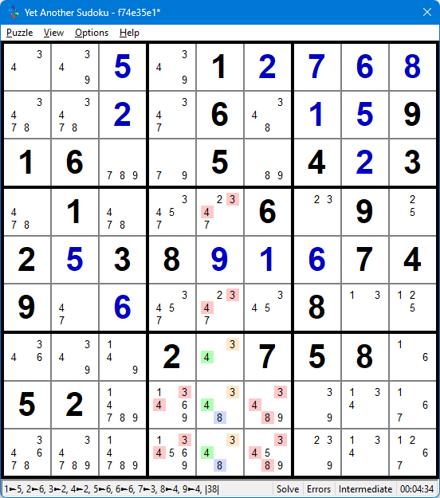
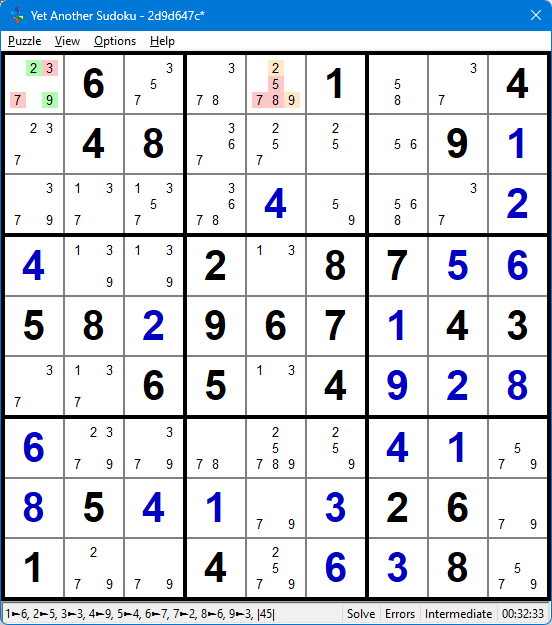
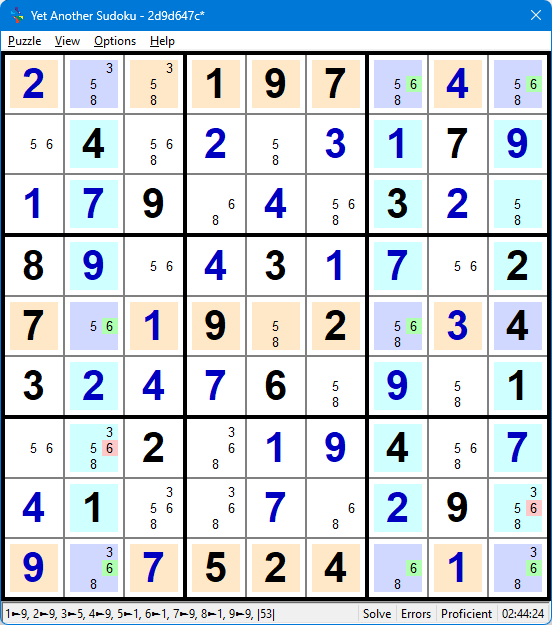
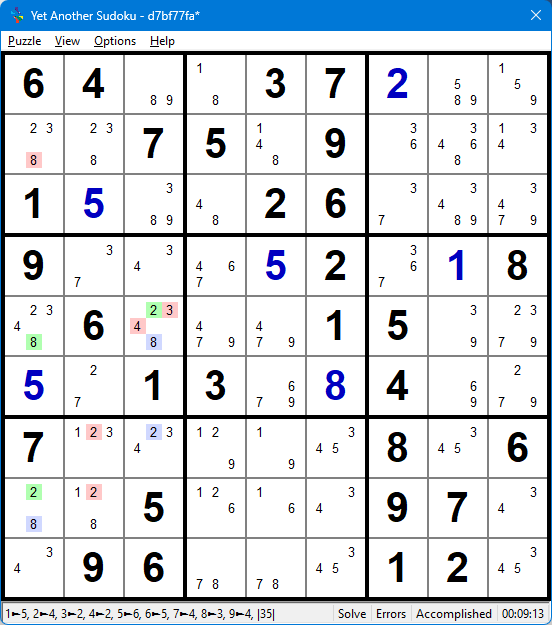

.. title:: Yet Another Sudoku | Foundation | Base Link, and Cover Sets

.. include:: ..\globals.inc

..  _found_blc_sets:

*************************
Base, Link and Cover Sets
*************************

This section owes much credit to:
   |  https://www.stolaf.edu/people/hansonr/sudoku/12rules.htm, and
   |  http://sudoku.allanbarker.com/sweb/general.htm
   
.. _found_blc_intro:

Introduction
============

Some Definitions
----------------

**Cell**
   A location in a Sudoku grid which either contains a :term:`Given` or into which a 
   :term:`Solved Value` is placed.

**Ccell**
   A three-dimensional tuple uniquely identifying a candidate element by value, row,
   and column in a Sudoku Grid.

**House**
   A specific 9 cell of a :term:`Row`, :term:`column` or :term:`Box`.  Also known as a Group, 
   Sector or Unit.

**Chouse**
   Collective noun for :term:`House` and :term:`Cell`.

**See**
   :term:`Ccell`\s that have an :term:`Link` between them are said to see each other.

**Set**
   A collection of :term:`Ccell`\s that :term:`See` each other in a :term:`Chouse`.
   
**Truth**
   A collection of :term:`Ccell`\s that :term:`See` each other in a :term:`Chouse` where one of 
   the Ccells is True, that is the :term:`Solved Value`.

**Base Set**
   A Base Set is a :term:`Set` of one or more :term:`Ccell`\s in a :term:`Chouse` forming a 
   :term:`Truth`.

**Link Set**
   A :term:`Set` of one or more :term:`Ccell`\s in a non-:term:`Base Set` :term:`Chouse` that are 
   in any Base Set.

**Cover Set**
   A Cover Set is a :term:`Set` of all the :term:`Ccell`\s that :term:`See` each other in the 
   :term:`Chouse` of a :term:`Link Set`.
   
Base Set Cover Set - X Wing Example
-----------------------------------

.. figure:: images/base-cover-eg1.png
   :name: fig-base-cover-eg1
   :scale: 65%
   :alt: Sudoku X-Wing Example
   :align: right
   :figwidth: 359px

   Base, Link and Cover Set Example

   :raw-html:`<mong>+17+6.2958.94...+6...+8+3.....6.4+816.....+7239.+4+8.+65+6+9..24..+2+9+7.6814.+6+1+4.+9...+835+8+24+1+6+97||X-Wing||3r17c49|r2c4-=3;r2c9-=3;r4c9-=3;r6c4-=3;r6c9-=3;r8c4-=3|+17+6+42958+394+5+8+3+6+7+1+2+8+3+2+1+7+5+96+44+816+5+3+2+7+9+7239+1+4+8+5+65+6+9+7+824+3+1+2+9+7+36814+5+6+1+4+5+9+7+3+2+835+8+24+1+6+97</mong>`

In Fig :numref:`fig-base-cover-eg1`

*  Row 1 is a :term:`Base Set` containing the :term:`Truth` ``3r1c49``.
*  Row 7 is also a :term:`Base Set` containing the  :term:`Truth` ``3r7c49``.
*  Column 4 is a :term:`Link Set` connecting ``3r1c4`` and ``3r7c4`` from the Base Sets.
*  Column 9 is also a :term:`Link Set` connecting ``3r1c9`` and ``3r7c9`` from the Base Sets.
*  Column 4 is also a :term:`Cover Set` including all :term:`Ccell`\s that see the Link Set, that is ``3r12678c4``.
*  Column 9 is also a :term:`Cover set` including all :term:`Ccell`\s that see its Link Set  that is ``3r12467c9``
*  Because all the Base Ccells are covered by Cover Ccells, the intersecting Ccells are confirmed as 
   a Truth in the Cover Sets.  Thus, resulting in the elimination on non-intersecting Ccells in the 
   Cover Sets, ``(r268c4,r246c9) -= 3``

.. _found_blc_sbs:

Single Base Set Patterns
========================

A single :term:`Base Set`, with a single :term:`Ccell` :term:`Truth`.  Ccells in
:term:`Intersecting <Intersection>` :term:`Cover Set`\s outside the intersection are eliminated.
Because the Base Set is a Single Ccell, the whole Truth of the Base Set can be seen from any other
:term:`Chouse`.

:ref:`Exposed Singles <found_sing_exposed>`, :ref:`Hidden Singles <found_sing_hidden>`, and 
:ref:`Locked Singles <found_sing_locked>` are examples of Single Order Patterns.

Expressing the :term:`Sudoku Rule` as a Formula for Single Order Patterns using Set Algebra:

:raw-html:`

<pre>Base Set  <b>B</b>  = {P}    # P is the only Ccell Truth in the Base Set <b>B</b>
Cover Set <b>Cj</b> = {S, T, V, ...}    # S, T, U, ... are the Ccells that see P in Cover Setj.
Cover Set <b>CU</b> = U(<b>C0</b>, <b>C1</b>, ...)    # C is the union of Cover Sets C0, C1, ...
&nbsp;
IF (<b>B</b> & <b>CU</b> == <b>B</b>):    # if <u>all</u> the Cover Set Ccells intersect Base Set Ccells
&nbsp;  THEN <b>Elims</b> = <b>CU</b> - <b>B</b>    # Then Eliminate all Cover Ccells not in Base Sets  
</pre>

`

Hidden Single Example
---------------------

.. figure:: images/hid-sing-eg1.png
   :name: fig-hid-sing-eg1
   :scale: 65%
   :alt: Sudoku Single Base Set Hidden Single Example
   :align: right
   :figwidth: 359px

   Single Base Set - Hidden Single Example

   :raw-html:`<mong>.6...1..4.48....9+1....+4...+2+4..2.87+5+658+2967+143..65.4+9+2+8+6.....+4+1.+85+4+1..26.1..4.+6+38.|r1c3-=9;r1c5-=3;r2c5-=3;r3c2-=9;r3c3-=9;r7c5-=3;r8c5-=3|Hidden Pair||29#2r1c15|r1c1-=37;r1c5-=578|+96+3+8+21+5+74+248+3+7+5+69+1+7+1+5+6+4+9+8+3+2+4+9+12+387+5+658+2967+143+3+765+14+9+2+8+6+3+9+7+8+2+4+1+5+85+4+1+9+326+71+2+74+5+6+38+9</mong>`

In :numref:`fig-hid-sing-eg1` Candidate 3 occurs once in Row 8 in location ``r8c6``. From Theorem 1, as ``3r8c6`` is the only 
occurrence of 3 in row 8, it is also the only occurrence in:

*  Column 6 resulting in the eliminations ``r236c6-=3``.
*  Box 8 resulting in the eliminations ``r7c46-=3``.
*  Cell ``r8c6`` resulting in the elimination ``r8c6-=9``, and placement of only remaining candidate
   ``r8c6:= 3``.

Normally the following logic bypassed by recognising that the only occurrence of a candidate in a
House is the solved value. ``r8c6:= 3``, which automagically eliminates all ccells with
candidate 3 that can see this placed value.  However, this Logic is easier understood with a simple
example before progressing to more complex patterns.

|
|

:raw-html:`

<pre>Base Set: <b>B3r8</b> = {3r8c6}   # The only 3 in Row 8
&nbsp;
Column Cover Set: <b>C3c6</b> = {3r2c6, 3r3c6, 3r7c6, 3r8c6}    # Intersecting Column
Box Cover Set: <b>C3b8</b> = {3r7c4, 3r7c6, 3r8c6}    # Intersecting Box
Cell Cover Set:<b>Cr8c6</b> = {3r8c6, 9r8c6}    # Intersecting Cell
&nbsp;
Cover Set Union <b>CU</b> = {3r2c6, 3r3c6, 3r7c4, 3r7c6, 3r8c6, 9r8c6}
</pre>

`

Evaluating the IF condition:

:raw-html:`

<pre><b>B3r8</b> & <b>CU</b> == <b>B3r8</b>
{3r8c6} & {<del>3r2c6</del>, <del>3r7c4</del>, <del>3r3c6</del>, <del>3r7c6</del>, 3r8c6, <del>9r8c6</del>}
True</pre>

`

Because the IF condition is True, the Eliminations are evaluated as:

:raw-html:`

<pre>Elims = <b>CU</b> - <b>B3r8</b>
&nbsp;       {3r2c6, 3r3c6, 3r7c4, 3r7c6, <del>3r8c6</del>, 9r8c6} - {3r8c6}
&nbsp;       {3r2c6, 3r3c6, 3r7c4, 3r7c6, 9r8c6}</pre>

`

All same value Ccells in intersecting houses that can see 3r8c6 in the intersection are eliminated,
leaving ``3r8c6`` as the only Ccell in the intersection, permitting its placement.

.. _found_blc_mop:

Multi Base Set Patterns and Rank
================================

Multi Base Set Patterns have more than one :term:`Truth`, each in a :term:`Base Set`,
that is confirmed as a collective Truth.  If all the :term:`Ccell`\s in these Truths can be linked 
orthogonally (:term:`intersected <Intersection>` by Ccells in non-Base Set :term:`Chouse`\s) in 
:term:`Link Set`\s, then parts of the pattern are locked as a collective Truth.  :term:`Cover Set`\s
include all Ccells in the Chouse of the Link Set that see all the Link Set Ccells.  

Where a collective Truth exists, eliminations, if any, are the non-Base Set Ccells in the 
intersection of Cover Sets overlapping the collective Truth.

Rank is the minimum number of Link Sets needed to intersect all Base Set Ccells, less the number of
Base Sets.  

.. topic:: Definition

   Rank = Number of Link Sets - Number of Cover Sets
   
Multi Base Set Patterns are classified according to Rank.

*  **Rank < 0:** Without additional crieria, it is impossible to lock further Truths.  Look to 
   `Allan Barker's General Logic of Sudoku <https://sudoku.allanbarker.com/sweb/general.htm>`_'s
   section on Illegal Logic for more information.
*  **Rank = 0:** All :term:`Ccell`\s in 'n' :term:`Base Set`\s are 
   :term:`Intersected <Intersection>` by at least 'n' :term:`Link Set`\s.  Any :term:`Cover Set` 
   :term:`Ccell` that is not in a Base Set cannot be True and is eliminated.
*  **Rank > 1:** 'n + r' :term:`Link Set`\s are required to :term:`Intersect <Intersection>` all the
   Base Set Ccells. Any non Base Set Ccell in 'r + 1' Cover Sets cannot be True and is eliminated.

Rank 0 Patterns
---------------

Rank 0 patterns have 'n' non-:term:`intersecting <Intersection>` Base Sets where all their 
:term:`Ccell`\s are intersected by a minimum of 'n' :term:`Link Set`\s, thereby Locking the pattern
as a collective :term:`Truth`\s.  Any Ccell in a Cover Set that is not part of the Intersection 
cannot be True and is eliminated.

.. topic:: Rank 0 Rule

   Any non-Base Set Ccell in any Cover Set cannot be True and is eliminated.

Rank 0 patterns include :ref:`Singles <found_str_subs>` in all there forms, 
:ref:`Straight Subsets <found_str_subs>`,
:ref:`Fish <found_fish>`, and :ref:`Even Loops <found_even_loops>`.

Singles are :ref:`Single Base Set Patterns <found_blc_sbs>`, a special case of Rank 0 patterns with
a single Ccell Truth.  A Single CCell Truth can never need more than one Link Set to intersect it 
completely as there is only on Ccell to overlap.  Therefore, Singles are always Rank 0.

Exposed Subsets have Base Set Cells, and Link Sets all in a same House type (Row, Column or Box).
Hidden Subsets have Base Sets in the Same House Type, and Link Sets in Cells.

Fish are single digit patterns with non-Intersecting House Base Sets that can Overlap, covered by 
the same of House Link Sets.

An Even Loop is a AI chain with an even number of Nodes that loops back on itself.  The Strong
Links from Base Sets, connected by the Weak Link Cover Sets. Because the Loop is Closed, a collective
Truth is locked into the pattern.

Rank 0 Exposed Quad Example
+++++++++++++++++++++++++++

.. figure:: images/exp-quad-cd1.png
   :name: fig-exp-quad-cd1
   :scale: 65%
   :alt: Exposed Quad
   :align: right
   :figwidth: image

   Exposed Quad Pattern

In the Exposed Quad :numref:`fig-exp-quad-cd1`, B1, B2, B3, B4 are Base Sets, each containing two or
more instances of values W, X, Y, and Z; such that each of the 4 Link Sets see two or more instances of 
each value W, X, Y, Z. That is, L1 sees all the W's present in B1, B2, B3, B4; L2 sees all the X's, L3
all the Y's and L4 all the Z's.  Therefore, by virtue of L1, L2, L3 and L4, each intersecting all the Base Sets,
they hold the Truths for W, X, Y and Z respectively in that house.  W, X, Y, and Z cannot be True anywhere else in 
this House and are Eliminated.

.. figure:: images/not-exp-quad-cd1.png
   :name: fig-not-exp-quad-cd1
   :scale: 65%
   :alt: Not A Exposed Quad
   :align: right
   :figwidth: image

   Not Quite an Exposed Quad Pattern
   
:numref:`fig-not-exp-quad-cd1` has a V instead of a Z in B3.  Here candidate V remains uncovered
after the Link Sets have been applied.  Either the remaining Exposed Quad is True, or V is True.  
But which it is, is undetermined.  Therefore, without additional criteria, it is impossible to draw 
any elimination conclusions.

Base Sets may be any combination of distinct :term:`Chouse`\s.  That is, they can :term:`Overlap`,
but do not :term:`Intersect <intersection>`.  Base Sets do not share :term:`Ccell`\s.  

Extending the :term:`Sudoku Rule` formula to include Equal Multi Order Patterns:

.. _n-base-n-link-sud-rule:

:raw-html:`

<pre>Base Set  <b>Bi</b>  = {P, Q, R, ...}    # P, Q, R, ... are the Ccells making up the Truth in the Base Set <b>Bi</b>
Base Set <b>BU</b> = U(<b>B0</b>, <b>B1</b>, ...,<b>Bn</b>)    # The union of Base Sets <b>B1</b>, <b>B2</b>, ..., <b>Bn</b>
Link Set <b>Li</b> = {K, M, N, ...}    # K, M, N, ... Links Ccells from the Base Set Union that see each other in a non-Base Set Chouse
Link Set <b>LU</b> = U(<b>L0</b>, <b>L1</b>, ..., <b>Ln</b>)    # The union of Link Sets <b>L1</b>, <b>L2</b>, ..., <b>Ln</b>
Cover Set <b>Ci</b> = {K, M, N, S, T, ...}    # Contains all the Ccells that See each other in the Link Set House <b>Li</b>
Cover Set <b>CU</b> = U(<b>C0</b>, <b>C1</b>, ..., <b>Cn</b>)    # The union of Cover Sets <b>C1</b>, <b>C2</b>, ..., <b>Cn</b>
&nbsp;
IF (<b>BU</b> == <b>LU</b>):    # if <u>all</u> the Base Set Ccells are Linked
&nbsp;  THEN <b>Elims</b> = <b>CU</b> - <b>BU</b>    # Then Any Cover Sets Ccells that is not in a Base Set is eliminated.
</pre>

`

The :term:`Base Set`\s are non-intersecting :term:`Chouse`\s, each containing a :term:`Truth`.  :term:`Link Set`\s connect the :term:`Ccell`\s of the truths in 
other non-Base Set Chouses.  If all the Base Set Ccells are :term:`Linked <Link>` (union of Base Sets == Union of 
Link Sets), then the :term:`Cover Set` Ccells that are not in this union (union of Cover Sets - Union of Base 
Sets) cannot be True and are eliminated. 

Rank 0 Locked Exposed Triple - Subset Example
+++++++++++++++++++++++++++++++++++++++++++++

The :term:`Base Set`\s are the :term:`CCell`\s, each containing a :term:`Truth`.  :term:`Link Set`\s are all confined to a :term:`House` in
which all the Base Sets are contained. 

   Locked Exposed Triple

   :raw-html:`<mong>..+5.1+2+7+6+8..+2.6.+1+5916..5.4+23.1...6.9.2+538+9+1+6749.+6...8.....2.758.52................||Locked Exposed Triple||34==r7c5,348==r8c5,348==r9c5|r8c4-=34;r9c4-=34;r8c6-=348;r9c6-=348;r4c5-=34;r6c5-=34|+3+4+5+91+2+7+6+8+7+8+2+46+3+1+5916+9+75+84+23+81+4+3+76+29+52+538+9+1+6749+7+6+5+2+48+3+1+4+9+12+3758+652+8+6+4+9+3+1+7+6+3+7+1+8+5+9+4+2</mong>`

The Locked Exposed Triple in :numref:`fig-locked-exp-trip-eg1` has the following :term:`Base Set`\s:
:raw-html:`

<ul class="simple">
<li>
<code class="docutils literal notranslate"><b>Br7c5</b> = {3r7c5, 4r7c5}</code>,
</li>
<li>
<code class="docutils literal notranslate"><b>Br8c5</b> = {3r8c5, 4r8c5, 8r8c5}</code>, and
</li>
<li>
<code class="docutils literal notranslate"><b>Br9c5</b> = {3r9c5, 4r9c5, 8r9c5}</code>.
</li>
</ul>

`

The :term:`Link Set`\s are:
:raw-html:`

<ul class="simple">
<li>
<code class="docutils literal notranslate"><b>L3c5</b> = {3r7c5, 3r8c5, 3r9c5}</code>,
</li>
<li>
<code class="docutils literal notranslate"><b>L4c5</b> = {4r7c5, 4r8c5, 4r9c5}</code>, and
</li>
<li>
<code class="docutils literal notranslate"><b>L8c5</b> = {8r8c5, 8r9c5}</code>.
</li>
</ul>

`

And the :term:`Cover Set`\s in Column 4 are:
:raw-html:`

<ul class="simple">
<li>
<code class="docutils literal notranslate"><b>C3c5</b> = {3r4c5, 3r6c5, 3r7c5, 3r8c5, 3r9c5}</code>,
</li>
<li>
<code class="docutils literal notranslate"><b>C4c5</b> = {4r4c5, 4r6c5, 4r7c5, 4r8c5, 4r9c5}</code>, and
</li>
<li>
<code class="docutils literal notranslate"><b>C8c5</b> = {8r4c5, 8r6c5, 8r8c5, 8r9c5}</code>.
</li>
</ul>

`

And notice that this pattern is also locked to Box 8
:raw-html:`

<ul class="simple">
<li>
<code class="docutils literal notranslate"><b>C3b8</b> = {3r7c5, 3r8c4, 3r8c5, 3r8c6, 3r9c4, 3r9c5, 3r9c6}</code>,
</li>
<li>
<code class="docutils literal notranslate"><b>C4b8</b> = {4r7c5, 4r8c4, 4r8c5, 4r8c6, 4r9c4, 4r9c5, 4r9c6}</code>, and
</li>
<li>
<code class="docutils literal notranslate"><b>C8b8</b> = {8r9c5, 8r9c6}</code>.
</li>
</ul>

`

The set unions are:
:raw-html:`

<ul class="simple">
<li>
<code class="docutils literal notranslate"><b>Bu</b> = {3r7c5, 4r7c5, 3r8c5, 4r8c5, 8r8c5, 3r9c5, 4r9c5, 8r9c5}</code>,
</li>
<li>
<code class="docutils literal notranslate"><b>Lu</b> = {3r7c5, 3r8c5, 3r9c5, 4r7c5, 4r8c5, 4r9c5, 8r8c5, 8r9c5}</code>, and
</li>
<li>
<code class="docutils literal notranslate"><b>CU</b> = {3r4c5, 3r6c5, 3r7c5, 3r8c4, 3r8c5, 3r8c6, 3r9c4, 3r9c5, 3r9c6, 4r4c5, 4r6c5, 4r7c5, 4r8c4, 4r8c5, 4r8c6, 4r9c4, 4r9c5 4r9c6, 8r4c5, 8r6c5, 8r8c5, 8r8c6, 8r9c5, 8r9c6}</code>.
</li>
</ul>

`

Applying the Sudoku Rule: 
:raw-html:`

<pre>IF (<b>BU</b> == <b>LU</b>):    # Evaluates True
&nbsp;  THEN <b>Elims</b> = <b>CU</b> - <b>BU</b>  # Compute Eliminations
&nbsp;            = {3r4c5, 3r6c5, <del>3r7c5</del>, 3r8c4, <del>3r8c5</del>, 3r8c6, 3r9c4, <del>3r9c5</del>, 3r9c6, 4r4c5, 4r6c5, <del>4r7c5</del>, 4r8c4, <del>4r8c5</del>, 4r8c6, 4r9c4, <del>4r9c5</del>, 4r9c6, 8r4c5, 8r6c5, <del>8r8c5</del>, 8r8c6, <del>8r9c5</del>, 8r9c6} - {3r7c5, 3r8c5, 3r9c5, 4r7c5, 4r8c5, 4r9c5, 8r8c5, 8r9c5}
&nbsp;            = {3r4c5, 3r6c5, 3r8c4, 3r8c6, 3r9c4, 3r9c6, 4r4c5, 4r6c5, 4r8c4, 4r8c6, 4r9c4, 4r9c6, 8r8c6, 8r9c6}
</pre>

`

An unusually productive 14 Ccell Elimination.

.. _found_emop_hid_ssets1:

Rank 0 Hidden Pair Subset Example
+++++++++++++++++++++++++++++++++

:term:`Base Set`\s are :term:`Set`\s of :term:`Ccell`\s, each a :term:`Truth`, all in the same 
:term:`House`.  :term:`Link Set`\s connect Base Set Ccells in :term:`Cell`\s.

   Hidden Pair

   :raw-html:`<mong>.6...1..4.48....9+1....+4...+2+4..2.87+5+658+2967+143..65.4+9+2+8+6.....+4+1.+85+4+1.+326.1..4.+6+38.|r1c3-=9;r1c5-=3;r2c5-=3;r3c2-=9;r3c3-=9|Hidden Pair||29#2r1c15|r1c1-=37;r1c5-=578|+96+3+8+21+5+74+248+3+7+5+69+1+7+1+5+6+4+9+8+3+2+4+9+12+387+5+658+2967+143+3+765+14+9+2+8+6+3+9+7+8+2+4+1+5+85+4+1+9+326+71+2+74+5+6+38+9</mong>`

The Hidden Pair in :numref:`fig-hid-pair-eg1` has the following :term:`Base Set`\s:
:raw-html:`

<ul class="simple">
<li>
<code class="docutils literal notranslate"><b>B2r1</b> = {2r1c1, 2r1c5}</code>, and
</li>
<li>
<code class="docutils literal notranslate"><b>B9r1</b> = {9r1c1, 9r1c5}</code>.
</li>
</ul>

`

The :term:`Link Set`\s are:
:raw-html:`

<ul class="simple">
<li>
<code class="docutils literal notranslate"><b>Lr1c1</b> = {2r1c1, 9r1c1}</code>, and
</li>
<li>
<code class="docutils literal notranslate"><b>Lr1c5</b> = {2r1c5, 9r1c5}</code>.
</li>
</ul>

`

And the :term:`Cover Set`\s in Column 4 are:
:raw-html:`

<ul class="simple">
<li>
<code class="docutils literal notranslate"><b>Cr1c1</b> = {2r1c1, 3r1c1, 7r1c1, 9r1c1}</code>, and
</li>
<li>
<code class="docutils literal notranslate"><b>Cr1c5</b> = {2r1c5, 5r1c5, 7r1c5, 8r1c5, 9r1c5}</code>.
</li>
</ul>

`

The set unions are:
:raw-html:`

<ul class="simple">
<li>
<code class="docutils literal notranslate"><b>Bu</b> = {2r1c1, 2r1c5, 9r1c1, 9r1c5}</code>,
</li>
<li>
<code class="docutils literal notranslate"><b>Lu</b> = {2r1c1, 9r1c1, 2r1c5, 9r1c5}</code>, and
</li>
<li>
<code class="docutils literal notranslate"><b>CU</b> = {2r1c1, 3r1c1, 7r1c1, 9r1c1, 2r1c5, 5r1c5, 7r1c5, 8r1c5, 9r1c5}</code>.
</li>
</ul>

`

Applying the Sudoku Rule: 
:raw-html:`

<pre>IF (<b>BU</b> == <b>LU</b>):    # Evaluates True
&nbsp;  THEN <b>Elims</b> = <b>CU</b> - <b>BU</b>  # Compute Eliminations
&nbsp;            = {<del>2r1c1</del>, 3r1c1, 7r1c1, <del>9r1c1</del>, <del>2r1c5</del>, 5r1c5, 7r1c5, 8r1c5, <del>9r1c5</del>} - {2r1c1, 9r1c1, 2r1c5, 9r1c5}
&nbsp;            = {3r1c1, 7r1c1, 5r1c5, 7r1c5, 8r1c5}
</pre>

`

.. _found_emop_fish:

Rank 0 Swordfish Example
++++++++++++++++++++++++

Fish are single Candidate value patterns.  Base Sets are Sets of same value Ccell Truths
each in their own House.  Link Sets connect Ccells from the Base Sets in non-Base Set Houses.

   Swordfish

   :raw-html:`<mong>+2..197.+4..4.+2.+3+17+9+1+79.+4.3+2.8+9.+43+1+7.27.+19.2.+343+2+4+76.+9.1..2.+1+94.+7+41..+7.+29.+9.+7524.+1.|r1c2-=6;r1c3-=6;r3c9-=6|Swordfish||6r159c279|r7c2-=6;r8c9-=6|+2+3+8197+5+4+6+54+6+2+8+3+17+9+1+79+6+4+53+2+88+9+5+43+1+7+627+6+19+52+8+343+2+4+76+8+9+51+6+52+3+1+94+8+7+41+3+8+7+6+29+5+9+8+7524+6+1+3</mong>`

The Candidate 6 Swordfish in :numref:`fig-swordfish-eg1`, Base Set Houses are highlighted beigé, Link Set Houses highlighted cyan, and intersections 
highlighted light purple.  The Base Sets are:
:raw-html:`

<ul class="simple">
<li>
<code class="docutils literal notranslate"><b>B6r1</b> = {6r1c7, 6r1c9}</code>,
</li>
<li>
<code class="docutils literal notranslate"><b>B6r5</b> = {6r5c2, 6r5c7}</code>, and
</li>
<li>
<code class="docutils literal notranslate"><b>B6r9</b> = {6r9c2, 6r9c7, 6r9c9}</code>.
</li>
</ul>

`

The :term:`Link Set`\s are:
:raw-html:`

<ul class="simple">
<li>
<code class="docutils literal notranslate"><b>L6c2</b> = {6r5c2, 6r9c2}</code>,
</li>
<li>
<code class="docutils literal notranslate"><b>L6c7</b> = {6r1c7, 6r5c7, 6r9c7}</code>, and
</li>
<li>
<code class="docutils literal notranslate"><b>L6c9</b> = {6r1c9, 6r9c9}</code>.
</li>
</ul>

`

And the :term:`Cover Set`\s in Column 4 are:
:raw-html:`

<ul class="simple">
<li>
<code class="docutils literal notranslate"><b>C3c5</b> = {6r5c2, 6r7c2, 6r9c2}</code>,
</li>
<li>
<code class="docutils literal notranslate"><b>C4c5</b> = {6r1c7, 6r5c7, 6r9c7}</code>, and
</li>
<li>
<code class="docutils literal notranslate"><b>C8c5</b> = {6r1c9, 6r8c9, 6r9c9}</code>.
</li>
</ul>

`

The set unions are:
:raw-html:`

<ul class="simple">
<li>
<code class="docutils literal notranslate"><b>Bu</b> = {6r1c7, 6r1c9, 6r5c2, 6r5c7, 6r9c2, 6r9c7, 6r9c9}</code>,
</li>
<li>
<code class="docutils literal notranslate"><b>Lu</b> = {6r5c2, 6r9c2, 6r1c7, 6r5c7, 6r9c7, 6r1c9, 6r9c9}</code>, and
</li>
<li>
<code class="docutils literal notranslate"><b>CU</b> = {6r5c2, 6r7c2, 6r9c2, 6r1c7, 6r5c7, 6r9c7, 6r1c9, 6r8c9, 6r9c9}</code>.
</li>
</ul>

`

Applying the Sudoku Rule: 
:raw-html:`

<pre>IF (<b>BU</b> == <b>LU</b>):    # Evaluates True
&nbsp;  THEN <b>Elims</b> = <b>CU</b> - <b>BU</b>  # Compute Eliminations
&nbsp;            = {<del>6r5c2</del>, 6r7c2, <del>6r9c2</del>, <del>6r1c7</del>, <del>6r5c7</del>, <del>6r9c7</del>, <del>6r1c9</del>, 6r8c9, <del>6r9c9</del>} - {6r5c2, 6r9c2, 6r2c7, 6r5c7, 6r9c7, 6r2c9, 6r9c9}
&nbsp;            = {6r7c2, 6r8c9}
</pre>

`

Rank 0 Even Loop Example
++++++++++++++++++++++++

   Even Loop

   :raw-html:`<mong>64..37+2....75.9...1+5..26...9...+52.+18.6...15..+5.13.+84..7.....8.6..5...97..96...12.|r7c4-=4;r7c5-=4;r8c1-=34;r8c2-=3;r8c4-=48;r8c5-=48;r9c1-=8;r9c4-=4;r9c5-=4|Even AI-Loop T3||2r5c3=2r7c3-2r8c1=8r8c1-8r5c1=8r5c3-,8r5c1-8r2c1-8r8c1,2r5c3-3r5c3-8r5c3,2r5c3-4r5c3-8r5c3,2r8c1-2r7c2-2r7c3,2r8c1-2r8c2-2r7c3|r2c1-=8;r5c3-=34;r7c2-=2;r8c2-=2|64+9+137+2+8+5+2+875+49+6+3+11+5+3+826+7+4+99+7+4+6+52+3+18+36+8+4+715+9+2+5+213+9+84+6+77+3+2+9+1+48+56+8+15+2+6+397+4+496+7+8+512+3</mong>`
   
Strong Sets are indicated by green to blue Ccells, Link Sets by blue to green Ccells. Characteristic
of all :ref:`AI Chains <found_chains>`  Both All Base Sets and Link Sets only contain 2 Ccells each.

The :term:`Base Set`\s are:
:raw-html:`

<ul class="simple">
<li>
<code class="docutils literal notranslate"><b>B2c3</b> = {2r5c3, 2r7c3}</code>,
</li>
<li>
<code class="docutils literal notranslate"><b>Br8c2</b> = {2r8c1, 8r8c1}</code>, and
</li>
<li>
<code class="docutils literal notranslate"><b>B8r5</b> = {8r5c1, 8r5c3}</code>. and
</li>
</ul>

`

The :term:`Link Set`\s are:
:raw-html:`

<ul class="simple">
<li>
<code class="docutils literal notranslate"><b>L2b7</b> = {2r7c3, 2r8c1}</code>,
</li>
<li>
<code class="docutils literal notranslate"><b>L8r1</b> = {8r8c1, 8r5c1}</code>, and
</li>
<li>
<code class="docutils literal notranslate"><b>Lr5c3</b> = {2r5c3, 8r5c3}</code>.
</li>
</ul>

`

And the corresponding :term:`Cover Set`\s in Column 4 are:
:raw-html:`

<ul class="simple">
<li>
<code class="docutils literal notranslate"><b>L2b7</b> = {2r7c2, 2r7c3, 2r1c8, 2r8c2}</code>,
</li>
<li>
<code class="docutils literal notranslate"><b>L8r1</b> = {8r8c1, 8r5c1}</code>, and
</li>
<li>
<code class="docutils literal notranslate"><b>Lr5c3</b> = {2r5c3, 3r5c3, 4r5c3, 8r5c3}</code>.
</li>
</ul>

`

The set unions are:
:raw-html:`

<ul class="simple">
<li>
<code class="docutils literal notranslate"><b>Bu</b> = {2r5c3, 2r7c3, 2r8c1, 8r8c1, 8r5c1, 8r5c3}</code>,
</li>
<li>
<code class="docutils literal notranslate"><b>Lu</b> = {2r7c3, 2r8c1, 8r8c1, 8r5c1, 2r5c3, 8r5c3}</code>, and
</li>
<li>
<code class="docutils literal notranslate"><b>CU</b> = {2r7c2, 2r7c3, 2r8c1, 8r8c1, 8r5c1, 2r5c3, 3r5c3, 4r5c3, 8r5c3}</code>.
</li>
</ul>

`

Applying the Sudoku Rule: 
:raw-html:`

<pre>IF (<b>BU</b> == <b>LU</b>):    # Evaluates True
&nbsp;  THEN <b>Elims</b> = <b>CU</b> - <b>BU</b>  # Compute Eliminations
&nbsp;            = {2r7c2, <del>2r7c3</del>, <del>2r8c1</del>, <del>8r8c1</del>, <del>8r5c1</del>, <del>2r5c3</del>, 3r5c3, 4r5c3, <del>8r5c3</del>} - {2r5c3, 2r7c3, 2r8c1, 8r8c1, 8r5c1, 8r5c3}
&nbsp;            = {2r7c2, 2r8c2, 3r5c3, 4r5c3}
</pre>

`

Rank 1 Patterns
---------------

Rank 1 patterns need a minimum of 'n + 1' Link Sets to intersect all the Base Set Ccells

Rank 1 patterns have 'n' non-:term:`intersecting <Intersection>` Base Sets with all their 
:term:`Ccell`\s are intersected by a minimum of 'n + 1' :term:`Link Set`\s.  Therefore, the union of 
any two Link Sets will always see a complete Base Set :term:`Truth`.  Consequently, where ever two
Link Sets overlap, any non-Base Set Ccell in the Intersection of those Cover Sets cannot be True and
is eliminated.

.. topic:: Rank 1 Rule

   Any non-Base Set Ccell in the intersection of any two Cover Sets cannot be True and is eliminated.
   
Many “Human Solvable” patterns are Rank 1 patterns.  These include :ref:`Bent Subsets <found_bent_subs>`, 
:ref:`Finned Fish <found_finned_fish>`, :ref:`Sashimi Fish <found_sashimi_fish>`, 
:ref:`AI Chains <found_chains>` in many of their forms, and :ref:`Nearly Locked Sets <found_NLS>`.

The Sudoku Rule as a formula for Rank 1 patterns:

:raw-html:`

<pre>Base Set  <b>Bi</b>  = {P, Q, R, ...}    # P, Q, R, ... are the Ccells making up the Truth in the Base Set <b>Bi</b>
Base Set <b>BU</b> = U(<b>B1</b>, <b>B1</b>, ...,<b>Bn</b>)    # The union of Base Sets <b>B1</b>, <b>B2</b>, ..., <b>Bn</b>
Link Set <b>Li</b> = {K, M, N, ...}    # K, M, N, ... Links Ccells from the Base Set Union that see each other in a non-Base Set Chouse
Link Set <b>LU</b> = U(<b>L1</b>, <b>L1</b>, ..., <b>Ln+1</b>)    # The union of Link Sets <b>L1</b>, <b>L2</b>, ..., <b>Ln+1</b>
Cover Set <b>Ci</b> = {K, M, N, S, T, ...}    # Contains all the Ccells that See each other in the Link Set House <b>Li</b>
Cover Set <b>CU</b> = U(<b>C1</b>, <b>C1</b>, ..., <b>Cn+1</b>)    # The union of Cover Sets <b>C1</b>, <b>C2</b>, ..., <b>Cn+1</b>
&nbsp;
IF (<b>BU</b> == <b>LU</b>):    # if <u>all</u> the Base Set Ccells are Linked
&nbsp;  THEN <b>Elims</b> = (Union of (Intersections of all Combinations of 2 Cover Sets)) - <b>BU</b>   
</pre>

`

Any Ccell in the occupied Intersected Cover Set Pair that is not of the Union of Base Set CCells cannot 
be True and is eliminated.  

A quick way to find the union of intersections is to scan the list of cover sets to find all those 
Ccells that occur more than once, no Ccell should appear more than twice in the list.  Then remove 
those that are in the Base Set Union.  What's left is the eliminations.

Rank 1 Finned X Wing Example
++++++++++++++++++++++++++++

.. figure:: images/finned-x-wing-eg1.png
   :name: fig-finned-x-wing-eg1
   :scale: 65%
   :alt: Sudoku Finned-X-Wing Example
   :align: right
   :figwidth: 359px

   Finned X-Wing

   :raw-html:`<mong>+156+87+49+3+2.4+762.+18+528....+4+7+6....8.+5+9.73....618+8.5...+32.........+3.7.5...49....487.1||Finned X-Wing||3c35r38,r9c3;3r8c1-3r9c3|r8c1-=3|+156+87+49+3+2+34+762+9+18+528+9+1+5+3+4+7+6+4+6+1+38+2+5+9+773+2+4+9+5618+8+95+7+1+6+32+4+9+1+4+2+6+7+8+5+3+67+85+3+1+249+5+2+3+9487+61</mong>`

The Rank 1 puzzle pattern on the right is a Finned X-Wing ``3c35r38,r9c3``.
The Base Sets are:
:raw-html:`

<ul class="simple">
<li>
<code class="docutils literal notranslate"><b>B3c3</b> = {3r3c3, 3r8c3, 3r9c3}</code>, and
</li>
<li>
<code class="docutils literal notranslate"><b>B3c5</b> = {3r3c5, 3r8c5}</code>.
</li>
</ul>

`

The Link Sets are:
:raw-html:`

<ul class="simple">
<li>
<code class="docutils literal notranslate"><b>L3r3</b> = {3r3c3, 3r3c5}</code>,
</li>
<li>
<code class="docutils literal notranslate"><b>L3r8</b> = {3r8c3, 3r8c5}</code>, and
</li>
<li>
<code class="docutils literal notranslate"><b>L3b7</b> = {3r8r3, 3r9c3}</code>.
</li>
</ul>

`

And the Cover Sets are:
:raw-html:`

<ul class="simple">
<li>
<code class="docutils literal notranslate"><b>C3r3</b> = {3r3c3, 3r3c4, 3r3c5, 3r3c6}</code>,
</li>
<li>
<code class="docutils literal notranslate"><b>C3r8</b> = {3r8c1, 3r8c3, 3r8c5, 3r8c6}</code>, and
</li>
<li>
<code class="docutils literal notranslate"><b>C3b7</b> = {3r8c1, 3r8r3, 3r9c1, 3r9c3}</code>.
</li>
</ul>

`

Applying the Sudoku Rule: 
:raw-html:`

<pre>IF (<b>BU</b> == <b>LU</b>):    # Evaluates True
&nbsp;  THEN <b>Elims</b> = (<b>C3r8</b> & <b>C3b7</b>) - <b>BU</b>  # Compute Eliminations
&nbsp;             = ({3r8c1, 3r8c3, 3r8c5, 3r8c6} & {3r8c1, 3r8r3, 3r9c1, 3r9c3}) - {3r3c3, 3r8c3, 3r9c3, 3r3c5, 3r8c5}
&nbsp;             = {3r8c1, 3r8c3} - {3r3c3, 3r8c3, 3r9c3, 3r3c5, 3r8c5}
&nbsp;             = {3r8c1}
</pre>

`

The intersection of :raw-html:`<code class="docutils literal notranslate"><b>C3r8</b> & <b>C3b7</b></code>`
is the only intersection of pairs of Link Sets that yields an occupied set.

Double-checking this result intuitively, either the Fish pattern will be True or the Fin will be
True.  Therefore, any Ccell that is any Cover Set Ccell outside the
intersections that can also see the Fin cannot be True and can be eliminated.

|

Rank 1 Two String Kite Example
++++++++++++++++++++++++++++++

.. figure:: images/two-string-kite-eg1.png
   :name: fig-two-string-kite-eg1
   :scale: 65%
   :alt: Sudoku Two String Kite Example
   :align: right
   :figwidth: 359px

   Two String Kite

   :raw-html:`<mong>+3617..+2+95842+395+6+7+1.5.+26+14+8+3+1.+8+5+2+6.3+4+625....+1+8.+341..+526+4..+6+1.+8+5+2+58...+2+1672+1+6+8+5+7349||Two String Kite||9r6c6=9r6c1~9r4c2=9r7c2,9r6c6-9r7c6-9r7c2|r7c6-=9|+3617+8+4+2+95842+395+6+7+1+75+9+26+14+8+3+1+7+8+5+2+6+93+4+625+4+3+9+7+1+8+9+341+7+8+526+4+9+7+6+1+3+8+5+2+58+3+9+4+2+1672+1+6+8+5+7349</mong>`

The Rank 1 puzzle pattern on the right is a Two String Kite
``9(r6c6=r6c1-r4c2=r7c2)``.  This pattern is also an example of two base sets
crossing over each other without intersecting.  

The two Base Sets for Candidate 9 are:

:raw-html:`

<ul class="simple">
<li>
<code class="docutils literal notranslate"><b>B9r7</b> = {9r6c1, 9r6c6}</code>, and
</li>
<li>
<code class="docutils literal notranslate"><b>B9c2</b> = {9r4c2, 9r7c2}</code>.
</li>
</ul>

`

The Link Sets are:
:raw-html:`

<ul class="simple">
<li>
<code class="docutils literal notranslate"><b>L9b4</b> = {9r6c1, 9r4c2}</code>,
</li>
<li>
<code class="docutils literal notranslate"><b>L9r7|9b7|r7c2</b> = {9r7c2}</code>, and
</li>
<li>
<code class="docutils literal notranslate"><b>L9c6|9b5|r6c6</b> = {9r6c6}</code>.
</li>
</ul>

`

Note:  The last two Link Sets are single Ccell sets.  An interesting property of Single Ccell 
Link Sets, is that they are not bound to any house, they are visible from all the remaining 
non-Base Set Chouses, as indicated in the subscript.

And the Cover Sets are:
:raw-html:`

<ul class="simple">
<li>
<code class="docutils literal notranslate"><b>C9b4</b> = {9r6c1, 9r4c2}</code>,
</li>
<li>
<code class="docutils literal notranslate"><b>C9r7|9b7|r7c2</b> = {9r7c2, 9r7c3, 9r7c6, 9r8c3, 7r7c2}</code>, and
</li>
<li>
<code class="docutils literal notranslate"><b>C9c6|9b5|r6c6</b> = {9r5c6, 9r6c6, 9r7c6, 9r5c4, 8r6c6}</code>.
</li>
</ul>

`

Applying the Sudoku Rule: 
:raw-html:`

<pre>IF (<b>BU</b> == <b>LU</b>):    # Evaluates True
&nbsp;  THEN <b>Elims</b> = (<b>C9r7|9b7|r7c2</b> & <b>C9c6|9b5|r6c6</b>) - <b>BU</b>  # Compute Eliminations
&nbsp;             = ({9r7c2, 9r7c3, 9r7c6} & {9r5c6, 9r6c6, 9r7c6}) - {9r6c1, 9r6c6, 9r4c2, 9r7c2}
&nbsp;             = {9r7c6} - {9r6c1, 9r6c6, 9r4c2, 9r7c2}
&nbsp;             = {9r7c6}
</pre>

`

The intersection of :raw-html:`<code class="docutils literal notranslate"><b>C9r7|9b7|r7c2</b> & <b>C9c6|9b5|r6c6</b></code>`
is the only intersection of pairs of Link Sets that yields an occupied set.

Resolving as a Two String Kite, if ``9r6c6`` is False, ``9r6c2`` is True, ``9r4c2`` is False, and ``9r2c7``
is True.  Similarly walking the links in the opposite direction, if ``9r2c7`` is False, then
``9r6c6`` is True.  Thus, there is a :ref:`Robust link <found_cc_robust_links>` ``9r6c6|~|9r7c2``.
At least one end of a Robust Link must be True, therefore any Ccell such as ``9r7c6`` that sees both
ends cannot be True and is eliminated.

|

Rank 1 Nearly Locked Set or XY Chain Example
++++++++++++++++++++++++++++++++++++++++++++

.. figure:: images/uls-chain-cd1.png
   :name: fig-uls-chain-cd1
   :scale: 65%
   :alt: Sudoku Unlocked Set Chain Candidate Diagram Example
   :align: right
   :figwidth: 359px

   Unlocked Set Chain Candidate Diagram

The Rank 1 Puzzle pattern on the right is also both an XY-Chain:
``(Z=Y)r1c4~(Y=X)r5c4~(X=W)r5c7~(W=Z)r6c8``, and a 2 Node Unlocked Set Chain:
``Z(YZr1c4,XYr5c4)X(WXr5c7,WZr6c8)Z``.

As a Rank 1 :term:`GMOP`, identify the Bi-value Cells as the Base Sets:
:raw-html:`

<ul class="simple">
<li>
<code class="docutils literal notranslate"><b>Br1c4</b> = {Yr1c4, Zr1c4}</code>,
</li>
<li>
<code class="docutils literal notranslate"><b>Br5c4</b> = {Xr5c4, Yr5c4}</code>
</li>
<li>
<code class="docutils literal notranslate"><b>Br5c7</b> = {Wr5c7, Xr5c7}</code>, and
</li>
<li>
<code class="docutils literal notranslate"><b>Br6c8</b> = {Wr6c8, Zr6c8}</code>.
</li>
</ul>

`

The Link Sets are:
:raw-html:`

<ul class="simple">
<li>
<code class="docutils literal notranslate"><b>LWb6</b> = {Wr5c7, Wr6c8}</code>,
</li>
<li>
<code class="docutils literal notranslate"><b>LXr5</b> = {Xr5c4, Xr5c7}</code>,
</li>
<li>
<code class="docutils literal notranslate"><b>LYc4</b> = {Yr1c4, Yr5c4}</code>,
</li>
<li>
<code class="docutils literal notranslate"><b>LZr1|Zc4|Zb2</b> = {Zr1c4}</code>, and
</li>
<li>
<code class="docutils literal notranslate"><b>LZr6|Zc8|Zb6</b> = {Zr6c8}</code>.
</li>
</ul>

`

And the Cover Sets are:
:raw-html:`

<ul class="simple">
<li>
<code class="docutils literal notranslate"><b>LWb6</b> = {Wr5c7, Wr6c8}</code>,
</li>
<li>
<code class="docutils literal notranslate"><b>LXr5</b> = {Xr5c4, Xr5c7}</code>,
</li>
<li>
<code class="docutils literal notranslate"><b>LYc4</b> = {Yr1c4, Yr5c4}</code>,
</li>
<li>
<code class="docutils literal notranslate"><b>LZr1|Zc4|Zb2</b> = {Zr1c4, Zr1c8, Zr6c4}</code>, and
</li>
<li>
<code class="docutils literal notranslate"><b>LZc8|Zc8|Zb6</b> = {Zr6c8, Zr1c8, Zr6c4}</code>.
</li>
</ul>

`

Applying the Sudoku Rule: 
:raw-html:`

<pre>IF (<b>BU</b> == <b>LU</b>):    # Evaluates True
&nbsp;  THEN <b>Elims</b> = (<b>CZr1|Zc4|Zb2</b> & <b>CZc8|Zc8|Zb6</b>) - <b>BU</b>  # Compute Eliminations
&nbsp;             = ({Zr1c4, Zr1c8, Zr6c4} & {Zr6c8, Zr1c8, Zr6c4}) - {Yr1c4, Zr1c4, Xr5c4, Yr5c4, Wr5c7, Xr5c7, Wr6c8, Zr6c8}
&nbsp;             = {Zr1c8, Zr6c4} - {Yr1c4, Zr1c4, Xr5c4, Yr5c4, Wr5c7, Xr5c7, Wr6c8, Zr6c8}
&nbsp;             = {Zr1c8, Zr6c4}
</pre>

`

The intersection of :raw-html:`<code class="docutils literal notranslate"><b>CZc8|Zc8|Zb6</b> & <b>CZc8|Zc8|Zb6</b></code>`
is the only intersection of pairs of Link Sets that yields an occupied set.
elimination of Zr1c8.

As an XY Chain the Ccells in the Bi Value cells are the Strong links of the AI Chain.  They are
weakly linked by a common value Ccell connecting two Bi Value Ccells.  The Chain ends are ``Zr1c4``
and ``Zr6c8`` and the Chain ensures that neither end is simultaneously False, at least one end is True,
which it is yet to be determined.  Therefore, any Ccell that can see both ends of the chain
cannot be True, and is eliminated.

As the 2 Node Unlocked Set Chain, X is the only member in the RCS connecting the two ULS’s.  The
other common candidate is “Z”.  If X is True in the first ULS, then Z is True in ULS2, and if X is
True in the second ULS, then Z is True in the first ULS.  This locks  ``Zr1c4`` and ``Zr6c8`` are locked
into “A Truth”.  Therefore, any same valued (Z) Ccell that can see all the elements of this
'A Truth' cannot be True and can be eliminated.

Rank 'r' Patterns
-----------------

Rank r patterns have 'n' non-:term:`intersecting <Intersection>` Base Sets with all their 
:term:`Ccell`\s are intersected by a minimum of 'n + r' :term:`Link Set`\s.  Therefore, the union of 
any 'r + 1' Link Sets will always see a complete Base Set :term:`Truth`.  Consequently, where ever 
'r + 1' Link Sets overlap, any non-Base Set Ccell in the Intersection of
those Cover Sets cannot be True and is eliminated.

.. topic:: Rank 'r' Rule

   Any non-Base Set Ccell in the intersection of any ‘r + 1’ two Cover Sets cannot be True and is 
   eliminated.
   
The Sudoku Rule as a formula for Rank 'r' patterns:

:raw-html:`

<pre>Base Set  <b>Bi</b>  = {P, Q, R, ...}    # P, Q, R, ... are the Ccells making up the Truth in the Base Set <b>Bi</b>
Base Set <b>BU</b> = U(<b>B1</b>, <b>B1</b>, ...,<b>Bn</b>)    # The union of Base Sets <b>B1</b>, <b>B2</b>, ..., <b>Bn</b>
Link Set <b>Li</b> = {K, M, N, ...}    # K, M, N, ... Links Ccells from the Base Set Union that see each other in a non-Base Set Chouse
Link Set <b>LU</b> = U(<b>L1</b>, <b>L1</b>, ..., <b>Ln+r</b>)    # The union of Link Sets <b>L1</b>, <b>L2</b>, ..., <b>Ln+1</b>
Cover Set <b>Ci</b> = {K, M, N, S, T, ...}    # Contains all the Ccells that See each other in the Link Set House <b>Li</b>
Cover Set <b>CU</b> = U(<b>C1</b>, <b>C1</b>, ..., <b>Cn+r</b>)    # The union of Cover Sets <b>C1</b>, <b>C2</b>, ..., <b>Cn+1</b>
&nbsp;
IF (<b>BU</b> == <b>LU</b>):    # if <u>all</u> the Base Set Ccells are Linked
&nbsp;  THEN <b>Elims</b> = (Union of (Intersections of all Combinations of 'r + 1' Cover Sets)) - <b>BU</b>   
</pre>

`
   
Sudoku puzzles exist in a three-dimensional space where each :term:`Ccell` is uniquely identified
by its value-row-column tuple.

Ccells are members of :term:`Set`\s.  A Set are collections of Ccells that :term:`See` each other
in a :term:`Chouse`.  A Chouse is one of a Row, Column, Box or Cell.  Every Ccell is a member of
four Sets:

*  The Ccells it sees in a Row
*  The Ccells it sees in a Column
*  The Ccells it sees in a Box
*  The Ccells it sees in a Cell

Constrained to four intersections, any pattern greater than Rank 3 requires additional logic:

*  A Link Triplet is a CCell that lies in the intersection of two Link Sets and a Base Set.  This
   Ccell is key to reducing the rank by one of a Link Set that intersects that Triplet Base Set.
*  Relax the Intersecting Base Sets constraint and seek out both Link Triplets and Base Triplets
   A Base Triplet is a Ccell that lies in the intersection of two Base Sets and a Link Set.  This
   Ccell is key to reducing the rank by one of a Base Set that intersects that Triplet Base Set.
   
FIXUP

..
   Taken directly from Allan Barker's site, with an attempt to make things a bit clearer  Give more
   examples and layouts.
   
   https://sudoku.allanbarker.com/sweb/general.htm
   
Triplets and Rank
+++++++++++++++++

Base Triplets
~~~~~~~~~~~~~

Link Triplets
~~~~~~~~~~~~~

..  Put Rank 2 Mixed rank logic here .

Rank Regions
~~~~~~~~~~~~

.. Omit the idea of uniform rank.

Additive Properties of Triplets
~~~~~~~~~~~~~~~~~~~~~~~~~~~~~~~

The art of Identifying Rank 'r' Patterns
++++++++++++++++++++++++++++++++++++++++

Rank 'r' Examples
+++++++++++++++++

So if you have the fortitude and inclination, get yourself a cuppa, a pencil and a ream of paper. 
rest of this section walks through Allan Barker's solution of the Easter Monster, and Golden Nugget,
each acknowledged as one of the `Hardest Sudoku Puzzles. <http://forum.enjoysudoku.com/the-hardest-sudokus-new-thread-t6539.html>`_.

`Easter Monster Solution <https://sudoku.allanbarker.com/sweb/old/a_em.htm>`_.

`Golden Nugget Solution <https://sudoku.allanbarker.com/sweb/old/a_gn.htm>`_.
