.. title:: Yet Another Sudoku | Foundation | Chains, Loops and Nets

.. include:: ..\globals.inc

.. _found_chains:

**********************
Chains, Loops and Nets
**********************

In this section, a Node refers to a Ccell that is part of a Chain, Loop or Net pattern to
distinguish it from Ccells that are not part of that pattern.

This section builds substantially on the :ref:`Truths <cc_truth>` and
:ref:`Premises and Inferences <cc_premises_and_inferences>` concepts developed in
:ref:`Core Concepts <core-concepts>`.

A Link is an inference describing the relationship between two Ccells.  A Direct Link describes the
relationship between two Ccells that see each directly.  An Indirect Link describes the relationship
between two Ccells that are connected indirectly by a pattern such as a chain, etc.

Direct Links
============

Recall:
   *  :ref:`Direct Weak Links <cc_weak_links>`:  If one end is True, the other end must be False,
      and both ends cannot be simultaneously True, but can be simultaneously False.  These Links
      characterise the following Ccell relationships:

      *  Between two same valued Ccells in a House that has 3 or more same valued Ccells.
      *  Between two different valued Ccells in a cell that has 3 or more Ccells.

   *  :ref:`Direct Strong Links <cc_strong_links>`:  The ends are always the opposite state of each
      other.  The ends cannot be simultaneously True or False.  These Links characterise the
      following Ccell relationships

      *  Between the only two same valued Ccells in a house (a Conjugate Pair).
      *  Between the only two Ccells in a Cell (Bi-value Cell)

Chains and Nets
===============

Chains
------

A chain is simply a stream of inferences (links).  Starting with an assertion of a premise (state is
True or False) of a Ccell at one end, and propagating the inferences from Ccell to Ccell reaching
another end Ccell.

The only link patterns that propagate in chains are:
   *  concatenated Strong Links forming Strong Link Chains (SLC), and
   *  alternating Strong and Weak Links forming Alternating Inference Chains (AIC).

Concatenating Weak Links cannot propagate because it is impossible to infer the state of a next
node from a False node.

A Chain of 'n' nodes will have 'n - 1' links.

A Node can only be used once in the construction of a chain.  If a specific node is encountered a
second time in a chain, then a loop can be formed by pruning the chain in front of the first
occurrence of the node, and have the chain link back on itself.  Any other cross-linking of nodes
in a chain breaks the inference logic forming the chain.

Chain Patterns are productive when they form indirect links that behave as Weak Links, Strong Links,
or Robust Links.

Nets
----

A Chain is made up of interior Nodes that are linked to Nodes on either side and two End Nodes that
are linked to an Interior Node.  A net or a tree structure permits Nodes to link to more than two
Nodes.

In its simplest form, a chain is a Net or Tree with no branches off the Trunk.  If this chain is
picked up by an interior Node, making that node the Base of the Net, it forms a Net of two branches.

In a Sudoku Grid, it is possible for a Node to have a branch to every Node that it can see.  A
potential maximum of 32 weak links or 4 strong links to children.

Alternate Inference Nets are constructed to search for productive Alternate Inference Chains in
Sudoku puzzles, where each chain is a path from each Net leaf back to the base.

Strong Linked Nets are productive in their own right with the
resolution techniques that depend on adjacent net level nodes always having opposite True/False
state.

Net generations of Children / Tree branches grow until:
   *  No more children / branches can be found
   *  A child / branch loops back on its chain created so far.
   *  The maximum recursion limit is reached. Nets / Trees grow by successively recusing down all the
      children found at each level.  The growth in nodes is    explosive often exceeding tens of
      millions of nodes, especially when considering Group Link Nodes.  It is practical to limit the
      successive levels searched to contain the time required to find a chain or not.

Indirect Links
==============

Weak Link Ended Alternating Inference Chains (WE-AIC)
-----------------------------------------------------

Consider two end Nodes A and B connected with AI Linked six node Chain, where the end links are Weak
Links.

:raw-html:`

<pre>A - W = X - Y = Z - B</pre>

`

The chain's inferences are described in the following table.

.. table::  :raw-html:`&nbsp;<b><mong>A |-| B</mong></b>:&nbsp;` Weak Link Ended AIC Inference Table
   :name: tbl-we-aic-it
   :width: 80%
   :widths: 60 40
   :header-alignment: center left
   :header-columns: 1
   :column-alignment: center left
   :column-dividers: single single none
   :column-wrapping: nn

   ==================================================================================================================================== ================================
   :raw-html:`<mono>A &nbsp;-&nbsp; W &nbsp;=&nbsp; X &nbsp;-&nbsp; Y &nbsp;=&nbsp; Z &nbsp;-&nbsp; B</mono>`
   ==================================================================================================================================== ================================
   :raw-html:`<mono>T &nbsp;&rarr;&nbsp; F &nbsp;&rarr;&nbsp; T &nbsp;&rarr;&nbsp; F &nbsp;&rarr;&nbsp; T &nbsp;&rarr;&nbsp; F</mono>`  If A is True then B is False
   :raw-html:`<mono>F &nbsp;&larr;&nbsp; T &nbsp;&larr;&nbsp; F &nbsp;&larr;&nbsp; T &nbsp;&larr;&nbsp; F &nbsp;&larr;&nbsp; T</mono>`  If B is True then A is False
   :raw-html:`<mono>F &nbsp;&rarr;&nbsp; ? &nbsp;&rarr;&nbsp; ? &nbsp;&rarr;&nbsp; ? &nbsp;&rarr;&nbsp; ? &nbsp;&rarr;&nbsp; ?</mono>`  If A is False then B is unknown
   :raw-html:`<mono>? &nbsp;&larr;&nbsp; ? &nbsp;&larr;&nbsp; ? &nbsp;&larr;&nbsp; ? &nbsp;&larr;&nbsp; ? &nbsp;&larr;&nbsp; F</mono>`  If B is False then A is unknown
   ==================================================================================================================================== ================================

A WE-AIC has an Even Node count to preserve the weak end link requirement of the chain. If an End
Node is True, the other is False, and if the other end is True, then the first is False.  The chain
identifies a reversible opposing inference relationship (True to False) between the End Nodes.
The ends of WE-AIC behave in the same as :ref:`Weak Links <cc_weak_links>`.

With an Odd Node count chain, if the one end is True, so is the other.  But the chain is not
reversible. The other starting link is Strong, and a True assertion from that end does not
propagate passed the second link.  This passing forward of the True state in one direction may be
useful.  But it is this reversible opposing inference relationship found in Even Node
Count chains that gives them the same behaviour as Weak Links.  And like weak links, can be used in
the characterisation of Truths.

The symbol :raw-html:`<mono>"|-|"</mono>` describes the indirect linkage of the end Nodes of a WE-AIC.  The bars
indicating that the end nodes are indirectly related.

Strong Link Ended Alternating Inference Chains (SE-AIC)
-------------------------------------------------------

Consider two end Nodes A and B connected with AI Linked six node Chain, where the end links are
Strong Links.

:raw-html:`

<pre>A = W - X = Y - Z = B</pre>

`

The chain's inferences are described in the following table.

.. table::  :raw-html:`&nbsp;<b><mong>A |~| B</mong></b>:&nbsp;` Strong Link Ended AIC Inference Table
   :name: tbl-se-aic-it
   :width: 80%
   :widths: 60 40
   :header-alignment: center left
   :header-columns: 1
   :column-alignment: center left
   :column-dividers: single single none
   :column-wrapping: nn

   ==================================================================================================================================== ===============================
   :raw-html:`<mono>A &nbsp;=&nbsp; W &nbsp;-&nbsp; X &nbsp;=&nbsp; Y &nbsp;-&nbsp; Z &nbsp;=&nbsp; B</mono>`
   ==================================================================================================================================== ===============================
   :raw-html:`<mono>T &nbsp;&rarr;&nbsp; F &nbsp;&rarr;&nbsp; ? &nbsp;&rarr;&nbsp; ? &nbsp;&rarr;&nbsp; ? &nbsp;&rarr;&nbsp; ?</mono>`  If A is True then B is unknown
   :raw-html:`<mono>? &nbsp;&larr;&nbsp; ? &nbsp;&larr;&nbsp; ? &nbsp;&larr;&nbsp; ? &nbsp;&larr;&nbsp; F &nbsp;&larr;&nbsp; T</mono>`  If B is True then A is unknown
   :raw-html:`<mono>F &nbsp;&rarr;&nbsp; T &nbsp;&rarr;&nbsp; F &nbsp;&rarr;&nbsp; T &nbsp;&rarr;&nbsp; F &nbsp;&rarr;&nbsp; T</mono>`  If A is False then B is True
   :raw-html:`<mono>T &nbsp;&larr;&nbsp; F &nbsp;&larr;&nbsp; T &nbsp;&larr;&nbsp; F &nbsp;&larr;&nbsp; T &nbsp;&larr;&nbsp; F</mono>`  If B is False then A is True
   ==================================================================================================================================== ===============================

A SE-AIC has an Even node count to preserve the strong end link requirement of the chain.  If an End
Node is False, the other is True, and if the other is False then the first is True.  The chain
identifies a reversible opposing inference relationship (False to True) between the end Nodes. The
ends of a SE-AIC behave like :ref:`Robust Links <cc_robust_links>`.

With an Odd Node count chain, if the one end is False so is the other.  But the chain is not
reversible. The other starting link is Weak and a False assertion from that end does not propagate.
This False to False one way passing forward may be useful.  But it is this reversible opposing
inference relationship found in Even Node count chains that give it the behavior of Robust Links.

The Robust Link symbol :raw-html:`<mono>"|~|"</mono>` describes the indirect linkage of the end Nodes of a
SE-AIC.  The bars indicating that the end nodes are indirectly related.

Because at least one end of a Robust link is always True, any Ccell (including interior nodes,
see :ref:`Cannibalism <cannibalism>` below), cannot be True and can be eliminated.

.. _strong-linked-patterns:

Strong Linked Patterns
----------------------

Chain Patterns refer to Chains, Nets and Loops.

Consider two end Nodes A and B, connected by Strongly Linked six node chain:

:raw-html:`

<pre>A = W = X = Y = Z = B</pre>

`

The end Nodes behave exactly as a Direct Strong Link.  This relationship is indicated with a
:raw-html:`<mono>"|=|"</mono>` symbol to differentiate this Link type from a Direct Strong Link

.. table::  :raw-html:`&nbsp;<b><mong>A |=| B</mong></b>:&nbsp;` Strongly Linked Chain Inference Table
   :name: tbl-slc-it
   :width: 80%
   :widths: 60 40
   :header-alignment: center left
   :header-columns: 1
   :column-alignment: center left
   :column-dividers: single single none
   :column-wrapping: nn

   ==================================================================================================================================== =============================
   :raw-html:`<mono>A &nbsp;=&nbsp; W &nbsp;=&nbsp; X &nbsp;=&nbsp; Y &nbsp;=&nbsp; Z &nbsp;=&nbsp; B</mono>`
   ==================================================================================================================================== =============================
   :raw-html:`<mono>T &nbsp;&rarr;&nbsp; F &nbsp;&rarr;&nbsp; T &nbsp;&rarr;&nbsp; F &nbsp;&rarr;&nbsp; T &nbsp;&rarr;&nbsp; F</mono>`  If A is True then B is False
   :raw-html:`<mono>F &nbsp;&larr;&nbsp; T &nbsp;&larr;&nbsp; F &nbsp;&larr;&nbsp; T &nbsp;&larr;&nbsp; F &nbsp;&larr;&nbsp; T</mono>`  If B is True then A is False
   :raw-html:`<mono>F &nbsp;&rarr;&nbsp; T &nbsp;&rarr;&nbsp; F &nbsp;&rarr;&nbsp; T &nbsp;&rarr;&nbsp; F &nbsp;&rarr;&nbsp; T</mono>`  If A is False then B is True
   :raw-html:`<mono>T &nbsp;&larr;&nbsp; F &nbsp;&larr;&nbsp; T &nbsp;&larr;&nbsp; F &nbsp;&larr;&nbsp; T &nbsp;&larr;&nbsp; F</mono>`  If B is False then A is True
   ==================================================================================================================================== =============================

Because one end of a Strongly Linked Chain is always True, any other Ccell (including interior
nodes, see :ref:`Cannibalism <cannibalism>` below), cannot be True and can be eliminated.

However, an SLC or SLN physically requires at least two nodes of each state, for another Ccell to
see a node of either State.  Therefore, the minimum node count for a productive SLC or Net is four
with two of either state.  In an SLC there will always be 'n / 2' nodes of either state, but not
necessarily in a SLN where is possible for four Nodes to be made up of one parent and three
children.  In this scenario it is physically not possible to for any cell to see a node of either
state.

Broken Wings
++++++++++++

http://sudopedia.enjoysudoku.com/Broken_Wing.html

TOTO: Also add to solver.

Any strong linked chain, where Ccells that see both ends see it with a strong link.

Super Nodes
+++++++++++

Strong Linked Chains have a valuable additional property which greatly increases its productivity.
All consecutive nodes of a Strongly linked chain will always be of opposite state.  Therefore, any
Ccell that is not part of the pattern that sees both an odd count Node and even count Node in the
chain cannot be True and can be eliminated.  This property envelops the Strong Link property because
Chain End Nodes of an Even node count Strongly Linked Chain will always have opposing state.

.. _super-node:

In working with Strong Linked Chains it is useful to consecutively number the nodes from one end to
the other and identify odd and even parity nodes.  Similarly, odd and even parity nodes are
determined by the parity of the net level count.  Odd and even parity nodes will have opposing (yet
to be determined) state.  Therefore, any Ccell that is not part of the SL pattern that sees two
nodes in the pattern of opposing parity cannot be True and can be eliminated.

All the odd parity nodes are grouped into the Odd Parity Super Node Set of the SL pattern.
Similarly, the even parity are grouped int the Even Parity Super Node Set of the SL pattern. These
two Super-Nodes are Strongly linked, implying all the Nodes in each set are strongly linked to all
the nodes in the other set.

When solving as humans, it is useful to use different colours to distinguish parity.

.. _chained-strong-linked-pattern:

Chained Strong Linked Patterns
------------------------------

Developed from:
   |   http://www.sudocue.net/guide.php#MedusaBridge, and
   |   http://forum.enjoysudoku.com/3d-medusa-help-on-a-specific-puzzle-t31070.html.

Often puzzles with multiple SL Patterns have node in each pattern that see nodes in other SL
patterns.  These nodes form a Weak Link between the SL pattern.  From the perspective of the SL
pattern being two Strongly Linked :term:`Super-Node`\s, a chain of Super-Nodes is formed.

The Types 1, 2, and 3 pattern resolutions available to AI-Chains are also available to these 'Super
Node' AI-Chains where the actual chain end nodes can be any in the end 'Super-Nodes'.

Unlike regular SL Nets, Chained SL Nets can be of any Super Node count.  Each 'Super-Node' set
can be as small as one node.

Some Chain Examples
===================

It is illustrative to provide some examples, simply to explain the mechanics of what is being
discussed.  The practicalities associated with identifying and resolving these patterns are covered
in :ref:`Human Solvable Chain Patterns <human-solvable-chain-patterns>`.

A Two String Kite
-----------------

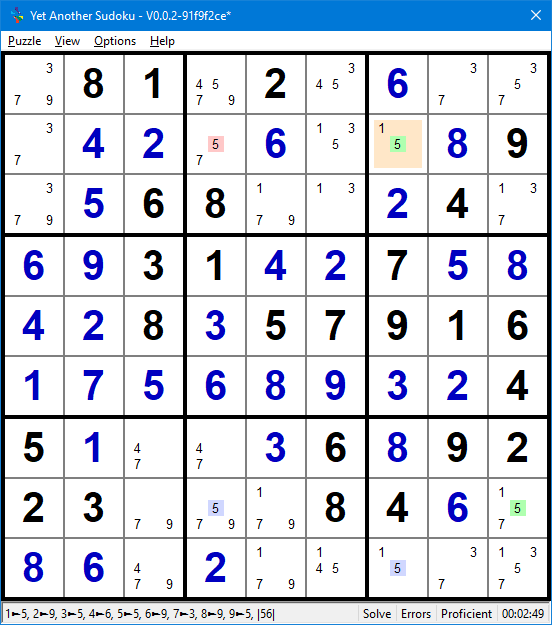

   Two String Kite Example

   :raw-html:`<mong>.81.2.+6...+4+2.+6..+89.+568..+24.+6+931+4+27+5+8+4+28+357916+1+7+5+6+8+9+3+245+1..+36+89223...84+6.+8+6.+2.....||Two String Kite||5r2c7=5r9c7-5r8c9=5r8c4,5r2c7-5r2c4-5r8c4,5r2c7-5r2c4-5r8c4|r2c4-=5|+781+92+4+6+3+5+3+4+2+7+6+5+1+89+9+568+1+3+24+7+6+931+4+27+5+8+4+28+357916+1+7+5+6+8+9+3+245+1+7+4+36+89223+9+5+784+6+1+8+6+4+2+9+1+5+7+3</mong>`

The chain in this example is :raw-html:`<mong>5r2c7=5r9c7-5r8c9=5r8c4</mong>`, source:
`Hodoku <http://hodoku.sourceforge.net/en/tech_sdp.php#t2sk>`__.  This is an alternating strong/weak
link chain four nodes long starting and ending with a strong link.  A short chain was chosen for
simplicity but the logic applies to any even node count chain.

Starting at with ccell 5r2c7, assert the premise that it is False. The strong link between 5r2c7 and
5r9c7, infers 5r9c7 True.  The weak link between 5r9c7 and 5r8c9 infers 5r8c9 False.  The strong
link between 5r8c9 and 5r8c4 infers 5r8c4 True.  Also walking the chain in the opposite direction
starting with 5r8c4 as False will ultimately infer 5r2c7 True.  Thus concluding neither 5r2c7 nor
5r8c4 can be simultaneously False, one or the other has to be True.

But with this AIC if 5r2c7 is asserted True, then 5r8c4 can be either True or False.  For example,
The premise that 5r2c7 is True, infers 5r9c7 False.  Because 5r9c7 is weakly linked to 5r8c9,
nothing can be inferred about its state when it is False, which breaks the inferences for the rest
of the chain.

The important conclusions to be drawn from AIC/Inferred links is that same value candidates that can
see both ends of the AIC can be eliminated.  This is because at least one end Ccell will always be
True.  In this example 5 is eliminated from r2c4 (r2c4-=5).

A Skyscraper
------------

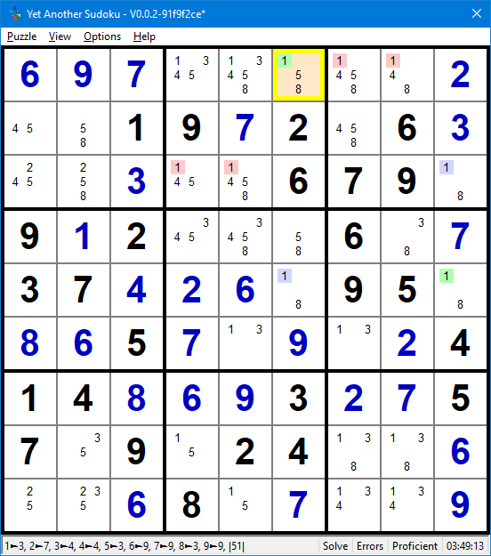

   Skyscraper Example

   :raw-html:`<mong>+6+9+7.....+2..19+72.6+3..+3..679.9+12...6.+737+4+2+6.95.+8+65+7.+9.+2414+8+6+93+2+757.9.24..+6..+68.+7..+9||Skyscraper||1r1c6=1r5c6~1r5c9=1r3c9,1r1c6-1r1c7-1r3c9,1r1c6-1r1c8-1r3c9,1r1c6-1r3c4-1r3c9,1r1c6-1r3c5-1r3c9|r1c7-=1;r1c8-=1;r3c4-=1;r3c5-=1|+6+9+7+3+1+5+8+4+2+4+819+72+56+3+5+2+3+4+8679+19+12+5+4+86+3+737+4+2+6+195+8+8+65+7+3+9+1+2414+8+6+93+2+757+59+124+3+8+6+2+3+68+5+7+4+1+9</mong>`

The chain in this example is :raw-html:`<mong>1r1c6=1r5c6~1r5c9=1r3c9</mong>`, source: `Hodoku
<http://hodoku.sourceforge.net/en/tech_sdp.php#sk>`_.  This is another AI chain of four nodes with
strong end links.  Note that the centre link is a Strong Link masquerading as a Weak Link.

Walking the chain exactly like the previous example, the indirect Robust link
:raw-html:`<mong>1r1c6|~|1r2c9</mong>` is found.  Recall that at least one end will always be true,
therefore any Ccell that can see both ends cannot be True.  Four such Ccells exist in this pattern
which can be eliminated: :raw-html:`<mong>r1c7-=1, r1c8-=1, r3c4-=1, r3c5-=1</mong>`.

|
|
|
|
|

A Strong Linked Net (SLN) Chain
-------------------------------

Here is an example of three Strong Linked Nets in a Chain.  Source: `SudokuWiki <https://www.sudokuwiki.org/Aligned_Pair_Exclusion>`__

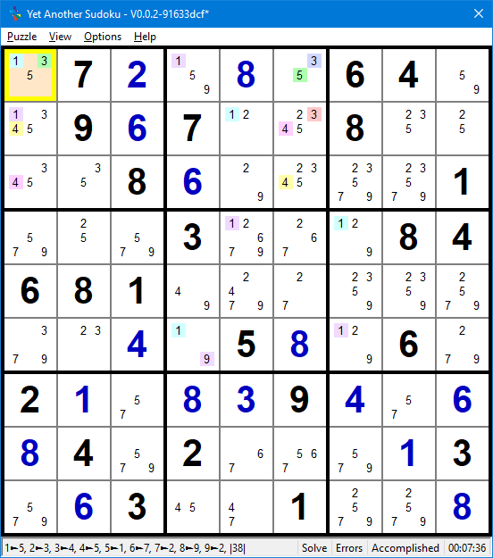

   Chained Strong Linked Net Type 2 Example

   :raw-html:`<mong>.7+2.+8.64..9+67..8....8+6....1...3...84681........+4.5+8.6.2+1.+8+39+4.+6+84.2...+13.+63..1..+8|r2c5-=4;r3c5-=4;r4c7-=57;r5c6-=4;r5c7-=7;r5c8-=7;r6c7-=37|Chained Strong Linked Net T2||[3r1c1e=3r1c6o=5r1c6e]<3r1c1-1r1c1>[1r1c1e=1r1c4o=1r6c4e={1r6c7o=1r4c7e=1r4c5o=1r2c5e={1r2c1o,2r2c5o},9r6c4o}]<1r2c1-4r2c1>[4r2c1e=4r2c6o=4r3c6e=4r3c1o],3r1c6-3r2c6-4r2c6|r2c6-=3|+172+98+364+5+4967+1+58+3+2+3+586+2+4+7+91+5+2+73+9+6+184681+4+7+2+3+5+9+9+34+158+26+721+58394+7684+92+6+7+513+763+5+41+9+28</mong>`

The three chains are:

*  :raw-html:`<mong>SLN1 = 3r1c1e=3r1c6o=5r1c6e</mong>`
*  :raw-html:`<mong>SLN2 = 1r1c1e=1r1c4o=1r6c4e={1r6c7o=1r4c7e=1r4c5o=1r2c5e={1r2c1o,2r2c5o},9r6c4o}</mong>`
*  :raw-html:`<mong>SLN3 = 4r2c1e=4r2c6o=4r3c6e=4r3c1o</mong>`

Viewed from the perspective of Odd and Even Parity Super Nodes:

*  :raw-html:`<mong>SLN1e = {3r1c1, 5r1c6}</mong>`
*  :raw-html:`<mong>SLN1o = {3r1c6}</mong>  `
*  :raw-html:`<mong>SLN2e = {1r1c1, 1r6c4, 1r4c7, 1r2c5}</mong>`
*  :raw-html:`<mong>SLN2o = {1r1c4, 1r6c7, 1r4cp, 1r2c1, 2r2c5, 9r6c4}</mong>  `
*  :raw-html:`<mong>SLN3e = {4r2c1, 4r3c6}</mong>`
*  :raw-html:`<mong>SLN3e = {4r2c6, 4r3c1}</mong>`

These three chains are linked by:

*  :raw-html:`<mong>SLN1e-SLN2e &nbsp;&rArr;&nbsp; 3r1c1-1r1c1</mong>`
*  :raw-html:`<mong>SLN2o-SLN3e &nbsp;&rArr;&nbsp; 1r2c1-4r2c1</mong>`

The Super Node Chain is:

*  :raw-html:`<mong>SLN1o=SLN1e-SLN2e=SLN2o-SLN3e=SLN3o</mong>`

Because :raw-html:`<mong>3r1c6</mong> in SLN1o and <mong>4r2c6</mong> in SLN3o are in the same
house, and because of the Chain, at least one of them will be True, any Ccell (such as
<mong>3r2c6</mong>) that sees both, cannot be True and can be eliminated <mong>r2c6-=3</mong>`.

.. _cc_chain_elims_and_plcmts:

Chain Eliminations and Placements
=================================

.. _we_aic:

Weak Link Ended Chains (WE-AIC)
-------------------------------

Recall, Weak Link Ended AI-Chain characteristics are:
   *  An even count of Nodes,
   *  Link count is one less than Node Count, an odd number,
   *  Both outer links are Weak Links,
   *  Reversible.  Asserting the one end True and traversing the inferences will find the other end
      False.
   *  Although both ends cannot be simultaneously True, they can be simultaneously False.

The ends of Weak Link Ended Chains behave exactly as Weak Links and can be used as such.  Ccells
'See' each other through weak links.  Two Ccells that 'See' each other both cannot be True.

This application of the Sudoku rule on its own, does not give much.  Its real power is in linking
Ccells to all the elements of :ref:`'A Truth' <cc_truth>`.  If a Ccell :term:`See`\s all the elements of
'A Truth', it cannot be True and can be eliminated as in Kraken Fish.

This will be covered in detail when reviewing the application of :ref:`Kraken Fish <kraken-fish>`.

Strong Link Ended Chains (SE-AIC)
---------------------------------

Recall, Strong Ended AI-Chain characteristics are that of :ref:`Robust Links <cc_robust_links>`:
   *  An even count of Nodes
   *  Link count is one less than Node Count, an odd number,
   *  Both outer links are Strong Links,
   *  Reversible.  Asserting the one end False and traversing the inferences will find the other end
      True.
   *  Although both ends cannot be simultaneously False, they can be simultaneously True.

Because at least one end of a SE-AIC is always True, any Ccell (including interior nodes, see
:ref:`Cannibalism <cannibalism>`) seeing both ends cannot be True and can be eliminated.

Just as a Robust Link or a Strong Link can be substituted for a Weak Link

Type 1:  Same end Values
++++++++++++++++++++++++

Considering SE-AIC's with the same candidate values, eliminations depend on the locations of the
ends relative to each other:

.. figure:: images/se-aic-diff-chute-cd1.png
   :name: fig-se-aic-diff-chute-cd1
   :scale: 50%
   :alt: Sudoku Robust Link Different Chutes Candidate Diagram
   :align: right
   :figwidth: 320px

   Robust Link Different Chutes Candidate Diagram

With ends in different :term:`Chute`\s, the only cells that can see both ends are the two diagonally
opposite to the ends.  In the figure on the right, hypothetical chain ends are marked X and the
cells that can see both ends are highlighted green.  Any same valued Ccell in the highlighted green
cells cannot be True and can be eliminated.

|
|
|
|
|
|
|
|

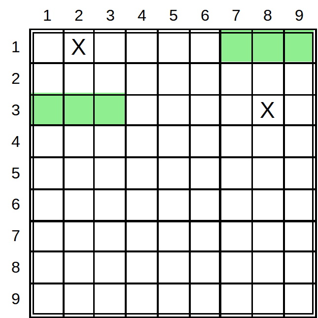

   Robust Link Same Chutes Candidate Diagram

With ends in the same :term:`Chute`, six cells can see both ends.  In the figure on the right,
hypothetical chain ends are marked X and the cells that can see both ends are highlighted green.
Any same valued Ccell in the highlighted green cells cannot be True and can be eliminated.

|
|
|
|
|
|
|
|

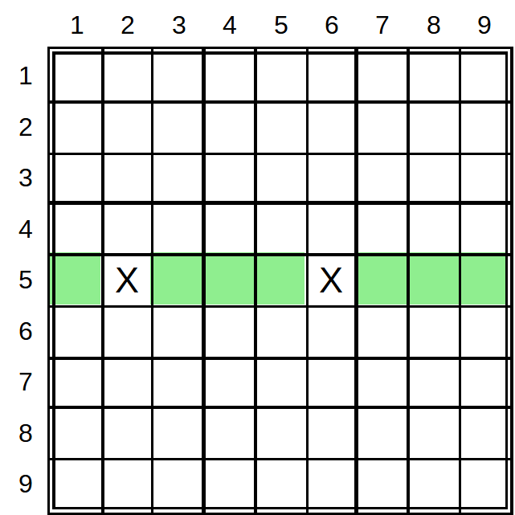

   Robust Link Same House Candidate Diagram

With ends in the Same :term:`House`, seven cells can see both ends.  In the figure on the right,
hypothetical chain ends are marked X and the cells that can see both ends are highlighted green.
Any same valued Ccell in the highlighted green cells cannot be True and can be eliminated.

Furthermore and perhaps more importantly, An :ref:`Even Loop <found_even-loops>` by the SE-AIC ends seeing
each other.  An Even Loop pattern strengthens all the weak links, causing all the other same value
Ccells in the Weak Links never to be True, resulting in their elimination.

|
|
|
|
|

Type 2:  Different End Values
+++++++++++++++++++++++++++++

Eliminations are only possible if the different ends occur in the same house or cell.

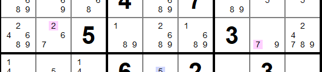

   Robust Link Different Ends Grid Snip Example 1

In this grid snippet say :raw-html:`<mong>2r3c2</mong> and <mong>7r3c8</mong> are the chain ends.
<mong>7r3c2</mong> can see both chain ends.  Therefore, it cannot be True and can be
eliminated. <mong>r3c2-=7</mong>`.

|

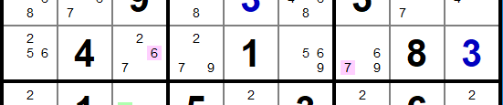

   Robust Link Different Ends Grid Snip Example 2

In this grid snippet say :raw-html:`<mong>6r6c3</mong> and <mong>7r6c7</mong> are the chain ends.
<mong>7r6c3</mong> and <mong>6r6c7</mong> can both see both chain ends and can be eliminated.
<mong>r6c3-=7</mong> and <mong>r6c7-=6</mong>`.

To summarise: Considering different value chain ends of a SE-AIC in the same house, if a Ccell of
same value as the one end is in the other end, it can be eliminated.  This pattern can yield a
maximum of two eliminations.

Type 3:  Opposing Exposed Pair Ends
+++++++++++++++++++++++++++++++++++++

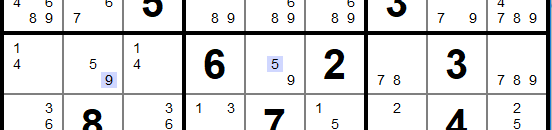

   Robust Link Opposing Conjugate Pair Ends Grid Snip

In this grid snippet, say :raw-html:`<mong>9r4c2</mong> and <mong>5r4c5</mong>` of the
:ref:`Exposed Pair <hsp_exposed_pairs>` :raw-html:`<mong>59r4c25</mong>.  The Ccells in the Exposed Pair
that are not part Chain can both see both end of the chain, and therefore cannot be True and can be
eliminated, <mong>r4c2-=5</mong> and <mong>r4c5-=9</mong>.  This leaves the Chain Ccells as the only
Ccells in the Chain end cells respectively, and they can be placed.  <mong>r4c2:=9</mong> and
<mong>r4c5:=5</mong>`.

Strong Linked Patterns
----------------------

Recall, SL Patterns:
   *  Have alternating State Consecutive Nodes.
   *  Are reversible, inferences can be traversed in either direction with same predictable results.

More is gained by working with SL Net patterns than SL Chain patterns.
   *  Net patterns typically capture more nodes than string patterns.
   *  A Ccell can only be a member of a single SL Net, whereas, the same Ccell can be a member of
      multiple SL Chains.
   *  A Puzzle typically contains fewer larger SL-Nets than chains, thereby reducing the search
      effort for similar outcomes.

Recall further:
   *  SL Patterns members can be divided into two Super-Nodes of even and odd parity.  SL Chain
      parity is found by assigning count numbers to each consecutive nodes. SL Node parity is found
      by assigning the level number to the Node.  In both cases, all odd and even Nodes to their
      respective Super-Node.
   *  Either all the Even or all the Odd Parity nodes will True.  Which it is, is yet to be
      determined.
   *  A Strong link exists between the odd and even Super-Nodes of SL patterns.  Any node in the one
      Super-Node set is strongly linked to all nodes in the other Super Node.

Type 1: Same State Nodes See Each Other
+++++++++++++++++++++++++++++++++++++++

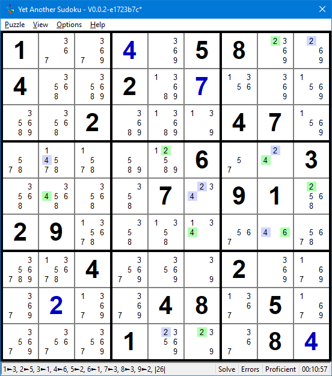

   Strong Linked Net Type 1 Example

   :raw-html:`<mong>1..+4.58..4..2.+7.....2...47......6..3....7.91.29.........4...2...+2..48.5....1...8+4||Strong Linked Net T1||2r1c8e=2r1c9o=2r5c9e=2r5c6o=2r9c6e=2r9c5o=2r4c5e=2r4c8o=4r4c8e=4r4c2o=4r5c2e=4r5c6o=4r6c6e=4r6c8o=6r6c8e,2r5c6o-4r5c6o|r1c8:=2;r5c9:=2;r9c6:=2;r4c5:=2;r4c8:=4;r5c2:=4;r6c6:=4;r6c8:=6|1+3+7+4+958+2+64+5+82+6+7+3+9+1+9+62+3+8+147+5+7+8+1+9+26+5+43+6+4+5+87+391+229+3+5+1+4+7+6+8+8+14+6+5+92+3+7+3+2+6+748+15+9+5+7+91+3+2+68+4</mong>`

The puzzle pattern on the right is the SL Net:
:raw-html:`<mong>2r1c8e=2r1c9o=2r5c9e=2r5c6o=2r9c6e=2r9c5o =2r4c5e=2r4c8o=4r4c8e=4r4c2o=4r5c2e=4r5c6o
=4r6c6e=4r6c8o=6r6c8e,2r5c6o-4r5c6o</mong>.
Even Ccells are highlighted green and Odd Ccells highlighted blue.  Two odd parity (same state)
Ccells <mong>2r5c6</mong> and <mong>4r5c6</mong> are present in cell r5c6.  As it is impossible for
two Ccells to be True in the Same cell, these two odd Ccells must be False, and so must all the
other odd Ccells. That means all the even Ccells are True and can be placed:
<mong>r1c8:=2;r5c9:=2;r9c6:=2;r4c5:=2;r4c8:=4;r5c2:=4;r6c6:=4;r6c8:=6</mong>`.

|
|
|
|
|

Type 2: All Candidates in a Cell See Same State Nodes
+++++++++++++++++++++++++++++++++++++++++++++++++++++

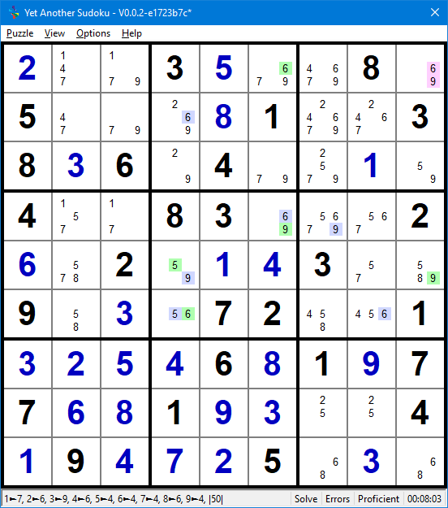

   Strong Linked Net Type 2 Example

   :raw-html:`<mong>+2..3+5..8.5...+81..38+36.4..+1.4..83...2+6.2.+1+43..9.+3.72..1+3+2+5+46+81+977+6+81+9+3..4+19+4+7+25.+3.|r6c7-=6|Strong Linked Net T2||5r5c4e=5r6c4o=6r6c4e={6r6c8o,6r2c4o=6r1c6e=6r4c6o=9r4c6e=9r4c7o=9r5c9e=9r5c4o},9r1c9-9r5c9e,6r1c9-6r1c6e|r6c4:=5;r6c8:=6;r2c4:=6;r4c6:=6;r4c7:=9;r5c4:=9|+2+4+13+5+7+68+95+7+9+6+81+2+438+36+24+9+7+1+54+1+783+6+9+52+6+52+9+1+43+7+89+8+3+572+4+61+3+2+5+46+81+977+6+81+9+3+5+24+19+4+7+25+8+3+6</mong>`

The puzzle pattern on the right is the SL Net:
:raw-html:`<mong>5r5c4e=5r6c4o=6r6c4e={6r6c8o,6r2c4o=6r1c6e =6r4c6o=9r4c6e=9r4c7o=9r5c9e=9r5c4o},
9r1c9-9r5c9e,6r1c9-6r1c6e</mong>.
Even Ccells are highlighted green and Odd Ccell highlighted blue.  The Ccells <mong>6r1c9</mong>
and <mong>9r1c9</mong> in r1c9, both see even Nodes <mong>6r1c6</mong> and <mong>9r5c9</mong>
respectively.  If the Even Nodes of the pattern are True, then neither <mong>6r1c9</mong> and
<mong>9r1c9</mong> can be True.  This is impossible as there will be no Truth in r1c9; therefore,
the Even Nodes must be False.  This in turn makes the Odd Nodes True which can be placed:
<mong>r6c4:=5;r6c8:=6;r2c4:=6;r4c6:=6;r4c7:=9;r5c4:=9</mong>`.

|
|
|
|
|
|

Type 3: Ccells See Opposing State Nodes
+++++++++++++++++++++++++++++++++++++++

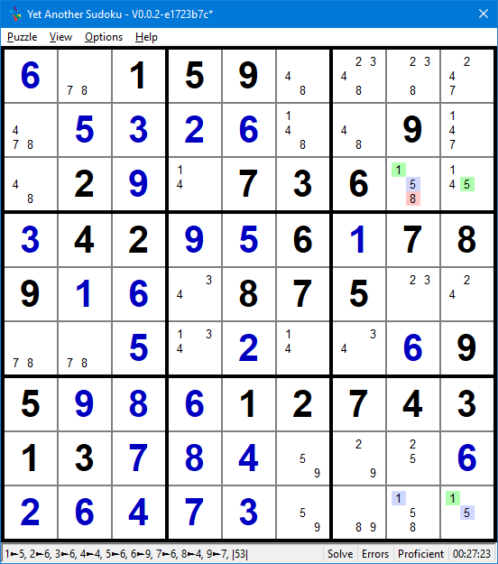

   Strong Linked Net Type 3 Example

   :raw-html:`<mong>+6.159.....+5+3+2+6..9..2+9.736..+342+9+56+1789+1+6.875....+5.+2..+695+9+8+61274313+7+8+4...+6+2+6+4+7+3....||Strong Linked Net T3||1r3c8e=1r9c8o=1r9c9e=5r9c9o=5r3c9e=5r3c8o,5r3c8e-8r3c8-5r3c8o|r3c8-=8|+6+7159+8+4+3+2+4+5+3+2+6+1+89+7+82+9+4736+1+5+342+9+56+1789+1+6+3875+2+4+7+8+5+1+2+4+3+695+9+8+61274313+7+8+4+9+2+5+6+2+6+4+7+3+5+9+8+1</mong>`

The puzzle pattern on the right is the SL Net:
:raw-html:`<mong>1r3c8e=1r9c8o=1r9c9e=5r9c9o=5r3c9e=5r3c8o, 5r3c8e-8r3c8-5r3c8o</mong>.  Even Ccells
are highlighted green and Odd Ccells are highlighted blue.  Ccell <mong>8r3c8</mong> sees both Even
Node <mong>1r3c8</mong> and Odd Node <mong>5r3c8</mong>.  Because either the Even Node or the Odd
Node will be True, <mong>8r3c8</mong> cannot be True and can be eliminated: <mong>r3c8-=8</mong>`.

It doesn't matter whether the Even Node, Odd Node, and Ccell that sees both are in the same Group
or Cell; it only matters that the Ccell sees both and Odd and Even Ndoe that results in its demise.

Sub Chains
==========

Source: http://forum.enjoysudoku.com/x-chain-optimalisation-t38330.html.

An important observation about AI Chains with 6 or more Nodes.  Any lesser Even Node count sub chain
is also a valid chain.

.. _cannibalism:

Cannibalism
===========

In an AI-Chain pattern, if one of the interior Nodes sees both ends of the Chain, can this Node be
eliminated without breaking the chain?

To answer this we need to distinguish between the pattern used to identify a condition, and the
condition.  The condition in this case is the inference (direct or indirect link) between two
Ccells.  That condition exists, whatever the current state of the puzzle.  The condition belongs to
the solution of a puzzle and not its current state.  The condition is unvarying as the solution of a
puzzle does not change.

A pattern, in contrast, is dependent on the current state of a puzzle to identify a condition.
SE-AIC patterns identify Ccells that both cannot be simultaneously True, This an unvarying condition
of the puzzle that has been identified.  This condition does not change as puzzle state continuously
changes as it is solved.

Therefore, patterns such as AI Chains can be cannibalistic and consume their interior links.

.. figure:: images/cannib-ai-chain-eg1.png
   :name: fig-cannib-ai-chain-eg1
   :scale: 65%
   :alt: Sudoku Cannibalistic AI-Chain Example
   :align: right
   :figwidth: 359px

   Cannibalistic AI Chain Example

   :raw-html:`<mong>9.+8...+1.33..89+12.+6.61....8...+3+2.9.18.92...36.81.3......8....63..+39.24+8+577.......1|r1c2-=5;r1c4-=67;r1c5-=47;r1c6-=7;r3c1-=5;r3c4-=5;r3c5-=45;r3c6-=5;r3c7-=47;r3c9-=4;r4c5-=7;r5c4-=45;r5c5-=45;r5c6-=5;r6c5-=7;r6c6-=7;r6c8-=47;r7c5-=5;r9c5-=56;r9c6-=56;r9c8-=4|AI-Chain T1||4r5c9=4r5c1-4r3c1=2r3c1~2r7c1=2r7c9-4r7c9=4r9c7,4r5c9~4r7c9=4r9c7|r4c7-=4;r6c7-=4;r7c9-=4|9+2+8+4+6+5+1+733+7+589+12+4+6+461+7+3+2+98+5+6+4+3+2+59+718+592+1+7+836+481+73+4+6+5+9+2+28+4+5+1+763+9+1+39+624+8+577+5+6+9+8+3+4+21</mong>`

The AI Chain :raw-html:`<mong>4r5c9=4r5c1-4r3c1=2r3c1~2r7c1=2r7c9- 4r7c9=4r9c7,4r5c9~4r7c9=4r9c7</mong>
identifies the Robust link <mong>4r5c9|~|4r9c7</mong>.  The Ccells that see both ends of this Robust
link and can be eliminated are<mong>r4c7-=4</mong>, <mong>r6c7-=4</mong> and <mong>r7c9-=4</mong>.
<Mong4r7c9</mong>,the second last link of the AI-Chain gets consumed.`

Source: https://www.youtube.com/c/SudokuSwami

|
|
|
|
|
|
|

.. _loops:

AI Loops
========

An AI loop is an AI Chain that loops back on itself.  An even length AIC looping back on itself has
the same strong and weak link count.  An odd length AIC that loops back on itself can either have an
extra strong link or extra weak link in the loop; an odd count loop has either two adjacent strong
links or two adjacent weak links.

These three loop types result in different eliminations or placements.

.. _found_even_loops:

Even AI Loops
-------------

Consider the following Even AI-Loop:

:raw-html:`

<pre>A = B – C = D –</pre>

`

The ending dash indicates a weak link looping back to Node A.  If Node A is False, the AI Chain
ensures D is True.  If Node A is True, the looped weak link to Node D ensures that Node D is False.
Thus, the Weak link between Nodes D and A is made Strong by the loop.  The same is said for the Weak
link between Nodes B and C.

Since the Loop strengthens all the Weak links in the AI Chain, The same eliminations and placements
that apply to :ref:`Strong Linked Patterns <strong-linked-patterns>`, apply to Even AI Chains.

Strong Loops
------------

Consider the following Strong AI-Loop:

:raw-html:`

<pre>A = B – C = D – E =</pre>

`

The ending '=' indicates a strong link looping back from Node E to node A.  Node A is the only node
in the chain sporting two strong links.

If Node A is False, then both Nodes B and E are True because of the Strong Links.  But B and E
cannot be simultaneously True because :raw-html:`<mong>B - C = D - E</mong>` is a WE-AIC.
A contradiction exists when Node A is False.  Therefore, Node A must be True and can be placed.

Weak Loops
----------

Consider the following Weak AI Loop:

:raw-html:`

<pre>A = B – C = D – E –</pre>

`

The ending dash indicates a weak link looping back from Node E to Node A.  Node E is the only node
in the chain sporting two weak links.

If Node E is True, then both Nodes A and D are False because of the Weak Links.  But A and D cannot
be simultaneously True because :raw-html:`<mong>A = B - C = D</mong>` is a SE-AIC.  A contradiction
exists when Node E is True.  Therefore, Node A can only be False and can be eliminated.

Observe that this is a narrower pattern than an AI-Chain Type 1.  Ccell E sees both ends of an
SE-AIC, and therefore, cannot be True and can be eliminated.  A SE-AIC Type 1 deals with all Ccells
that can see both chain ends at once, whereas the Weak Loop deals with each Ccell that sees both
chain ends individually.

Group Links
===========

Characterising Group Links
--------------------------

It is possible to group Ccells that lie within a Line/Box intersection into a 'Grouped Node' that
can be considered as a Node when identifying Strong Linked Nodes in patterns.

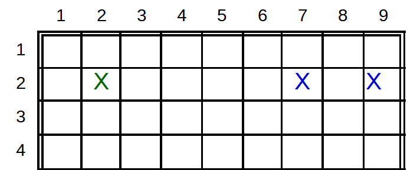

   Group Link Candidate Diagram

:numref:`fig-gl-cd1` shows the strong link between the Grouped Node Xr2c79 and Xr2c2.  That is
:raw-html:`<mong>Xr2c2=Xr2c79</mong>`

If Xr2c2 is True, then both of Xr2c79 are False.  If Xr2c2 is False then one of Xr2C79 is True, or
if one of Xr2c79 is True then Xr2c2 is False.

In isolation, this linkage does not yield much, however when used in the formation of other
patterns like chains, may yield many more productive outcomes.

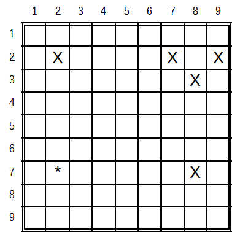

   Group Link 2-String Kite Candidate Diagram

:numref:`fig-gl-cd2` shows a 2 String Kite with a group link:
:raw-html:` <mong>Xr2c2=Xr2c79~Xr3c8=Xr7c8<mong>`

Walking the :term:`SE-AIC`, starting with a False premise as the End Links are Strong.  If Xr2c2 is
False, then one of X2r79 is True, making Xr3c8 is False and Xr7c8 True.  And, if Xr7c8 is False, then
Xr3c8 is True, making both Xr2c79 False and Xr2c2 True.  That is both ends of the chain cannot be
simultaneously False, at least one End is True.  Recall this is the definition of a :term:`Robust
Link`.  Therefore, Xr7c2 if it exists, sees both ends, cannot be True resulting in its elimination.

|
|
|
|
|

Line Group Link Examples
------------------------

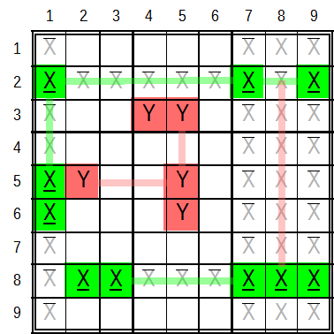

   Group Link Line Examples

:numref:`fig-gl-cd3`: shows how to correctly identify Group links:

*  In Row 2, if Xr2c1 is False, then one of Xr2c79 is True, and if both Xr2c79 are False, then Xr2c1
   is True.  In reverse, if Xr2c1 is True, then both Xr2c7 are False, and if one of Xr2c79 is True
   then Xr2c1 is False. Because the relationship meets the criteria of a
   :ref:`Strong Link <cc_strong_links>` in both directions, Xr2Xr2c1=Xr2c79 is a valid Group link.
*  In Column 1, if Xr2c1 is False, then one of Xr56c1 is True, and if both Xr56c1 are
   False, then Xr2c1 is True.  In reverse, if Xr2c1 is True, then both xr56c1 are False, and if one
   of Xr56c1 is True, then Xr2c1 is False.  Therefore, Xr2c1=Xr56c1 is a valid Group Link.
*  These two Group Links pivot through Xr2c1, such that if both Xr56c1 are False, Xr2c1 is True and
   both of Xr2c79 are False. And if one of Xr56c1 is True, Xr2c1 is False and one of Xr2c79 is True.
*  In Row 8, if both of Xr8c23 are False, then one of Xr8c789 is True, and if all of Xr8c789 are
   False, then one of Xr8c23 is True.  In reverse, if one of Xr8c23 is True, then all of Xr8c789 are
   False, and if one of Xr8c789 is True, then all of Xr8c23 are False.

Avoiding Group Link Identifying errors.  Examining the relationship between:

*  xr2c79 and Xr8c789 in :term:`Tower` 3. If Xr8c8 in Xr8c789 is True, it does not ensure that all
   of Xr2c79 is False. It is possible for either Xr2c79 to be True    while Xr8c8 is also True,
   inhibiting a Strong Link.  Even if Ccell Xr8c8 had previously been eliminated, Xr2c79 still does
   not form a valid Group Link with Xr8c79.  If Xr2c7 is True, does not prevent Xr8c9 from being
   False.
*  Yr3c45 and Yr56c5.  If Yr3c4 in Yr3c45 is True, then Yr3c5 is False.  This permits one of
   Yr56c5 to be True, inhibiting the strong link.
*  Yr5c2 and Yr56c5.  If Yr6c5 in Yr56c5 is True, then Yr5c5 is False.  This permits Yr5c2 to be
   True, inhibiting the Strong Link.

Box Group Link Examples
-----------------------

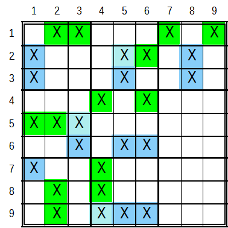

   Group Link Box Examples

|

:numref:`fig-gl-cd4` shows some Box Group Link patterns, out of a total of 81. Box Group Link
patterns are only possible with no less than 3 and no more than five same value Ccells in
a box.  The patterns in Boxes 2, 4 and 8 have a Shared Ccell.  A shared Ccell is present on both
sides of the link equation.  For example, the Group link in box 2 Xr2c56=Xr23c5 shares Xr2c5.

Instead of walking through the Group Link of each example like done above, let's examine the (Box)
Group Link in the context of an :term:`SE-AIC` using the example in box 2.

The chain's inferences are described in the following table.

.. table::  SE-AIC with Box Group Link Inference Table
   :name: tbl-se-aic-gl-it
   :header-columns: 1
   :header-alignment: center center
   :column-alignment: center center
   :column-dividers: single single none
   :column-wrapping: nn

   ============================================================================================================================================================ ====================================
      :raw-html:`<mono>A &nbsp;=&nbsp; B &nbsp;-&nbsp; Xr2c56 &nbsp;=&nbsp; Xr23c5 &nbsp;-&nbsp; C &nbsp;=&nbsp; D</mono>`
   ============================================================================================================================================================ ====================================
   :raw-html:`<mono>F &nbsp;&rarr;&nbsp; T &nbsp;&rarr;&nbsp; <oline>Xr2c56</oline> &nbsp;&rarr;&nbsp; Xr3c5 &nbsp; &rarr;&nbsp; F &nbsp;&rarr;&nbsp; T</mono>` Xr2c56 is False, Xr3c5 is True
   :raw-html:`<mono>T &nbsp;&larr;&nbsp; F &nbsp;&larr;&nbsp; Xr2c6 &nbsp; &larr;&nbsp; <oline>Xr23c5</oline> &nbsp;&larr;&nbsp; T &nbsp;&larr;&nbsp; F</mono>` Xr23c5 is False, Xr2c6 is True
   :raw-html:`<mono>T &nbsp;&larr;&nbsp; F &nbsp;&larr;&nbsp; &nbsp; &nbsp; &nbsp; Xr2c5 &nbsp;&nbsp; &nbsp; &nbsp; &rarr;&nbsp; F &nbsp;&rarr;&nbsp; T</mono>` Xr2c6,Xr3c5 is False, Xr2c5 is True
   ============================================================================================================================================================ ====================================

From :numref:`tbl-se-aic-gl-it` the Shared Ccell is always False when walking the Chain in either
direction and the Chain behaves as a SE-AIC.  Row 3 in the table examines the case when the Shared
Ccell is True.  In this case, the Chain is walked in both directions to its extremities.   If the
Shared Ccell is True, both the Chain Ends will also be True.  This is a valid condition of the
Robust Link formed by the SE-AIC Ends.

This behaviour is consistent across all 81 Box Group Link variants.

Group Links in Even Loops
-------------------------

An Even AI-Loop, makes all the links in the loop strong.  Therefore, with a Type 1 (two same parity
nodes see each other) or Type 2 (all candidates in a cell see same parity nodes) where one (yet to
be determined) :term:`Parity` will be True and Ccells placed while the other will be false and
Ccells eliminated.

But what happens if the node is a grouped ccell?

Take for example this snippet of a chain:

:raw-html:`

<pre>...-3r6c4=3r6c79~3r4c8=2r4c8~...</pre>

`

If 3r6c4 is True then both 3r6c7 and 3r6c9 are False, but if 3r6c4 is False it is impossible to know
which of 3r6c7 or 3r6c9 will be True?

Therefore, if group links are present in Even loops, they must be stepped over as it is impossible
to know which ccell in the grouped node is the Truth.
